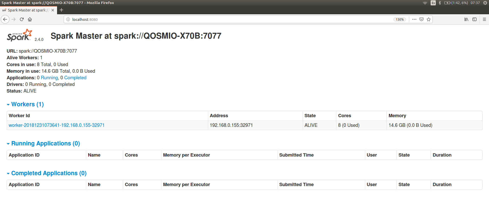

# Instalando, configurando y arrancando un cluster de un nodo de Kafka en un pc

```
arturotarin@QOSMIO-X70B:~/Downloads
06:37:08 $ wget https://archive.apache.org/dist/kafka/kafka-2.0.0/kafka_2.12-2.0.0.tgz

arturotarin@QOSMIO-X70B:~/Downloads
06:37:08 $ tar xvfz kafka_2.12-2.0.0.tgz

arturotarin@QOSMIO-X70B:~/Downloads/kafka_2.12-2.0.0
07:31:55 $ bin/zookeeper-server-start.sh -daemon config/zookeeper.properties

arturotarin@QOSMIO-X70B:~/Downloads/kafka_2.12-2.0.0
07:32:06 $ nc -vz localhost 2181
Connection to localhost 2181 port [tcp/*] succeeded!

arturotarin@QOSMIO-X70B:~/Downloads/kafka_2.12-2.0.0
07:32:59 $ bin/kafka-server-start.sh -daemon config/server.properties

arturotarin@QOSMIO-X70B:~/Downloads/kafka_2.12-2.0.0
07:33:13 $ nc -vz localhost 9092
Connection to localhost 9092 port [tcp/*] succeeded!

arturotarin@QOSMIO-X70B:~/Downloads/kafka_2.12-2.0.0
07:33:19 $ bin/kafka-topics.sh --list --zookeeper localhost:2181

arturotarin@QOSMIO-X70B:~/Downloads/kafka_2.12-2.0.0
07:33:41 $ bin/kafka-topics.sh --create --topic prueba --replication-factor 1 --partitions 3 --zookeeper localhost:2181Created topic "prueba".

arturotarin@QOSMIO-X70B:~/Downloads/kafka_2.12-2.0.0
07:34:25 $ bin/kafka-topics.sh --describe --topic prueba --zookeeper localhost:2181
Topic:prueba	PartitionCount:3	ReplicationFactor:1	Configs:
	Topic: prueba	Partition: 0	Leader: 0	Replicas: 0	Isr: 0
	Topic: prueba	Partition: 1	Leader: 0	Replicas: 0	Isr: 0
	Topic: prueba	Partition: 2	Leader: 0	Replicas: 0	Isr: 0
```

# Instalando, configurando y arrancando un cluster de un nodo de Spark en un pc

```
arturotarin@QOSMIO-X70B:~/Downloads/spark-2.4.0-bin-hadoop2.7
(reverse-i-search)`apt': sudo apt-get install ssh

arturotarin@QOSMIO-X70B:~
06:37:08 $ ssh-keygen -t rsa

arturotarin@QOSMIO-X70B:~
06:37:08 $ ssh-copy-id arturotarin@127.0.1.1

arturotarin@QOSMIO-X70B:~/Downloads
06:37:08 $ wget https://archive.apache.org/dist/spark/spark-2.4.0/spark-2.4.0-bin-hadoop2.7.tgz

arturotarin@QOSMIO-X70B:~/Downloads
06:37:08 $ wget https://archive.apache.org/dist/spark/spark-2.4.0/spark-2.4.0-bin-hadoop2.7.tgz

arturotarin@QOSMIO-X70B:~/Downloads/spark-2.4.0-bin-hadoop2.7
11:17:57 $ cat conf/slaves
127.0.1.1

arturotarin@QOSMIO-X70B:~/Downloads/spark-2.4.0-bin-hadoop2.7
11:18:20 $ cat conf/spark-env.sh
#!/usr/bin/env bash

export SPARK_MASTER_HOST=127.0.1.1
export JAVA_HOME=/usr/lib/jvm/java-8-openjdk-amd64/jre
export SPARK_LOCAL_IP=127.0.1.1


arturotarin@QOSMIO-X70B:~/Downloads/spark-2.4.0-bin-hadoop2.7
11:19:33 $ sbin/stop-all.sh
127.0.1.1: stopping org.apache.spark.deploy.worker.Worker
stopping org.apache.spark.deploy.master.Master

arturotarin@QOSMIO-X70B:~/Downloads/spark-2.4.0-bin-hadoop2.7
11:19:36 $ sbin/start-all.sh
starting org.apache.spark.deploy.master.Master, logging to /home/arturotarin/Downloads/spark-2.4.0-bin-hadoop2.7/logs/spark-arturotarin-org.apache.spark.deploy.master.Master-1-QOSMIO-X70B.out
127.0.1.1: starting org.apache.spark.deploy.worker.Worker, logging to /home/arturotarin/Downloads/spark-2.4.0-bin-hadoop2.7/logs/spark-arturotarin-org.apache.spark.deploy.worker.Worker-1-QOSMIO-X70B.out

```

El cluster debe tener los siguientes jars extra:

* spark-streaming-kafka-0-10_2.11-2.4.0.jar
* kafka-clients-2.0.0.jar
* spark-streaming_2.11-2.4.0.jar

Para ello podemos optar por copiarlos dentro de la carpeta jars como vemos a continuación

```
arturotarin@QOSMIO-X70B:~/Downloads/spark-2.4.0-bin-hadoop2.7
08:20:08 $ ls -rlht jars

-rw-rw-r-- 1 arturotarin arturotarin  212K dic 30 11:00 spark-streaming-kafka-0-10_2.11-2.4.0.jar
-rw-rw-r-- 1 arturotarin arturotarin  1,9M dic 30 11:59 kafka-clients-2.0.0.jar
-rw-rw-r-- 1 arturotarin arturotarin   46M dic 30 16:49 Spark-Scala-Maven-Example-1.0-SNAPSHOT.jar
-rw-rw-r-- 1 arturotarin arturotarin  2,1M dic 31 08:24 spark-streaming_2.11-2.4.0.jar
```

O bien incluir su referencia en el archivo

```
arturotarin@QOSMIO-X70B:~/Downloads/spark-2.4.0-bin-hadoop2.7
08:22:15 $ cat conf/spark-defaults.conf

# Default system properties included when running spark-submit.
# This is useful for setting default environmental settings.

# Example:
# spark.master                     spark://master:7077
# spark.eventLog.enabled           true
# spark.eventLog.dir               hdfs://namenode:8021/directory
# spark.serializer                 org.apache.spark.serializer.KryoSerializer
# spark.driver.memory              5g
# spark.executor.extraJavaOptions  -XX:+PrintGCDetails -Dkey=value -Dnumbers="one two three"

spark.driver.extraClassPath        /home/arturotarin/.m2/repository/org/apache/spark/spark-streaming-kafka-0-10_2.11/2.4.0/spark-streaming-kafka-0-10_2.11-2.4.0.jar

spark.executor.extraClassPath        /home/arturotarin/.m2/repository/org/apache/spark/spark-streaming-kafka-0-10_2.11/2.4.0/spark-streaming-kafka-0-10_2.11-2.4.0.jar

spark.jars                         /home/arturotarin/.m2/repository/org/apache/spark/spark-streaming-kafka-0-10_2.11/2.4.0/spark-streaming-kafka-0-10_2.11-2.4.0.jar,/home/arturotarin/.m2/repository/org/apache/kafka/kafka-clients/2.0.0/kafka-clients-2.0.0.jar,/home/arturotarin/.m2/repository/spark-kafka-maven-example-1.0-SNAPSHOT.jar

spark.jars.packages                org.apache.spark:spark-streaming-kafka-0-10_2.11:2.4.0,org.apache.kafka:kafka-clients:2.0.0

```

Además es necesario indicar al cluster de Spark el parámetro spark.jars.packages, para tener acceso a las clases específicas de Kafka
que estamos utilizando en nuestro código.

Si queremos tener más nodos en el cluster:

* parar el cluster
* copiar con ssh-copy-id las credenciales del nodo master a todos los nuevos nodos del cluster
* añadir las ip de los nuevos nodos en el archivo conf/slaves

Accedemos al cluster http://localhost:8080



# Instalando, configurando y arrancando un cluster de un nodo de Hadoop en un pc

```

arturotarin@QOSMIO-X70B:~/Downloads
11:25:36 $  wget http://apache.rediris.es/hadoop/common/stable2/hadoop-2.9.2.tar.gz

arturotarin@QOSMIO-X70B:~/Downloads
11:25:36 $  tar xvfz hadoop-2.9.2.tar.gz

arturotarin@QOSMIO-X70B:~/Downloads/hadoop-2.9.2
11:26:49 $ cat etc/hadoop/core-site.xml
<configuration>
  <property>
     <name>fs.default.name</name>
     <value>hdfs://localhost:9000</value>
  </property>
</configuration>

arturotarin@QOSMIO-X70B:~/Downloads/hadoop-2.9.2
11:27:30 $ vi etc/hadoop/hdfs-site.xml
<configuration>
  <property>
    <name>dfs.replication</name>
    <value>1</value>
  </property>
</configuration>

arturotarin@QOSMIO-X70B:~/Downloads/hadoop-2.9.2
11:27:57 $ vi etc/hadoop/mapred-site.xml
<configuration>
  <property>
    <name>mapred.job.tracker</name>
    <value>localhost:9001</value>
  </property>
</configuration>

arturotarin@QOSMIO-X70B:~/Downloads/hadoop-2.9.2
11:29:09 $ ssh localhost
The authenticity of host 'localhost (127.0.0.1)' can't be established.
ECDSA key fingerprint is SHA256:H/EQZct9AMt25UplNiTTvo8aXL+ea/dzR3zzQrhi+6M.
Are you sure you want to continue connecting (yes/no)? yes
Warning: Permanently added 'localhost' (ECDSA) to the list of known hosts.
Welcome to Ubuntu 16.04.5 LTS (GNU/Linux 4.15.0-43-generic x86_64)

 * Documentation:  https://help.ubuntu.com
 * Management:     https://landscape.canonical.com
 * Support:        https://ubuntu.com/advantage

32 packages can be updated.
0 updates are security updates.

New release '18.04.1 LTS' available.
Run 'do-release-upgrade' to upgrade to it.

Last login: Sun Dec 30 08:27:56 2018 from 127.0.0.1

arturotarin@QOSMIO-X70B:~
11:29:18 $ logout
Connection to localhost closed.

arturotarin@QOSMIO-X70B:~/Downloads/hadoop-2.9.2
11:29:48 $ export JAVA_HOME=/usr/lib/jvm/java-8-openjdk-amd64/jre/

arturotarin@QOSMIO-X70B:~/Downloads/hadoop-2.9.2
11:30:25 $ bin/hdfs namenode -format

18/12/31 11:30:30 INFO namenode.NameNode: STARTUP_MSG:
/************************************************************
STARTUP_MSG: Starting NameNode
STARTUP_MSG:   host = QOSMIO-X70B/127.0.1.1
STARTUP_MSG:   args = [-format]
STARTUP_MSG:   version = 2.9.2
STARTUP_MSG:   classpath = /home/arturotarin/Downloads/hadoop-2.9.2/etc/hadoop:/home/arturotarin/Downloads/hadoop-2.9.2/share/hadoop/common/lib/jaxb-impl-2.2.3-1.jar:/home/arturotarin/Downloads/hadoop-2.9.2/share/hadoop/common/lib/guava-11.0.2.jar:/home/arturotarin/Downloads/hadoop-2.9.2/share/hadoop/common/lib/java-xmlbuilder-0.4.jar:/home/arturotarin/Downloads/hadoop-2.9.2/share/hadoop/common/lib/json-smart-1.3.1.jar:/home/arturotarin/Downloads/hadoop-2.9.2/share/hadoop/common/lib/jsch-0.1.54.jar:/home/arturotarin/Downloads/hadoop-2.9.2/share/hadoop/common/lib/commons-beanutils-core-1.8.0.jar:/home/arturotarin/Downloads/hadoop-2.9.2/share/hadoop/common/lib/apacheds-i18n-2.0.0-M15.jar:/home/arturotarin/Downloads/hadoop-2.9.2/share/hadoop/common/lib/commons-configuration-1.6.jar:/home/arturotarin/Downloads/hadoop-2.9.2/share/hadoop/common/lib/commons-codec-1.4.jar:/home/arturotarin/Downloads/hadoop-2.9.2/share/hadoop/common/lib/commons-logging-1.1.3.jar:/home/arturotarin/Downloads/hadoop-2.9.2/share/hadoop/common/lib/servlet-api-2.5.jar:/home/arturotarin/Downloads/hadoop-2.9.2/share/hadoop/common/lib/commons-compress-1.4.1.jar:/home/arturotarin/Downloads/hadoop-2.9.2/share/hadoop/common/lib/jcip-annotations-1.0-1.jar:/home/arturotarin/Downloads/hadoop-2.9.2/share/hadoop/common/lib/jsp-api-2.1.jar:/home/arturotarin/Downloads/hadoop-2.9.2/share/hadoop/common/lib/commons-cli-1.2.jar:/home/arturotarin/Downloads/hadoop-2.9.2/share/hadoop/common/lib/jackson-jaxrs-1.9.13.jar:/home/arturotarin/Downloads/hadoop-2.9.2/share/hadoop/common/lib/jackson-xc-1.9.13.jar:/home/arturotarin/Downloads/hadoop-2.9.2/share/hadoop/common/lib/jackson-core-asl-1.9.13.jar:/home/arturotarin/Downloads/hadoop-2.9.2/share/hadoop/common/lib/activation-1.1.jar:/home/arturotarin/Downloads/hadoop-2.9.2/share/hadoop/common/lib/curator-client-2.7.1.jar:/home/arturotarin/Downloads/hadoop-2.9.2/share/hadoop/common/lib/httpclient-4.5.2.jar:/home/arturotarin/Downloads/hadoop-2.9.2/share/hadoop/common/lib/jetty-util-6.1.26.jar:/home/arturotarin/Downloads/hadoop-2.9.2/share/hadoop/common/lib/jaxb-api-2.2.2.jar:/home/arturotarin/Downloads/hadoop-2.9.2/share/hadoop/common/lib/slf4j-log4j12-1.7.25.jar:/home/arturotarin/Downloads/hadoop-2.9.2/share/hadoop/common/lib/stax2-api-3.1.4.jar:/home/arturotarin/Downloads/hadoop-2.9.2/share/hadoop/common/lib/zookeeper-3.4.6.jar:/home/arturotarin/Downloads/hadoop-2.9.2/share/hadoop/common/lib/paranamer-2.3.jar:/home/arturotarin/Downloads/hadoop-2.9.2/share/hadoop/common/lib/protobuf-java-2.5.0.jar:/home/arturotarin/Downloads/hadoop-2.9.2/share/hadoop/common/lib/commons-beanutils-1.7.0.jar:/home/arturotarin/Downloads/hadoop-2.9.2/share/hadoop/common/lib/snappy-java-1.0.5.jar:/home/arturotarin/Downloads/hadoop-2.9.2/share/hadoop/common/lib/jettison-1.1.jar:/home/arturotarin/Downloads/hadoop-2.9.2/share/hadoop/common/lib/jersey-server-1.9.jar:/home/arturotarin/Downloads/hadoop-2.9.2/share/hadoop/common/lib/xmlenc-0.52.jar:/home/arturotarin/Downloads/hadoop-2.9.2/share/hadoop/common/lib/api-asn1-api-1.0.0-M20.jar:/home/arturotarin/Downloads/hadoop-2.9.2/share/hadoop/common/lib/xz-1.0.jar:/home/arturotarin/Downloads/hadoop-2.9.2/share/hadoop/common/lib/jackson-mapper-asl-1.9.13.jar:/home/arturotarin/Downloads/hadoop-2.9.2/share/hadoop/common/lib/slf4j-api-1.7.25.jar:/home/arturotarin/Downloads/hadoop-2.9.2/share/hadoop/common/lib/junit-4.11.jar:/home/arturotarin/Downloads/hadoop-2.9.2/share/hadoop/common/lib/gson-2.2.4.jar:/home/arturotarin/Downloads/hadoop-2.9.2/share/hadoop/common/lib/api-util-1.0.0-M20.jar:/home/arturotarin/Downloads/hadoop-2.9.2/share/hadoop/common/lib/httpcore-4.4.4.jar:/home/arturotarin/Downloads/hadoop-2.9.2/share/hadoop/common/lib/hadoop-annotations-2.9.2.jar:/home/arturotarin/Downloads/hadoop-2.9.2/share/hadoop/common/lib/avro-1.7.7.jar:/home/arturotarin/Downloads/hadoop-2.9.2/share/hadoop/common/lib/asm-3.2.jar:/home/arturotarin/Downloads/hadoop-2.9.2/share/hadoop/common/lib/jersey-json-1.9.jar:/home/arturotarin/Downloads/hadoop-2.9.2/share/hadoop/common/lib/jetty-sslengine-6.1.26.jar:/home/arturotarin/Downloads/hadoop-2.9.2/share/hadoop/common/lib/jsr305-3.0.0.jar:/home/arturotarin/Downloads/hadoop-2.9.2/share/hadoop/common/lib/woodstox-core-5.0.3.jar:/home/arturotarin/Downloads/hadoop-2.9.2/share/hadoop/common/lib/commons-io-2.4.jar:/home/arturotarin/Downloads/hadoop-2.9.2/share/hadoop/common/lib/jetty-6.1.26.jar:/home/arturotarin/Downloads/hadoop-2.9.2/share/hadoop/common/lib/htrace-core4-4.1.0-incubating.jar:/home/arturotarin/Downloads/hadoop-2.9.2/share/hadoop/common/lib/apacheds-kerberos-codec-2.0.0-M15.jar:/home/arturotarin/Downloads/hadoop-2.9.2/share/hadoop/common/lib/netty-3.6.2.Final.jar:/home/arturotarin/Downloads/hadoop-2.9.2/share/hadoop/common/lib/mockito-all-1.8.5.jar:/home/arturotarin/Downloads/hadoop-2.9.2/share/hadoop/common/lib/commons-net-3.1.jar:/home/arturotarin/Downloads/hadoop-2.9.2/share/hadoop/common/lib/commons-collections-3.2.2.jar:/home/arturotarin/Downloads/hadoop-2.9.2/share/hadoop/common/lib/curator-recipes-2.7.1.jar:/home/arturotarin/Downloads/hadoop-2.9.2/share/hadoop/common/lib/stax-api-1.0-2.jar:/home/arturotarin/Downloads/hadoop-2.9.2/share/hadoop/common/lib/jersey-core-1.9.jar:/home/arturotarin/Downloads/hadoop-2.9.2/share/hadoop/common/lib/curator-framework-2.7.1.jar:/home/arturotarin/Downloads/hadoop-2.9.2/share/hadoop/common/lib/nimbus-jose-jwt-4.41.1.jar:/home/arturotarin/Downloads/hadoop-2.9.2/share/hadoop/common/lib/hamcrest-core-1.3.jar:/home/arturotarin/Downloads/hadoop-2.9.2/share/hadoop/common/lib/commons-math3-3.1.1.jar:/home/arturotarin/Downloads/hadoop-2.9.2/share/hadoop/common/lib/hadoop-auth-2.9.2.jar:/home/arturotarin/Downloads/hadoop-2.9.2/share/hadoop/common/lib/commons-digester-1.8.jar:/home/arturotarin/Downloads/hadoop-2.9.2/share/hadoop/common/lib/commons-lang-2.6.jar:/home/arturotarin/Downloads/hadoop-2.9.2/share/hadoop/common/lib/jets3t-0.9.0.jar:/home/arturotarin/Downloads/hadoop-2.9.2/share/hadoop/common/lib/log4j-1.2.17.jar:/home/arturotarin/Downloads/hadoop-2.9.2/share/hadoop/common/lib/commons-lang3-3.4.jar:/home/arturotarin/Downloads/hadoop-2.9.2/share/hadoop/common/hadoop-nfs-2.9.2.jar:/home/arturotarin/Downloads/hadoop-2.9.2/share/hadoop/common/hadoop-common-2.9.2.jar:/home/arturotarin/Downloads/hadoop-2.9.2/share/hadoop/common/hadoop-common-2.9.2-tests.jar:/home/arturotarin/Downloads/hadoop-2.9.2/share/hadoop/hdfs:/home/arturotarin/Downloads/hadoop-2.9.2/share/hadoop/hdfs/lib/guava-11.0.2.jar:/home/arturotarin/Downloads/hadoop-2.9.2/share/hadoop/hdfs/lib/commons-codec-1.4.jar:/home/arturotarin/Downloads/hadoop-2.9.2/share/hadoop/hdfs/lib/commons-logging-1.1.3.jar:/home/arturotarin/Downloads/hadoop-2.9.2/share/hadoop/hdfs/lib/servlet-api-2.5.jar:/home/arturotarin/Downloads/hadoop-2.9.2/share/hadoop/hdfs/lib/leveldbjni-all-1.8.jar:/home/arturotarin/Downloads/hadoop-2.9.2/share/hadoop/hdfs/lib/commons-cli-1.2.jar:/home/arturotarin/Downloads/hadoop-2.9.2/share/hadoop/hdfs/lib/jackson-core-asl-1.9.13.jar:/home/arturotarin/Downloads/hadoop-2.9.2/share/hadoop/hdfs/lib/jackson-core-2.7.8.jar:/home/arturotarin/Downloads/hadoop-2.9.2/share/hadoop/hdfs/lib/netty-all-4.0.23.Final.jar:/home/arturotarin/Downloads/hadoop-2.9.2/share/hadoop/hdfs/lib/jetty-util-6.1.26.jar:/home/arturotarin/Downloads/hadoop-2.9.2/share/hadoop/hdfs/lib/xercesImpl-2.9.1.jar:/home/arturotarin/Downloads/hadoop-2.9.2/share/hadoop/hdfs/lib/okio-1.6.0.jar:/home/arturotarin/Downloads/hadoop-2.9.2/share/hadoop/hdfs/lib/protobuf-java-2.5.0.jar:/home/arturotarin/Downloads/hadoop-2.9.2/share/hadoop/hdfs/lib/jersey-server-1.9.jar:/home/arturotarin/Downloads/hadoop-2.9.2/share/hadoop/hdfs/lib/xmlenc-0.52.jar:/home/arturotarin/Downloads/hadoop-2.9.2/share/hadoop/hdfs/lib/okhttp-2.7.5.jar:/home/arturotarin/Downloads/hadoop-2.9.2/share/hadoop/hdfs/lib/jackson-mapper-asl-1.9.13.jar:/home/arturotarin/Downloads/hadoop-2.9.2/share/hadoop/hdfs/lib/hadoop-hdfs-client-2.9.2.jar:/home/arturotarin/Downloads/hadoop-2.9.2/share/hadoop/hdfs/lib/asm-3.2.jar:/home/arturotarin/Downloads/hadoop-2.9.2/share/hadoop/hdfs/lib/jsr305-3.0.0.jar:/home/arturotarin/Downloads/hadoop-2.9.2/share/hadoop/hdfs/lib/commons-io-2.4.jar:/home/arturotarin/Downloads/hadoop-2.9.2/share/hadoop/hdfs/lib/jetty-6.1.26.jar:/home/arturotarin/Downloads/hadoop-2.9.2/share/hadoop/hdfs/lib/jackson-annotations-2.7.8.jar:/home/arturotarin/Downloads/hadoop-2.9.2/share/hadoop/hdfs/lib/htrace-core4-4.1.0-incubating.jar:/home/arturotarin/Downloads/hadoop-2.9.2/share/hadoop/hdfs/lib/netty-3.6.2.Final.jar:/home/arturotarin/Downloads/hadoop-2.9.2/share/hadoop/hdfs/lib/jersey-core-1.9.jar:/home/arturotarin/Downloads/hadoop-2.9.2/share/hadoop/hdfs/lib/commons-daemon-1.0.13.jar:/home/arturotarin/Downloads/hadoop-2.9.2/share/hadoop/hdfs/lib/xml-apis-1.3.04.jar:/home/arturotarin/Downloads/hadoop-2.9.2/share/hadoop/hdfs/lib/commons-lang-2.6.jar:/home/arturotarin/Downloads/hadoop-2.9.2/share/hadoop/hdfs/lib/log4j-1.2.17.jar:/home/arturotarin/Downloads/hadoop-2.9.2/share/hadoop/hdfs/lib/jackson-databind-2.7.8.jar:/home/arturotarin/Downloads/hadoop-2.9.2/share/hadoop/hdfs/hadoop-hdfs-client-2.9.2-tests.jar:/home/arturotarin/Downloads/hadoop-2.9.2/share/hadoop/hdfs/hadoop-hdfs-rbf-2.9.2.jar:/home/arturotarin/Downloads/hadoop-2.9.2/share/hadoop/hdfs/hadoop-hdfs-native-client-2.9.2-tests.jar:/home/arturotarin/Downloads/hadoop-2.9.2/share/hadoop/hdfs/hadoop-hdfs-client-2.9.2.jar:/home/arturotarin/Downloads/hadoop-2.9.2/share/hadoop/hdfs/hadoop-hdfs-2.9.2.jar:/home/arturotarin/Downloads/hadoop-2.9.2/share/hadoop/hdfs/hadoop-hdfs-2.9.2-tests.jar:/home/arturotarin/Downloads/hadoop-2.9.2/share/hadoop/hdfs/hadoop-hdfs-native-client-2.9.2.jar:/home/arturotarin/Downloads/hadoop-2.9.2/share/hadoop/hdfs/hadoop-hdfs-rbf-2.9.2-tests.jar:/home/arturotarin/Downloads/hadoop-2.9.2/share/hadoop/hdfs/hadoop-hdfs-nfs-2.9.2.jar:/home/arturotarin/Downloads/hadoop-2.9.2/share/hadoop/yarn:/home/arturotarin/Downloads/hadoop-2.9.2/share/hadoop/yarn/lib/jaxb-impl-2.2.3-1.jar:/home/arturotarin/Downloads/hadoop-2.9.2/share/hadoop/yarn/lib/guava-11.0.2.jar:/home/arturotarin/Downloads/hadoop-2.9.2/share/hadoop/yarn/lib/java-xmlbuilder-0.4.jar:/home/arturotarin/Downloads/hadoop-2.9.2/share/hadoop/yarn/lib/json-smart-1.3.1.jar:/home/arturotarin/Downloads/hadoop-2.9.2/share/hadoop/yarn/lib/jsch-0.1.54.jar:/home/arturotarin/Downloads/hadoop-2.9.2/share/hadoop/yarn/lib/metrics-core-3.0.1.jar:/home/arturotarin/Downloads/hadoop-2.9.2/share/hadoop/yarn/lib/commons-beanutils-core-1.8.0.jar:/home/arturotarin/Downloads/hadoop-2.9.2/share/hadoop/yarn/lib/apacheds-i18n-2.0.0-M15.jar:/home/arturotarin/Downloads/hadoop-2.9.2/share/hadoop/yarn/lib/commons-configuration-1.6.jar:/home/arturotarin/Downloads/hadoop-2.9.2/share/hadoop/yarn/lib/commons-codec-1.4.jar:/home/arturotarin/Downloads/hadoop-2.9.2/share/hadoop/yarn/lib/commons-logging-1.1.3.jar:/home/arturotarin/Downloads/hadoop-2.9.2/share/hadoop/yarn/lib/servlet-api-2.5.jar:/home/arturotarin/Downloads/hadoop-2.9.2/share/hadoop/yarn/lib/leveldbjni-all-1.8.jar:/home/arturotarin/Downloads/hadoop-2.9.2/share/hadoop/yarn/lib/commons-compress-1.4.1.jar:/home/arturotarin/Downloads/hadoop-2.9.2/share/hadoop/yarn/lib/jcip-annotations-1.0-1.jar:/home/arturotarin/Downloads/hadoop-2.9.2/share/hadoop/yarn/lib/jsp-api-2.1.jar:/home/arturotarin/Downloads/hadoop-2.9.2/share/hadoop/yarn/lib/commons-cli-1.2.jar:/home/arturotarin/Downloads/hadoop-2.9.2/share/hadoop/yarn/lib/jackson-jaxrs-1.9.13.jar:/home/arturotarin/Downloads/hadoop-2.9.2/share/hadoop/yarn/lib/jackson-xc-1.9.13.jar:/home/arturotarin/Downloads/hadoop-2.9.2/share/hadoop/yarn/lib/jackson-core-asl-1.9.13.jar:/home/arturotarin/Downloads/hadoop-2.9.2/share/hadoop/yarn/lib/fst-2.50.jar:/home/arturotarin/Downloads/hadoop-2.9.2/share/hadoop/yarn/lib/activation-1.1.jar:/home/arturotarin/Downloads/hadoop-2.9.2/share/hadoop/yarn/lib/mssql-jdbc-6.2.1.jre7.jar:/home/arturotarin/Downloads/hadoop-2.9.2/share/hadoop/yarn/lib/curator-client-2.7.1.jar:/home/arturotarin/Downloads/hadoop-2.9.2/share/hadoop/yarn/lib/httpclient-4.5.2.jar:/home/arturotarin/Downloads/hadoop-2.9.2/share/hadoop/yarn/lib/jetty-util-6.1.26.jar:/home/arturotarin/Downloads/hadoop-2.9.2/share/hadoop/yarn/lib/aopalliance-1.0.jar:/home/arturotarin/Downloads/hadoop-2.9.2/share/hadoop/yarn/lib/jaxb-api-2.2.2.jar:/home/arturotarin/Downloads/hadoop-2.9.2/share/hadoop/yarn/lib/stax2-api-3.1.4.jar:/home/arturotarin/Downloads/hadoop-2.9.2/share/hadoop/yarn/lib/zookeeper-3.4.6.jar:/home/arturotarin/Downloads/hadoop-2.9.2/share/hadoop/yarn/lib/paranamer-2.3.jar:/home/arturotarin/Downloads/hadoop-2.9.2/share/hadoop/yarn/lib/protobuf-java-2.5.0.jar:/home/arturotarin/Downloads/hadoop-2.9.2/share/hadoop/yarn/lib/commons-beanutils-1.7.0.jar:/home/arturotarin/Downloads/hadoop-2.9.2/share/hadoop/yarn/lib/snappy-java-1.0.5.jar:/home/arturotarin/Downloads/hadoop-2.9.2/share/hadoop/yarn/lib/jettison-1.1.jar:/home/arturotarin/Downloads/hadoop-2.9.2/share/hadoop/yarn/lib/guice-3.0.jar:/home/arturotarin/Downloads/hadoop-2.9.2/share/hadoop/yarn/lib/jersey-server-1.9.jar:/home/arturotarin/Downloads/hadoop-2.9.2/share/hadoop/yarn/lib/xmlenc-0.52.jar:/home/arturotarin/Downloads/hadoop-2.9.2/share/hadoop/yarn/lib/api-asn1-api-1.0.0-M20.jar:/home/arturotarin/Downloads/hadoop-2.9.2/share/hadoop/yarn/lib/xz-1.0.jar:/home/arturotarin/Downloads/hadoop-2.9.2/share/hadoop/yarn/lib/jackson-mapper-asl-1.9.13.jar:/home/arturotarin/Downloads/hadoop-2.9.2/share/hadoop/yarn/lib/jersey-guice-1.9.jar:/home/arturotarin/Downloads/hadoop-2.9.2/share/hadoop/yarn/lib/gson-2.2.4.jar:/home/arturotarin/Downloads/hadoop-2.9.2/share/hadoop/yarn/lib/jersey-client-1.9.jar:/home/arturotarin/Downloads/hadoop-2.9.2/share/hadoop/yarn/lib/api-util-1.0.0-M20.jar:/home/arturotarin/Downloads/hadoop-2.9.2/share/hadoop/yarn/lib/httpcore-4.4.4.jar:/home/arturotarin/Downloads/hadoop-2.9.2/share/hadoop/yarn/lib/json-io-2.5.1.jar:/home/arturotarin/Downloads/hadoop-2.9.2/share/hadoop/yarn/lib/avro-1.7.7.jar:/home/arturotarin/Downloads/hadoop-2.9.2/share/hadoop/yarn/lib/asm-3.2.jar:/home/arturotarin/Downloads/hadoop-2.9.2/share/hadoop/yarn/lib/jersey-json-1.9.jar:/home/arturotarin/Downloads/hadoop-2.9.2/share/hadoop/yarn/lib/jetty-sslengine-6.1.26.jar:/home/arturotarin/Downloads/hadoop-2.9.2/share/hadoop/yarn/lib/jsr305-3.0.0.jar:/home/arturotarin/Downloads/hadoop-2.9.2/share/hadoop/yarn/lib/woodstox-core-5.0.3.jar:/home/arturotarin/Downloads/hadoop-2.9.2/share/hadoop/yarn/lib/geronimo-jcache_1.0_spec-1.0-alpha-1.jar:/home/arturotarin/Downloads/hadoop-2.9.2/share/hadoop/yarn/lib/commons-io-2.4.jar:/home/arturotarin/Downloads/hadoop-2.9.2/share/hadoop/yarn/lib/jetty-6.1.26.jar:/home/arturotarin/Downloads/hadoop-2.9.2/share/hadoop/yarn/lib/htrace-core4-4.1.0-incubating.jar:/home/arturotarin/Downloads/hadoop-2.9.2/share/hadoop/yarn/lib/apacheds-kerberos-codec-2.0.0-M15.jar:/home/arturotarin/Downloads/hadoop-2.9.2/share/hadoop/yarn/lib/netty-3.6.2.Final.jar:/home/arturotarin/Downloads/hadoop-2.9.2/share/hadoop/yarn/lib/commons-net-3.1.jar:/home/arturotarin/Downloads/hadoop-2.9.2/share/hadoop/yarn/lib/commons-collections-3.2.2.jar:/home/arturotarin/Downloads/hadoop-2.9.2/share/hadoop/yarn/lib/curator-recipes-2.7.1.jar:/home/arturotarin/Downloads/hadoop-2.9.2/share/hadoop/yarn/lib/stax-api-1.0-2.jar:/home/arturotarin/Downloads/hadoop-2.9.2/share/hadoop/yarn/lib/jersey-core-1.9.jar:/home/arturotarin/Downloads/hadoop-2.9.2/share/hadoop/yarn/lib/curator-framework-2.7.1.jar:/home/arturotarin/Downloads/hadoop-2.9.2/share/hadoop/yarn/lib/javax.inject-1.jar:/home/arturotarin/Downloads/hadoop-2.9.2/share/hadoop/yarn/lib/nimbus-jose-jwt-4.41.1.jar:/home/arturotarin/Downloads/hadoop-2.9.2/share/hadoop/yarn/lib/HikariCP-java7-2.4.12.jar:/home/arturotarin/Downloads/hadoop-2.9.2/share/hadoop/yarn/lib/commons-math3-3.1.1.jar:/home/arturotarin/Downloads/hadoop-2.9.2/share/hadoop/yarn/lib/ehcache-3.3.1.jar:/home/arturotarin/Downloads/hadoop-2.9.2/share/hadoop/yarn/lib/java-util-1.9.0.jar:/home/arturotarin/Downloads/hadoop-2.9.2/share/hadoop/yarn/lib/commons-digester-1.8.jar:/home/arturotarin/Downloads/hadoop-2.9.2/share/hadoop/yarn/lib/guice-servlet-3.0.jar:/home/arturotarin/Downloads/hadoop-2.9.2/share/hadoop/yarn/lib/commons-lang-2.6.jar:/home/arturotarin/Downloads/hadoop-2.9.2/share/hadoop/yarn/lib/jets3t-0.9.0.jar:/home/arturotarin/Downloads/hadoop-2.9.2/share/hadoop/yarn/lib/log4j-1.2.17.jar:/home/arturotarin/Downloads/hadoop-2.9.2/share/hadoop/yarn/lib/commons-lang3-3.4.jar:/home/arturotarin/Downloads/hadoop-2.9.2/share/hadoop/yarn/hadoop-yarn-server-applicationhistoryservice-2.9.2.jar:/home/arturotarin/Downloads/hadoop-2.9.2/share/hadoop/yarn/hadoop-yarn-server-tests-2.9.2.jar:/home/arturotarin/Downloads/hadoop-2.9.2/share/hadoop/yarn/hadoop-yarn-api-2.9.2.jar:/home/arturotarin/Downloads/hadoop-2.9.2/share/hadoop/yarn/hadoop-yarn-server-router-2.9.2.jar:/home/arturotarin/Downloads/hadoop-2.9.2/share/hadoop/yarn/hadoop-yarn-server-nodemanager-2.9.2.jar:/home/arturotarin/Downloads/hadoop-2.9.2/share/hadoop/yarn/hadoop-yarn-server-common-2.9.2.jar:/home/arturotarin/Downloads/hadoop-2.9.2/share/hadoop/yarn/hadoop-yarn-server-resourcemanager-2.9.2.jar:/home/arturotarin/Downloads/hadoop-2.9.2/share/hadoop/yarn/hadoop-yarn-registry-2.9.2.jar:/home/arturotarin/Downloads/hadoop-2.9.2/share/hadoop/yarn/hadoop-yarn-server-sharedcachemanager-2.9.2.jar:/home/arturotarin/Downloads/hadoop-2.9.2/share/hadoop/yarn/hadoop-yarn-client-2.9.2.jar:/home/arturotarin/Downloads/hadoop-2.9.2/share/hadoop/yarn/hadoop-yarn-applications-distributedshell-2.9.2.jar:/home/arturotarin/Downloads/hadoop-2.9.2/share/hadoop/yarn/hadoop-yarn-server-web-proxy-2.9.2.jar:/home/arturotarin/Downloads/hadoop-2.9.2/share/hadoop/yarn/hadoop-yarn-common-2.9.2.jar:/home/arturotarin/Downloads/hadoop-2.9.2/share/hadoop/yarn/hadoop-yarn-server-timeline-pluginstorage-2.9.2.jar:/home/arturotarin/Downloads/hadoop-2.9.2/share/hadoop/yarn/hadoop-yarn-applications-unmanaged-am-launcher-2.9.2.jar:/home/arturotarin/Downloads/hadoop-2.9.2/share/hadoop/mapreduce/lib/leveldbjni-all-1.8.jar:/home/arturotarin/Downloads/hadoop-2.9.2/share/hadoop/mapreduce/lib/commons-compress-1.4.1.jar:/home/arturotarin/Downloads/hadoop-2.9.2/share/hadoop/mapreduce/lib/jackson-core-asl-1.9.13.jar:/home/arturotarin/Downloads/hadoop-2.9.2/share/hadoop/mapreduce/lib/aopalliance-1.0.jar:/home/arturotarin/Downloads/hadoop-2.9.2/share/hadoop/mapreduce/lib/paranamer-2.3.jar:/home/arturotarin/Downloads/hadoop-2.9.2/share/hadoop/mapreduce/lib/protobuf-java-2.5.0.jar:/home/arturotarin/Downloads/hadoop-2.9.2/share/hadoop/mapreduce/lib/snappy-java-1.0.5.jar:/home/arturotarin/Downloads/hadoop-2.9.2/share/hadoop/mapreduce/lib/guice-3.0.jar:/home/arturotarin/Downloads/hadoop-2.9.2/share/hadoop/mapreduce/lib/jersey-server-1.9.jar:/home/arturotarin/Downloads/hadoop-2.9.2/share/hadoop/mapreduce/lib/xz-1.0.jar:/home/arturotarin/Downloads/hadoop-2.9.2/share/hadoop/mapreduce/lib/jackson-mapper-asl-1.9.13.jar:/home/arturotarin/Downloads/hadoop-2.9.2/share/hadoop/mapreduce/lib/jersey-guice-1.9.jar:/home/arturotarin/Downloads/hadoop-2.9.2/share/hadoop/mapreduce/lib/junit-4.11.jar:/home/arturotarin/Downloads/hadoop-2.9.2/share/hadoop/mapreduce/lib/hadoop-annotations-2.9.2.jar:/home/arturotarin/Downloads/hadoop-2.9.2/share/hadoop/mapreduce/lib/avro-1.7.7.jar:/home/arturotarin/Downloads/hadoop-2.9.2/share/hadoop/mapreduce/lib/asm-3.2.jar:/home/arturotarin/Downloads/hadoop-2.9.2/share/hadoop/mapreduce/lib/commons-io-2.4.jar:/home/arturotarin/Downloads/hadoop-2.9.2/share/hadoop/mapreduce/lib/netty-3.6.2.Final.jar:/home/arturotarin/Downloads/hadoop-2.9.2/share/hadoop/mapreduce/lib/jersey-core-1.9.jar:/home/arturotarin/Downloads/hadoop-2.9.2/share/hadoop/mapreduce/lib/javax.inject-1.jar:/home/arturotarin/Downloads/hadoop-2.9.2/share/hadoop/mapreduce/lib/hamcrest-core-1.3.jar:/home/arturotarin/Downloads/hadoop-2.9.2/share/hadoop/mapreduce/lib/guice-servlet-3.0.jar:/home/arturotarin/Downloads/hadoop-2.9.2/share/hadoop/mapreduce/lib/log4j-1.2.17.jar:/home/arturotarin/Downloads/hadoop-2.9.2/share/hadoop/mapreduce/hadoop-mapreduce-client-hs-2.9.2.jar:/home/arturotarin/Downloads/hadoop-2.9.2/share/hadoop/mapreduce/hadoop-mapreduce-client-jobclient-2.9.2-tests.jar:/home/arturotarin/Downloads/hadoop-2.9.2/share/hadoop/mapreduce/hadoop-mapreduce-client-hs-plugins-2.9.2.jar:/home/arturotarin/Downloads/hadoop-2.9.2/share/hadoop/mapreduce/hadoop-mapreduce-client-shuffle-2.9.2.jar:/home/arturotarin/Downloads/hadoop-2.9.2/share/hadoop/mapreduce/hadoop-mapreduce-client-core-2.9.2.jar:/home/arturotarin/Downloads/hadoop-2.9.2/share/hadoop/mapreduce/hadoop-mapreduce-client-jobclient-2.9.2.jar:/home/arturotarin/Downloads/hadoop-2.9.2/share/hadoop/mapreduce/hadoop-mapreduce-examples-2.9.2.jar:/home/arturotarin/Downloads/hadoop-2.9.2/share/hadoop/mapreduce/hadoop-mapreduce-client-common-2.9.2.jar:/home/arturotarin/Downloads/hadoop-2.9.2/share/hadoop/mapreduce/hadoop-mapreduce-client-app-2.9.2.jar:/contrib/capacity-scheduler/*.jar:/contrib/capacity-scheduler/*.jar
STARTUP_MSG:   build = https://git-wip-us.apache.org/repos/asf/hadoop.git -r 826afbeae31ca687bc2f8471dc841b66ed2c6704; compiled by 'ajisaka' on 2018-11-13T12:42Z
STARTUP_MSG:   java = 1.8.0_191
************************************************************/
18/12/31 11:30:30 INFO namenode.NameNode: registered UNIX signal handlers for [TERM, HUP, INT]
18/12/31 11:30:30 INFO namenode.NameNode: createNameNode [-format]
Formatting using clusterid: CID-62f376ad-cd97-4495-8b7d-175941a86f92
18/12/31 11:30:30 INFO namenode.FSEditLog: Edit logging is async:true
18/12/31 11:30:30 INFO namenode.FSNamesystem: KeyProvider: null
18/12/31 11:30:30 INFO namenode.FSNamesystem: fsLock is fair: true
18/12/31 11:30:30 INFO namenode.FSNamesystem: Detailed lock hold time metrics enabled: false
18/12/31 11:30:30 INFO namenode.FSNamesystem: fsOwner             = arturotarin (auth:SIMPLE)
18/12/31 11:30:30 INFO namenode.FSNamesystem: supergroup          = supergroup
18/12/31 11:30:30 INFO namenode.FSNamesystem: isPermissionEnabled = true
18/12/31 11:30:30 INFO namenode.FSNamesystem: HA Enabled: false
18/12/31 11:30:30 INFO common.Util: dfs.datanode.fileio.profiling.sampling.percentage set to 0. Disabling file IO profiling
18/12/31 11:30:30 INFO blockmanagement.DatanodeManager: dfs.block.invalidate.limit: configured=1000, counted=60, effected=1000
18/12/31 11:30:30 INFO blockmanagement.DatanodeManager: dfs.namenode.datanode.registration.ip-hostname-check=true
18/12/31 11:30:30 INFO blockmanagement.BlockManager: dfs.namenode.startup.delay.block.deletion.sec is set to 000:00:00:00.000
18/12/31 11:30:30 INFO blockmanagement.BlockManager: The block deletion will start around 2018 Dec 31 11:30:30
18/12/31 11:30:30 INFO util.GSet: Computing capacity for map BlocksMap
18/12/31 11:30:30 INFO util.GSet: VM type       = 64-bit
18/12/31 11:30:30 INFO util.GSet: 2.0% max memory 889 MB = 17.8 MB
18/12/31 11:30:30 INFO util.GSet: capacity      = 2^21 = 2097152 entries
18/12/31 11:30:30 INFO blockmanagement.BlockManager: dfs.block.access.token.enable=false
18/12/31 11:30:30 WARN conf.Configuration: No unit for dfs.heartbeat.interval(3) assuming SECONDS
18/12/31 11:30:30 WARN conf.Configuration: No unit for dfs.namenode.safemode.extension(30000) assuming MILLISECONDS
18/12/31 11:30:30 INFO blockmanagement.BlockManagerSafeMode: dfs.namenode.safemode.threshold-pct = 0.9990000128746033
18/12/31 11:30:30 INFO blockmanagement.BlockManagerSafeMode: dfs.namenode.safemode.min.datanodes = 0
18/12/31 11:30:30 INFO blockmanagement.BlockManagerSafeMode: dfs.namenode.safemode.extension = 30000
18/12/31 11:30:30 INFO blockmanagement.BlockManager: defaultReplication         = 1
18/12/31 11:30:30 INFO blockmanagement.BlockManager: maxReplication             = 512
18/12/31 11:30:30 INFO blockmanagement.BlockManager: minReplication             = 1
18/12/31 11:30:30 INFO blockmanagement.BlockManager: maxReplicationStreams      = 2
18/12/31 11:30:30 INFO blockmanagement.BlockManager: replicationRecheckInterval = 3000
18/12/31 11:30:30 INFO blockmanagement.BlockManager: encryptDataTransfer        = false
18/12/31 11:30:30 INFO blockmanagement.BlockManager: maxNumBlocksToLog          = 1000
18/12/31 11:30:30 INFO namenode.FSNamesystem: Append Enabled: true
18/12/31 11:30:30 INFO namenode.FSDirectory: GLOBAL serial map: bits=24 maxEntries=16777215
18/12/31 11:30:30 INFO util.GSet: Computing capacity for map INodeMap
18/12/31 11:30:30 INFO util.GSet: VM type       = 64-bit
18/12/31 11:30:30 INFO util.GSet: 1.0% max memory 889 MB = 8.9 MB
18/12/31 11:30:30 INFO util.GSet: capacity      = 2^20 = 1048576 entries
18/12/31 11:30:30 INFO namenode.FSDirectory: ACLs enabled? false
18/12/31 11:30:30 INFO namenode.FSDirectory: XAttrs enabled? true
18/12/31 11:30:30 INFO namenode.NameNode: Caching file names occurring more than 10 times
18/12/31 11:30:30 INFO snapshot.SnapshotManager: Loaded config captureOpenFiles: falseskipCaptureAccessTimeOnlyChange: false
18/12/31 11:30:30 INFO util.GSet: Computing capacity for map cachedBlocks
18/12/31 11:30:30 INFO util.GSet: VM type       = 64-bit
18/12/31 11:30:30 INFO util.GSet: 0.25% max memory 889 MB = 2.2 MB
18/12/31 11:30:30 INFO util.GSet: capacity      = 2^18 = 262144 entries
18/12/31 11:30:30 INFO metrics.TopMetrics: NNTop conf: dfs.namenode.top.window.num.buckets = 10
18/12/31 11:30:30 INFO metrics.TopMetrics: NNTop conf: dfs.namenode.top.num.users = 10
18/12/31 11:30:30 INFO metrics.TopMetrics: NNTop conf: dfs.namenode.top.windows.minutes = 1,5,25
18/12/31 11:30:30 INFO namenode.FSNamesystem: Retry cache on namenode is enabled
18/12/31 11:30:30 INFO namenode.FSNamesystem: Retry cache will use 0.03 of total heap and retry cache entry expiry time is 600000 millis
18/12/31 11:30:30 INFO util.GSet: Computing capacity for map NameNodeRetryCache
18/12/31 11:30:30 INFO util.GSet: VM type       = 64-bit
18/12/31 11:30:30 INFO util.GSet: 0.029999999329447746% max memory 889 MB = 273.1 KB
18/12/31 11:30:30 INFO util.GSet: capacity      = 2^15 = 32768 entries
18/12/31 11:30:30 INFO namenode.FSImage: Allocated new BlockPoolId: BP-646887143-127.0.1.1-1546252230958
18/12/31 11:30:31 INFO common.Storage: Storage directory /tmp/hadoop-arturotarin/dfs/name has been successfully formatted.
18/12/31 11:30:31 INFO namenode.FSImageFormatProtobuf: Saving image file /tmp/hadoop-arturotarin/dfs/name/current/fsimage.ckpt_0000000000000000000 using no compression
18/12/31 11:30:31 INFO namenode.FSImageFormatProtobuf: Image file /tmp/hadoop-arturotarin/dfs/name/current/fsimage.ckpt_0000000000000000000 of size 330 bytes saved in 0 seconds .
18/12/31 11:30:31 INFO namenode.NNStorageRetentionManager: Going to retain 1 images with txid >= 0
18/12/31 11:30:31 INFO namenode.NameNode: SHUTDOWN_MSG:
/************************************************************
SHUTDOWN_MSG: Shutting down NameNode at QOSMIO-X70B/127.0.1.1
************************************************************/

arturotarin@QOSMIO-X70B:~/Downloads/hadoop-2.9.2
11:39:56 $ vi etc/hadoop/hadoop-env.sh

export JAVA_HOME=/usr/lib/jvm/java-8-openjdk-amd64/jre/


arturotarin@QOSMIO-X70B:~/Downloads/hadoop-2.9.2
11:40:11 $ sbin/start-all.sh
This script is Deprecated. Instead use start-dfs.sh and start-yarn.sh
Starting namenodes on [localhost]
localhost: starting namenode, logging to /home/arturotarin/Downloads/hadoop-2.9.2/logs/hadoop-arturotarin-namenode-QOSMIO-X70B.out
localhost: starting datanode, logging to /home/arturotarin/Downloads/hadoop-2.9.2/logs/hadoop-arturotarin-datanode-QOSMIO-X70B.out
Starting secondary namenodes [0.0.0.0]
0.0.0.0: Warning: Permanently added '0.0.0.0' (ECDSA) to the list of known hosts.
0.0.0.0: starting secondarynamenode, logging to /home/arturotarin/Downloads/hadoop-2.9.2/logs/hadoop-arturotarin-secondarynamenode-QOSMIO-X70B.out
starting yarn daemons
starting resourcemanager, logging to /home/arturotarin/Downloads/hadoop-2.9.2/logs/yarn-arturotarin-resourcemanager-QOSMIO-X70B.out
localhost: starting nodemanager, logging to /home/arturotarin/Downloads/hadoop-2.9.2/logs/yarn-arturotarin-nodemanager-QOSMIO-X70B.out

arturotarin@QOSMIO-X70B:~/Downloads/hadoop-2.9.2
11:41:41 $ bin/hdfs dfs -ls /

```

Vemos Hadoop desde estos enlaces:

http://localhost:50070/dfshealth.html#tab-overview

http://localhost:50070/explorer.html#/

http://localhost:8088/cluster


# Arrancando Stream.scala con **spark_master = "local[*]"**

funciona:

```

1546165355222	Yahoo	page_view		Visitor-382641	Page-1	Cen-Tech,7 Function Digital Multimeter
1546165355222	Twitter	add_to_cart		Visitor-387567	Page-8	Q-tips,Cotton Swabs
1546165355222	Yahoo	page_view		Visitor-318394	Page-8	De Cecco,Penne Rigate
18/12/30 11:22:30 INFO DAGScheduler: ResultStage 3 (foreach at Stream.scala:73) finished in 0.086 s
18/1
```

# Arrancando Stream.scala con **spark_master = "spark://127.0.1.1:7077"**

falla:

```

18/12/30 11:20:20 ERROR JobScheduler: Error running job streaming job 1546165220000 ms.0
org.apache.spark.SparkException: Job aborted due to stage failure: Task 0 in stage 0.0 failed 4 times, most recent failure: Lost task 0.3 in stage 0.0 (TID 3, 192.168.0.155, executor 0):

java.lang.NoClassDefFoundError: org/apache/kafka/common/TopicPartition
	at java.lang.Class.getDeclaredMethods0(Native Method)
```

Faltaría añadir packages al sparkConf. desde línea de comando es así:

```

./bin/spark-submit --packages org.apache.spark:spark-streaming-kafka-0-10_2.11:2.4.0  <DIR>/main.py localhost:9092 test
```


Añado los spark.jars a la ruta esperada:

```

arturotarin@QOSMIO-X70B:~/Downloads/spark-2.4.0-bin-hadoop2.7
11:46:15 $ cat conf/spark-defaults.conf

'# Default system properties included when running spark-submit.
'# This is useful for setting default environmental settings.

'# Example:
'# spark.master                     spark://master:7077
'# spark.eventLog.enabled           true
'# spark.eventLog.dir               hdfs://namenode:8021/directory
'# spark.serializer                 org.apache.spark.serializer.KryoSerializer
'# spark.driver.memory              5g
'# spark.executor.extraJavaOptions  -XX:+PrintGCDetails -Dkey=value -Dnumbers="one two three"
spark.driver.extraClassPath        /home/arturotarin/.m2/repository/org/apache/spark/spark-streaming-kafka-0-10_2.11/2.4.0/spark-streaming-kafka-0-10_2.11-2.4.0.jar
spark.executor.extraClassPath      /home/arturotarin/.m2/repository/org/apache/spark/spark-streaming-kafka-0-10_2.11/2.4.0/spark-streaming-kafka-0-10_2.11-2.4.0.jar
spark.jars                         /home/arturotarin/.m2/repository/org/apache/spark/spark-streaming-kafka-0-10_2.11/2.4.0/spark-streaming-kafka-0-10_2.11-2.4.0.jar
spark.jars.packages                org.apache.spark:spark-streaming-kafka-0-10_2.11:2.4.0
```


Ahora se queja de que el cluser de Spark no encuentra la misma clase kafkastreaming.Streaming.scala

```

Caused by: java.lang.ClassNotFoundException: sparkstreaming.Stream$$anonfun$main$1$$anonfun$apply$1
	at java.net.URLClassLoader.findClass(URLClassLoader.java:382)

```

Lo que nos lleva a la confirmación que hace falta tener el jar en el cluster de Spark para poder ejecutarlo, aunque utilicemos IntelliJ
deste nuestro pc.

Compilamos

```
arturotarin@QOSMIO-X70B:~/Documents/Mistral/2018-12-29 goldencars BIG DATA SIZING/Spark-Scala-Maven-Example$ mvn clean package
[INFO] Scanning for projects...
[INFO]
[INFO] ------------------------------------------------------------------------
[INFO] Building spark-kafka-maven-example 1.0-SNAPSHOT
[INFO] ------------------------------------------------------------------------
[INFO]
[INFO] --- maven-clean-plugin:2.5:clean (default-clean) @ spark-kafka-maven-example ---
[INFO] Deleting /home/arturotarin/Documents/Mistral/2018-12-29 goldencars BIG DATA SIZING/Spark-Scala-Maven-Example/target
[INFO]
[INFO] --- maven-resources-plugin:2.6:resources (default-resources) @ spark-kafka-maven-example ---
[INFO] Using 'UTF-8' encoding to copy filtered resources.
[INFO] Copying 3 resources
[INFO]
[INFO] --- maven-compiler-plugin:3.2:compile (default-compile) @ spark-kafka-maven-example ---
[INFO] Nothing to compile - all classes are up to date
[INFO]
[INFO] --- maven-resources-plugin:2.6:testResources (default-testResources) @ spark-kafka-maven-example ---
[INFO] Using 'UTF-8' encoding to copy filtered resources.
[INFO] Copying 4 resources
[INFO]
[INFO] --- maven-compiler-plugin:3.2:testCompile (default-testCompile) @ spark-kafka-maven-example ---
[INFO] Nothing to compile - all classes are up to date
[INFO]
[INFO] --- maven-surefire-plugin:2.18.1:test (default-test) @ spark-kafka-maven-example ---
[INFO] Tests are skipped.
[INFO]
[INFO] --- maven-jar-plugin:2.4:jar (default-jar) @ spark-kafka-maven-example ---
[INFO] Building jar: /home/arturotarin/Documents/Mistral/2018-12-29 goldencars BIG DATA SIZING/Spark-Scala-Maven-Example/target/spark-kafka-maven-example-1.0-SNAPSHOT.jar
[INFO]
[INFO] --- maven-shade-plugin:3.1.1:shade (default) @ spark-kafka-maven-example ---
[INFO] Excluding org.scala-lang:scala-library:jar:2.11.8 from the shaded jar.
[INFO] Excluding org.apache.spark:spark-core_2.11:jar:2.4.0 from the shaded jar.
. . .
[INFO] Including org.clapper:grizzled-slf4j_2.11:jar:1.3.1 in the shaded jar.
[INFO] Including com.typesafe:config:jar:1.3.2 in the shaded jar.
[INFO] Including org.scalactic:scalactic_2.11:jar:3.0.5 in the shaded jar.
[INFO] Excluding org.scala-lang:scala-reflect:jar:2.11.12 from the shaded jar.
[INFO] Including org.scala-lang.modules:scala-xml_2.11:jar:1.0.6 in the shaded jar.
[WARNING] commons-collections-3.2.2.jar, commons-beanutils-core-1.8.0.jar, commons-beanutils-1.7.0.jar define 10 overlapping classes:
[WARNING]   - org.apache.commons.collections.FastHashMap$EntrySet

[WARNING] See http://maven.apache.org/plugins/maven-shade-plugin/
[INFO] Replacing original artifact with shaded artifact.
[INFO] Replacing /home/arturotarin/Documents/Mistral/2018-12-29 goldencars BIG DATA SIZING/Spark-Scala-Maven-Example/target/spark-kafka-maven-example-1.0-SNAPSHOT.jar with /home/arturotarin/Documents/Mistral/2018-12-29 goldencars BIG DATA SIZING/Spark-Scala-Maven-Example/target/spark-kafka-maven-example-1.0-SNAPSHOT-shaded.jar
[INFO] Dependency-reduced POM written at: /home/arturotarin/Documents/Mistral/2018-12-29 goldencars BIG DATA SIZING/Spark-Scala-Maven-Example/dependency-reduced-pom.xml
[INFO] ------------------------------------------------------------------------
[INFO] BUILD SUCCESS
[INFO] ------------------------------------------------------------------------
[INFO] Total time: 10.883 s
[INFO] Finished at: 2018-12-30T12:06:47+01:00
[INFO] Final Memory: 29M/439M
[INFO] ------------------------------------------------------------------------

arturotarin@QOSMIO-X70B:~/Documents/Mistral/2018-12-29 goldencars BIG DATA SIZING/Spark-Scala-Maven-Example$ ls -lrth target/*.jar
-rw-rw-r-- 1 arturotarin arturotarin 7,7K dic 30 12:08 target/original-spark-kafka-maven-example-1.0-SNAPSHOT.jar
-rw-rw-r-- 1 arturotarin arturotarin  46M dic 30 12:09 target/spark-kafka-maven-example-1.0-SNAPSHOT.jar
```

Añado el fatjar a la ruta de los jar del cluster de spark reinicio:

```
arturotarin@QOSMIO-X70B:~/Downloads/spark-2.4.0-bin-hadoop2.7
15:08:12 $ cp "/home/arturotarin/Documents/Mistral/2018-12-29 goldencars BIG DATA SIZING/Spark-Scala-Maven-Example/target/spark-kafka-maven-example-1.0-SNAPSHOT.jar" jars/

arturotarin@QOSMIO-X70B:~/Downloads/spark-2.4.0-bin-hadoop2.7
15:09:29 $ sbin/stop-all.sh
127.0.1.1: stopping org.apache.spark.deploy.worker.Worker
stopping org.apache.spark.deploy.master.Master

arturotarin@QOSMIO-X70B:~/Downloads/spark-2.4.0-bin-hadoop2.7
15:09:35 $ sbin/start-all.sh
starting org.apache.spark.deploy.master.Master, logging to /home/arturotarin/Downloads/spark-2.4.0-bin-hadoop2.7/logs/spark-arturotarin-org.apache.spark.deploy.master.Master-1-QOSMIO-X70B.out
127.0.1.1: starting org.apache.spark.deploy.worker.Worker, logging to /home/arturotarin/Downloads/spark-2.4.0-bin-hadoop2.7/logs/spark-arturotarin-org.apache.spark.deploy.worker.Worker-1-QOSMIO-X70B.out
```

Lanzamos el Streams.scala desde IntelliJ y funciona, sólo muestra los en consola de ejecución cuando usamos local[*],
pero el resultado del comando stream.saveAsTextFiles("archivossalida", "extension") es enviado a los archivos:

```

arturotarin@QOSMIO-X70B:~/Documents/Mistral/2018-12-29 goldencars BIG DATA SIZING/Spark-Scala-Maven-Example
07:53:23 $ more archivossalida-1546238865000.extension/part-00001
ConsumerRecord(topic = prueba, partition = 0, offset = 315, CreateTime = 1546238861785, serialized key size = -1, serialized value size = 90, headers = RecordHeader
s(headers = [], isReadOnly = false), key = null, value = 1546240744734	Facebook	page_view		Visitor-606231	Page-7	CeraVe,Facial Moisturizing L
otion
)
. . .

arturotarin@QOSMIO-X70B:~/Documents/Mistral/2018-12-29 goldencars BIG DATA SIZING/Spark-Scala-Maven-Example
07:49:52 $ tree
.
├── archivossalida-1546238860000.extension
│   ├── part-00000
│   ├── part-00001
│   ├── part-00002
│   └── _SUCCESS
├── archivossalida-1546238865000.extension
│   ├── part-00000
│   ├── part-00001
│   ├── part-00002
│   └── _SUCCESS
├── archivossalida-1546238870000.extension
│   ├── part-00000
│   ├── part-00001
│   ├── part-00002
│   └── _SUCCESS
├── archivossalida-1546238875000.extension
│   ├── part-00000
│   ├── part-00001
│   ├── part-00002
│   └── _SUCCESS
├── archivossalida-1546238880000.extension
│   ├── part-00000
│   ├── part-00001
│   ├── part-00002
│   └── _SUCCESS
├── archivossalida-1546238885000.extension
│   ├── part-00000
│   ├── part-00001
│   ├── part-00002
│   └── _SUCCESS
├── archivossalida-1546238890000.extension
│   ├── part-00000
│   ├── part-00001
│   ├── part-00002
│   └── _SUCCESS

```


Generamos el jar y lo lanzamos desde línea de comando a mi pc, pero falla porque faltan dependencias:

```
arturotarin@QOSMIO-X70B:~/Documents/Mistral/2018-12-29 goldencars BIG DATA SIZING/Spark-Scala-Maven-Example
08:15:58 $ ~/Downloads/spark-2.4.0-bin-hadoop2.7/bin/spark-submit --class sparkstreaming.Stream \
             --master spark://127.0.1.1:7077 --executor-memory 1g --total-executor-cores 3 \
             target/Spark-Scala-Maven-Example-1.0-SNAPSHOT.jar

SLF4J: Class path contains multiple SLF4J bindings.
SLF4J: Found binding in [jar:file:/home/arturotarin/Downloads/spark-2.4.0-bin-hadoop2.7/jars/slf4j-log4j12-1.7.16.jar!/org/slf4j/impl/StaticLoggerBinder.class]
SLF4J: Found binding in [jar:file:/home/arturotarin/Downloads/spark-2.4.0-bin-hadoop2.7/jars/Spark-Scala-Maven-Example-1.0-SNAPSHOT.jar!/org/slf4j/impl/StaticLoggerBinder.class]
SLF4J: See http://www.slf4j.org/codes.html#multiple_bindings for an explanation.
SLF4J: Actual binding is of type [org.slf4j.impl.Log4jLoggerFactory]
Ivy Default Cache set to: /home/arturotarin/.ivy2/cache
The jars for the packages stored in: /home/arturotarin/.ivy2/jars
:: loading settings :: url = jar:file:/home/arturotarin/Downloads/spark-2.4.0-bin-hadoop2.7/jars/ivy-2.4.0.jar!/org/apache/ivy/core/settings/ivysettings.xml
org.apache.spark#spark-streaming-kafka-0-10_2.11 added as a dependency
org.apache.kafka#kafka-clients added as a dependency
:: resolving dependencies :: org.apache.spark#spark-submit-parent-b985c5b9-c6fc-4aa3-9799-ac03b3fc82c7;1.0
	confs: [default]
	found org.apache.spark#spark-streaming-kafka-0-10_2.11;2.4.0 in local-m2-cache
	found org.apache.kafka#kafka-clients;2.0.0 in spark-list
	found org.lz4#lz4-java;1.4.0 in spark-list
	found org.xerial.snappy#snappy-java;1.1.7.1 in spark-list
	found org.slf4j#slf4j-api;1.7.16 in spark-list
	found org.spark-project.spark#unused;1.0.0 in spark-list
:: resolution report :: resolve 484ms :: artifacts dl 22ms
	:: modules in use:
	org.apache.kafka#kafka-clients;2.0.0 from spark-list in [default]
	org.apache.spark#spark-streaming-kafka-0-10_2.11;2.4.0 from local-m2-cache in [default]
	org.lz4#lz4-java;1.4.0 from spark-list in [default]
	org.slf4j#slf4j-api;1.7.16 from spark-list in [default]
	org.spark-project.spark#unused;1.0.0 from spark-list in [default]
	org.xerial.snappy#snappy-java;1.1.7.1 from spark-list in [default]
	---------------------------------------------------------------------
	|                  |            modules            ||   artifacts   |
	|       conf       | number| search|dwnlded|evicted|| number|dwnlded|
	---------------------------------------------------------------------
	|      default     |   6   |   0   |   0   |   0   ||   6   |   0   |
	---------------------------------------------------------------------
:: retrieving :: org.apache.spark#spark-submit-parent-b985c5b9-c6fc-4aa3-9799-ac03b3fc82c7
	confs: [default]
	0 artifacts copied, 6 already retrieved (0kB/19ms)
2018-12-31 08:17:41 WARN  Utils:66 - Your hostname, QOSMIO-X70B resolves to a loopback address: 127.0.1.1; using 192.168.0.155 instead (on interface wlp8s0)
2018-12-31 08:17:41 WARN  Utils:66 - Set SPARK_LOCAL_IP if you need to bind to another address
2018-12-31 08:17:41 WARN  NativeCodeLoader:62 - Unable to load native-hadoop library for your platform... using builtin-java classes where applicable
Exception in thread "main" java.lang.NoClassDefFoundError: org/apache/spark/streaming/StreamingContext
	at sparkstreaming.Stream$.main(Stream.scala:52)
	at sparkstreaming.Stream.main(Stream.scala)
	at sun.reflect.NativeMethodAccessorImpl.invoke0(Native Method)
	at sun.reflect.NativeMethodAccessorImpl.invoke(NativeMethodAccessorImpl.java:62)
	at sun.reflect.DelegatingMethodAccessorImpl.invoke(DelegatingMethodAccessorImpl.java:43)
	at java.lang.reflect.Method.invoke(Method.java:498)
	at org.apache.spark.deploy.JavaMainApplication.start(SparkApplication.scala:52)
	at org.apache.spark.deploy.SparkSubmit.org$apache$spark$deploy$SparkSubmit$$runMain(SparkSubmit.scala:849)
	at org.apache.spark.deploy.SparkSubmit.doRunMain$1(SparkSubmit.scala:167)
	at org.apache.spark.deploy.SparkSubmit.submit(SparkSubmit.scala:195)
	at org.apache.spark.deploy.SparkSubmit.doSubmit(SparkSubmit.scala:86)
	at org.apache.spark.deploy.SparkSubmit$$anon$2.doSubmit(SparkSubmit.scala:924)
	at org.apache.spark.deploy.SparkSubmit$.main(SparkSubmit.scala:933)
	at org.apache.spark.deploy.SparkSubmit.main(SparkSubmit.scala)
Caused by: java.lang.ClassNotFoundException: org.apache.spark.streaming.StreamingContext
	at java.net.URLClassLoader.findClass(URLClassLoader.java:382)
	at java.lang.ClassLoader.loadClass(ClassLoader.java:424)
	at sun.misc.Launcher$AppClassLoader.loadClass(Launcher.java:349)
	at java.lang.ClassLoader.loadClass(ClassLoader.java:357)
	... 14 more
2018-12-31 08:17:42 INFO  ShutdownHookManager:54 - Shutdown hook called
2018-12-31 08:17:42 INFO  ShutdownHookManager:54 - Deleting directory /tmp/spark-0b40871e-8538-40a9-ac44-6c669485673f
```

Añado las dependencias a mi cluster de Spark. Para ello tengo dos modos:

1) Editar el archivo conf/spark-default.conf
2) Parar el cluster, copiar el jar que falta en la carpeta $SPARK_HOME/jars y arrancar de nuevo. Opto por esta segunda alternativa:

```
arturotarin@QOSMIO-X70B:~/Downloads/spark-2.4.0-bin-hadoop2.7
08:24:11 $ sbin/stop-all.sh

arturotarin@QOSMIO-X70B:~/Downloads/spark-2.4.0-bin-hadoop2.7
08:24:00 $ cp /home/arturotarin/.m2/repository/org/apache/spark/spark-streaming_2.11/2.4.0/spark-streaming_2.11-2.4.0.jar jars/

arturotarin@QOSMIO-X70B:~/Downloads/spark-2.4.0-bin-hadoop2.7
08:24:11 $ sbin/start-all.sh

```

Lo lanzo y funciona:

```
arturotarin@QOSMIO-X70B:~/Documents/Mistral/2018-12-29 goldencars BIG DATA SIZING/Spark-Scala-Maven-Example
08:38:33 $ ~/Downloads/spark-2.4.0-bin-hadoop2.7/bin/spark-submit --class sparkstreaming.Stream --master spark://127.0.1.1:7077 --executor-memory 1g --total-executor-cores 3 target/Spark-Scala-Maven-Example-1.0-SNAPSHOT.jar

SLF4J: Class path contains multiple SLF4J bindings.
SLF4J: Found binding in [jar:file:/home/arturotarin/Downloads/spark-2.4.0-bin-hadoop2.7/jars/slf4j-log4j12-1.7.16.jar!/org/slf4j/impl/StaticLoggerBinder.class]
SLF4J: Found binding in [jar:file:/home/arturotarin/Downloads/spark-2.4.0-bin-hadoop2.7/jars/Spark-Scala-Maven-Example-1.0-SNAPSHOT.jar!/org/slf4j/impl/StaticLoggerBinder.class]
SLF4J: See http://www.slf4j.org/codes.html#multiple_bindings for an explanation.
SLF4J: Actual binding is of type [org.slf4j.impl.Log4jLoggerFactory]
Ivy Default Cache set to: /home/arturotarin/.ivy2/cache
The jars for the packages stored in: /home/arturotarin/.ivy2/jars
:: loading settings :: url = jar:file:/home/arturotarin/Downloads/spark-2.4.0-bin-hadoop2.7/jars/ivy-2.4.0.jar!/org/apache/ivy/core/settings/ivysettings.xml
org.apache.spark#spark-streaming-kafka-0-10_2.11 added as a dependency
org.apache.kafka#kafka-clients added as a dependency
:: resolving dependencies :: org.apache.spark#spark-submit-parent-9706082c-1091-4874-85e7-250a52d58dd0;1.0
	confs: [default]
	found org.apache.spark#spark-streaming-kafka-0-10_2.11;2.4.0 in local-m2-cache
	found org.apache.kafka#kafka-clients;2.0.0 in spark-list
	found org.lz4#lz4-java;1.4.0 in spark-list
	found org.xerial.snappy#snappy-java;1.1.7.1 in spark-list
	found org.slf4j#slf4j-api;1.7.16 in spark-list
	found org.spark-project.spark#unused;1.0.0 in spark-list
:: resolution report :: resolve 382ms :: artifacts dl 9ms
	:: modules in use:
	org.apache.kafka#kafka-clients;2.0.0 from spark-list in [default]
	org.apache.spark#spark-streaming-kafka-0-10_2.11;2.4.0 from local-m2-cache in [default]
	org.lz4#lz4-java;1.4.0 from spark-list in [default]
	org.slf4j#slf4j-api;1.7.16 from spark-list in [default]
	org.spark-project.spark#unused;1.0.0 from spark-list in [default]
	org.xerial.snappy#snappy-java;1.1.7.1 from spark-list in [default]
	---------------------------------------------------------------------
	|                  |            modules            ||   artifacts   |
	|       conf       | number| search|dwnlded|evicted|| number|dwnlded|
	---------------------------------------------------------------------
	|      default     |   6   |   0   |   0   |   0   ||   6   |   0   |
	---------------------------------------------------------------------
:: retrieving :: org.apache.spark#spark-submit-parent-9706082c-1091-4874-85e7-250a52d58dd0
	confs: [default]
	0 artifacts copied, 6 already retrieved (0kB/7ms)
2018-12-31 08:38:37 WARN  Utils:66 - Your hostname, QOSMIO-X70B resolves to a loopback address: 127.0.1.1; using 192.168.0.155 instead (on interface wlp8s0)
2018-12-31 08:38:37 WARN  Utils:66 - Set SPARK_LOCAL_IP if you need to bind to another address
2018-12-31 08:38:37 WARN  NativeCodeLoader:62 - Unable to load native-hadoop library for your platform... using builtin-java classes where applicable
2018-12-31 08:38:38 INFO  SparkContext:54 - Running Spark version 2.4.0
2018-12-31 08:38:38 INFO  SparkContext:54 - Submitted application: goldencarsStreaming
2018-12-31 08:38:38 INFO  SecurityManager:54 - Changing view acls to: arturotarin
2018-12-31 08:38:38 INFO  SecurityManager:54 - Changing modify acls to: arturotarin
2018-12-31 08:38:38 INFO  SecurityManager:54 - Changing view acls groups to:
2018-12-31 08:38:38 INFO  SecurityManager:54 - Changing modify acls groups to:
2018-12-31 08:38:38 INFO  SecurityManager:54 - SecurityManager: authentication disabled; ui acls disabled; users  with view permissions: Set(arturotarin); groups with view permissions: Set(); users  with modify permissions: Set(arturotarin); groups with modify permissions: Set()
2018-12-31 08:38:38 INFO  Utils:54 - Successfully started service 'sparkDriver' on port 46241.
2018-12-31 08:38:38 INFO  SparkEnv:54 - Registering MapOutputTracker
2018-12-31 08:38:38 INFO  SparkEnv:54 - Registering BlockManagerMaster
2018-12-31 08:38:38 INFO  BlockManagerMasterEndpoint:54 - Using org.apache.spark.storage.DefaultTopologyMapper for getting topology information
2018-12-31 08:38:38 INFO  BlockManagerMasterEndpoint:54 - BlockManagerMasterEndpoint up
2018-12-31 08:38:38 INFO  DiskBlockManager:54 - Created local directory at /tmp/blockmgr-85a791db-b6f3-4324-817a-c1ffc3f8df69
2018-12-31 08:38:38 INFO  MemoryStore:54 - MemoryStore started with capacity 366.3 MB
2018-12-31 08:38:38 INFO  SparkEnv:54 - Registering OutputCommitCoordinator
2018-12-31 08:38:38 INFO  log:192 - Logging initialized @2483ms
2018-12-31 08:38:38 INFO  Server:351 - jetty-9.3.z-SNAPSHOT, build timestamp: unknown, git hash: unknown
2018-12-31 08:38:38 INFO  Server:419 - Started @2557ms
2018-12-31 08:38:38 INFO  AbstractConnector:278 - Started ServerConnector@15ac59c2{HTTP/1.1,[http/1.1]}{0.0.0.0:4040}
2018-12-31 08:38:38 INFO  Utils:54 - Successfully started service 'SparkUI' on port 4040.
2018-12-31 08:38:38 INFO  ContextHandler:781 - Started o.s.j.s.ServletContextHandler@28348c6{/jobs,null,AVAILABLE,@Spark}
2018-12-31 08:38:38 INFO  ContextHandler:781 - Started o.s.j.s.ServletContextHandler@6c8909c3{/jobs/json,null,AVAILABLE,@Spark}
2018-12-31 08:38:38 INFO  ContextHandler:781 - Started o.s.j.s.ServletContextHandler@1e008f36{/jobs/job,null,AVAILABLE,@Spark}
2018-12-31 08:38:38 INFO  ContextHandler:781 - Started o.s.j.s.ServletContextHandler@3cae7b8b{/jobs/job/json,null,AVAILABLE,@Spark}
2018-12-31 08:38:38 INFO  ContextHandler:781 - Started o.s.j.s.ServletContextHandler@184dbacc{/stages,null,AVAILABLE,@Spark}
2018-12-31 08:38:38 INFO  ContextHandler:781 - Started o.s.j.s.ServletContextHandler@2aeefcc{/stages/json,null,AVAILABLE,@Spark}
2018-12-31 08:38:38 INFO  ContextHandler:781 - Started o.s.j.s.ServletContextHandler@359ff4d9{/stages/stage,null,AVAILABLE,@Spark}
2018-12-31 08:38:38 INFO  ContextHandler:781 - Started o.s.j.s.ServletContextHandler@7ae9a33a{/stages/stage/json,null,AVAILABLE,@Spark}
2018-12-31 08:38:38 INFO  ContextHandler:781 - Started o.s.j.s.ServletContextHandler@301aa982{/stages/pool,null,AVAILABLE,@Spark}
2018-12-31 08:38:38 INFO  ContextHandler:781 - Started o.s.j.s.ServletContextHandler@5fc930f0{/stages/pool/json,null,AVAILABLE,@Spark}
2018-12-31 08:38:38 INFO  ContextHandler:781 - Started o.s.j.s.ServletContextHandler@3701e6e4{/storage,null,AVAILABLE,@Spark}
2018-12-31 08:38:38 INFO  ContextHandler:781 - Started o.s.j.s.ServletContextHandler@c6634d{/storage/json,null,AVAILABLE,@Spark}
2018-12-31 08:38:38 INFO  ContextHandler:781 - Started o.s.j.s.ServletContextHandler@65f58c6e{/storage/rdd,null,AVAILABLE,@Spark}
2018-12-31 08:38:38 INFO  ContextHandler:781 - Started o.s.j.s.ServletContextHandler@73ad7e90{/storage/rdd/json,null,AVAILABLE,@Spark}
2018-12-31 08:38:38 INFO  ContextHandler:781 - Started o.s.j.s.ServletContextHandler@4ba380c7{/environment,null,AVAILABLE,@Spark}
2018-12-31 08:38:38 INFO  ContextHandler:781 - Started o.s.j.s.ServletContextHandler@784c5ef5{/environment/json,null,AVAILABLE,@Spark}
2018-12-31 08:38:38 INFO  ContextHandler:781 - Started o.s.j.s.ServletContextHandler@31133b6e{/executors,null,AVAILABLE,@Spark}
2018-12-31 08:38:38 INFO  ContextHandler:781 - Started o.s.j.s.ServletContextHandler@29528a22{/executors/json,null,AVAILABLE,@Spark}
2018-12-31 08:38:38 INFO  ContextHandler:781 - Started o.s.j.s.ServletContextHandler@7ea08277{/executors/threadDump,null,AVAILABLE,@Spark}
2018-12-31 08:38:38 INFO  ContextHandler:781 - Started o.s.j.s.ServletContextHandler@6401d0a0{/executors/threadDump/json,null,AVAILABLE,@Spark}
2018-12-31 08:38:38 INFO  ContextHandler:781 - Started o.s.j.s.ServletContextHandler@4ce14f05{/static,null,AVAILABLE,@Spark}
2018-12-31 08:38:38 INFO  ContextHandler:781 - Started o.s.j.s.ServletContextHandler@41b0ae4c{/,null,AVAILABLE,@Spark}
2018-12-31 08:38:38 INFO  ContextHandler:781 - Started o.s.j.s.ServletContextHandler@af9a89f{/api,null,AVAILABLE,@Spark}
2018-12-31 08:38:38 INFO  ContextHandler:781 - Started o.s.j.s.ServletContextHandler@1cb37ee4{/jobs/job/kill,null,AVAILABLE,@Spark}
2018-12-31 08:38:38 INFO  ContextHandler:781 - Started o.s.j.s.ServletContextHandler@5bcb04cb{/stages/stage/kill,null,AVAILABLE,@Spark}
2018-12-31 08:38:38 INFO  SparkUI:54 - Bound SparkUI to 0.0.0.0, and started at http://192.168.0.155:4040
2018-12-31 08:38:38 INFO  SparkContext:54 - Added JAR file:///home/arturotarin/.m2/repository/org/apache/spark/spark-streaming-kafka-0-10_2.11/2.4.0/spark-streaming-kafka-0-10_2.11-2.4.0.jar at spark://192.168.0.155:46241/jars/spark-streaming-kafka-0-10_2.11-2.4.0.jar with timestamp 1546241918673
2018-12-31 08:38:38 INFO  SparkContext:54 - Added JAR file:///home/arturotarin/.m2/repository/org/apache/kafka/kafka-clients/2.0.0/kafka-clients-2.0.0.jar at spark://192.168.0.155:46241/jars/kafka-clients-2.0.0.jar with timestamp 1546241918674
2018-12-31 08:38:38 INFO  SparkContext:54 - Added JAR file:///home/arturotarin/.m2/repository/spark-kafka-maven-example-1.0-SNAPSHOT.jar at spark://192.168.0.155:46241/jars/spark-kafka-maven-example-1.0-SNAPSHOT.jar with timestamp 1546241918674
2018-12-31 08:38:38 INFO  SparkContext:54 - Added JAR file:///home/arturotarin/.ivy2/jars/org.apache.spark_spark-streaming-kafka-0-10_2.11-2.4.0.jar at spark://192.168.0.155:46241/jars/org.apache.spark_spark-streaming-kafka-0-10_2.11-2.4.0.jar with timestamp 1546241918675
2018-12-31 08:38:38 INFO  SparkContext:54 - Added JAR file:///home/arturotarin/.ivy2/jars/org.apache.kafka_kafka-clients-2.0.0.jar at spark://192.168.0.155:46241/jars/org.apache.kafka_kafka-clients-2.0.0.jar with timestamp 1546241918675
2018-12-31 08:38:38 INFO  SparkContext:54 - Added JAR file:///home/arturotarin/.ivy2/jars/org.spark-project.spark_unused-1.0.0.jar at spark://192.168.0.155:46241/jars/org.spark-project.spark_unused-1.0.0.jar with timestamp 1546241918676
2018-12-31 08:38:38 INFO  SparkContext:54 - Added JAR file:///home/arturotarin/.ivy2/jars/org.lz4_lz4-java-1.4.0.jar at spark://192.168.0.155:46241/jars/org.lz4_lz4-java-1.4.0.jar with timestamp 1546241918676
2018-12-31 08:38:38 INFO  SparkContext:54 - Added JAR file:///home/arturotarin/.ivy2/jars/org.xerial.snappy_snappy-java-1.1.7.1.jar at spark://192.168.0.155:46241/jars/org.xerial.snappy_snappy-java-1.1.7.1.jar with timestamp 1546241918676
2018-12-31 08:38:38 INFO  SparkContext:54 - Added JAR file:///home/arturotarin/.ivy2/jars/org.slf4j_slf4j-api-1.7.16.jar at spark://192.168.0.155:46241/jars/org.slf4j_slf4j-api-1.7.16.jar with timestamp 1546241918677
2018-12-31 08:38:38 INFO  SparkContext:54 - Added JAR file:/home/arturotarin/Documents/Mistral/2018-12-29%20goldencars%20BIG%20DATA%20SIZING/Spark-Scala-Maven-Example/target/Spark-Scala-Maven-Example-1.0-SNAPSHOT.jar at spark://192.168.0.155:46241/jars/Spark-Scala-Maven-Example-1.0-SNAPSHOT.jar with timestamp 1546241918677
2018-12-31 08:38:38 INFO  StandaloneAppClient$ClientEndpoint:54 - Connecting to master spark://127.0.1.1:7077...
2018-12-31 08:38:38 INFO  TransportClientFactory:267 - Successfully created connection to /127.0.1.1:7077 after 40 ms (0 ms spent in bootstraps)
2018-12-31 08:38:38 INFO  StandaloneSchedulerBackend:54 - Connected to Spark cluster with app ID app-20181231083838-0002
2018-12-31 08:38:38 INFO  StandaloneAppClient$ClientEndpoint:54 - Executor added: app-20181231083838-0002/0 on worker-20181231082655-192.168.0.155-46839 (192.168.0.155:46839) with 1 core(s)
2018-12-31 08:38:38 INFO  StandaloneSchedulerBackend:54 - Granted executor ID app-20181231083838-0002/0 on hostPort 192.168.0.155:46839 with 1 core(s), 1024.0 MB RAM
2018-12-31 08:38:38 INFO  Utils:54 - Successfully started service 'org.apache.spark.network.netty.NettyBlockTransferService' on port 44353.
2018-12-31 08:38:38 INFO  NettyBlockTransferService:54 - Server created on 192.168.0.155:44353
2018-12-31 08:38:38 INFO  BlockManager:54 - Using org.apache.spark.storage.RandomBlockReplicationPolicy for block replication policy
2018-12-31 08:38:38 INFO  StandaloneAppClient$ClientEndpoint:54 - Executor updated: app-20181231083838-0002/0 is now RUNNING
2018-12-31 08:38:38 INFO  BlockManagerMaster:54 - Registering BlockManager BlockManagerId(driver, 192.168.0.155, 44353, None)
2018-12-31 08:38:38 INFO  BlockManagerMasterEndpoint:54 - Registering block manager 192.168.0.155:44353 with 366.3 MB RAM, BlockManagerId(driver, 192.168.0.155, 44353, None)
2018-12-31 08:38:38 INFO  BlockManagerMaster:54 - Registered BlockManager BlockManagerId(driver, 192.168.0.155, 44353, None)
2018-12-31 08:38:38 INFO  BlockManager:54 - Initialized BlockManager: BlockManagerId(driver, 192.168.0.155, 44353, None)
2018-12-31 08:38:39 INFO  ContextHandler:781 - Started o.s.j.s.ServletContextHandler@126f1ba8{/metrics/json,null,AVAILABLE,@Spark}
2018-12-31 08:38:39 INFO  StandaloneSchedulerBackend:54 - SchedulerBackend is ready for scheduling beginning after reached minRegisteredResourcesRatio: 0.0
2018-12-31 08:38:39 WARN  KafkaUtils:66 - overriding enable.auto.commit to false for executor
2018-12-31 08:38:39 WARN  KafkaUtils:66 - overriding auto.offset.reset to none for executor
2018-12-31 08:38:39 WARN  KafkaUtils:66 - overriding executor group.id to spark-executor-use_a_separate_group_id_for_each_stream
2018-12-31 08:38:39 WARN  KafkaUtils:66 - overriding receive.buffer.bytes to 65536 see KAFKA-3135
2018-12-31 08:38:39 INFO  DirectKafkaInputDStream:54 - Slide time = 5000 ms
2018-12-31 08:38:39 INFO  DirectKafkaInputDStream:54 - Storage level = Serialized 1x Replicated
2018-12-31 08:38:39 INFO  DirectKafkaInputDStream:54 - Checkpoint interval = null
2018-12-31 08:38:39 INFO  DirectKafkaInputDStream:54 - Remember interval = 5000 ms
2018-12-31 08:38:39 INFO  DirectKafkaInputDStream:54 - Initialized and validated org.apache.spark.streaming.kafka010.DirectKafkaInputDStream@47d8f8ea
2018-12-31 08:38:39 INFO  ForEachDStream:54 - Slide time = 5000 ms
2018-12-31 08:38:39 INFO  ForEachDStream:54 - Storage level = Serialized 1x Replicated
2018-12-31 08:38:39 INFO  ForEachDStream:54 - Checkpoint interval = null
2018-12-31 08:38:39 INFO  ForEachDStream:54 - Remember interval = 5000 ms
2018-12-31 08:38:39 INFO  ForEachDStream:54 - Initialized and validated org.apache.spark.streaming.dstream.ForEachDStream@156a0d26
2018-12-31 08:38:39 INFO  ConsumerConfig:279 - ConsumerConfig values:
	auto.commit.interval.ms = 5000
	auto.offset.reset = latest
	bootstrap.servers = [localhost:9092]
	check.crcs = true
	client.id =
	connections.max.idle.ms = 540000
	default.api.timeout.ms = 60000
	enable.auto.commit = false
	exclude.internal.topics = true
	fetch.max.bytes = 52428800
	fetch.max.wait.ms = 500
	fetch.min.bytes = 1
	group.id = use_a_separate_group_id_for_each_stream
	heartbeat.interval.ms = 3000
	interceptor.classes = []
	internal.leave.group.on.close = true
	isolation.level = read_uncommitted
	key.deserializer = class org.apache.kafka.common.serialization.StringDeserializer
	max.partition.fetch.bytes = 1048576
	max.poll.interval.ms = 300000
	max.poll.records = 500
	metadata.max.age.ms = 300000
	metric.reporters = []
	metrics.num.samples = 2
	metrics.recording.level = INFO
	metrics.sample.window.ms = 30000
	partition.assignment.strategy = [class org.apache.kafka.clients.consumer.RangeAssignor]
	receive.buffer.bytes = 65536
	reconnect.backoff.max.ms = 1000
	reconnect.backoff.ms = 50
	request.timeout.ms = 30000
	retry.backoff.ms = 100
	sasl.client.callback.handler.class = null
	sasl.jaas.config = null
	sasl.kerberos.kinit.cmd = /usr/bin/kinit
	sasl.kerberos.min.time.before.relogin = 60000
	sasl.kerberos.service.name = null
	sasl.kerberos.ticket.renew.jitter = 0.05
	sasl.kerberos.ticket.renew.window.factor = 0.8
	sasl.login.callback.handler.class = null
	sasl.login.class = null
	sasl.login.refresh.buffer.seconds = 300
	sasl.login.refresh.min.period.seconds = 60
	sasl.login.refresh.window.factor = 0.8
	sasl.login.refresh.window.jitter = 0.05
	sasl.mechanism = GSSAPI
	security.protocol = PLAINTEXT
	send.buffer.bytes = 131072
	session.timeout.ms = 10000
	ssl.cipher.suites = null
	ssl.enabled.protocols = [TLSv1.2, TLSv1.1, TLSv1]
	ssl.endpoint.identification.algorithm = https
	ssl.key.password = null
	ssl.keymanager.algorithm = SunX509
	ssl.keystore.location = null
	ssl.keystore.password = null
	ssl.keystore.type = JKS
	ssl.protocol = TLS
	ssl.provider = null
	ssl.secure.random.implementation = null
	ssl.trustmanager.algorithm = PKIX
	ssl.truststore.location = null
	ssl.truststore.password = null
	ssl.truststore.type = JKS
	value.deserializer = class org.apache.kafka.common.serialization.StringDeserializer

2018-12-31 08:38:39 INFO  AppInfoParser:109 - Kafka version : 2.0.0
2018-12-31 08:38:39 INFO  AppInfoParser:110 - Kafka commitId : 3402a8361b734732
2018-12-31 08:38:39 INFO  Metadata:273 - Cluster ID: Lmm5LIKsRFehLbjFoU1wBA
2018-12-31 08:38:39 INFO  AbstractCoordinator:677 - [Consumer clientId=consumer-1, groupId=use_a_separate_group_id_for_each_stream] Discovered group coordinator QOSMIO-X70B:9092 (id: 2147483647 rack: null)
2018-12-31 08:38:39 INFO  ConsumerCoordinator:462 - [Consumer clientId=consumer-1, groupId=use_a_separate_group_id_for_each_stream] Revoking previously assigned partitions []
2018-12-31 08:38:39 INFO  AbstractCoordinator:509 - [Consumer clientId=consumer-1, groupId=use_a_separate_group_id_for_each_stream] (Re-)joining group
2018-12-31 08:38:39 INFO  AbstractCoordinator:473 - [Consumer clientId=consumer-1, groupId=use_a_separate_group_id_for_each_stream] Successfully joined group with generation 3
2018-12-31 08:38:39 INFO  ConsumerCoordinator:280 - [Consumer clientId=consumer-1, groupId=use_a_separate_group_id_for_each_stream] Setting newly assigned partitions [prueba-0, prueba-1, prueba-2]
2018-12-31 08:38:39 INFO  Fetcher:583 - [Consumer clientId=consumer-1, groupId=use_a_separate_group_id_for_each_stream] Resetting offset for partition prueba-0 to offset 4172.
2018-12-31 08:38:39 INFO  Fetcher:583 - [Consumer clientId=consumer-1, groupId=use_a_separate_group_id_for_each_stream] Resetting offset for partition prueba-1 to offset 4171.
2018-12-31 08:38:39 INFO  Fetcher:583 - [Consumer clientId=consumer-1, groupId=use_a_separate_group_id_for_each_stream] Resetting offset for partition prueba-2 to offset 4173.
2018-12-31 08:38:39 INFO  RecurringTimer:54 - Started timer for JobGenerator at time 1546241920000
2018-12-31 08:38:39 INFO  JobGenerator:54 - Started JobGenerator at 1546241920000 ms
2018-12-31 08:38:39 INFO  JobScheduler:54 - Started JobScheduler
2018-12-31 08:38:39 INFO  ContextHandler:781 - Started o.s.j.s.ServletContextHandler@58f437b0{/streaming,null,AVAILABLE,@Spark}
2018-12-31 08:38:39 INFO  ContextHandler:781 - Started o.s.j.s.ServletContextHandler@20f6f88c{/streaming/json,null,AVAILABLE,@Spark}
2018-12-31 08:38:39 INFO  ContextHandler:781 - Started o.s.j.s.ServletContextHandler@22ebccb9{/streaming/batch,null,AVAILABLE,@Spark}
2018-12-31 08:38:39 INFO  ContextHandler:781 - Started o.s.j.s.ServletContextHandler@5875de6a{/streaming/batch/json,null,AVAILABLE,@Spark}
2018-12-31 08:38:39 INFO  ContextHandler:781 - Started o.s.j.s.ServletContextHandler@5a75ec37{/static/streaming,null,AVAILABLE,@Spark}
2018-12-31 08:38:39 INFO  StreamingContext:54 - StreamingContext started
2018-12-31 08:38:40 INFO  Fetcher:583 - [Consumer clientId=consumer-1, groupId=use_a_separate_group_id_for_each_stream] Resetting offset for partition prueba-0 to offset 4172.
2018-12-31 08:38:40 INFO  Fetcher:583 - [Consumer clientId=consumer-1, groupId=use_a_separate_group_id_for_each_stream] Resetting offset for partition prueba-1 to offset 4171.
2018-12-31 08:38:40 INFO  Fetcher:583 - [Consumer clientId=consumer-1, groupId=use_a_separate_group_id_for_each_stream] Resetting offset for partition prueba-2 to offset 4173.
2018-12-31 08:38:40 INFO  JobScheduler:54 - Added jobs for time 1546241920000 ms
2018-12-31 08:38:40 INFO  JobScheduler:54 - Starting job streaming job 1546241920000 ms.0 from job set of time 1546241920000 ms
2018-12-31 08:38:40 INFO  SparkContext:54 - Starting job: foreach at Stream.scala:73
2018-12-31 08:38:40 INFO  DAGScheduler:54 - Got job 0 (foreach at Stream.scala:73) with 3 output partitions
2018-12-31 08:38:40 INFO  DAGScheduler:54 - Final stage: ResultStage 0 (foreach at Stream.scala:73)
2018-12-31 08:38:40 INFO  DAGScheduler:54 - Parents of final stage: List()
2018-12-31 08:38:40 INFO  DAGScheduler:54 - Missing parents: List()
2018-12-31 08:38:40 INFO  DAGScheduler:54 - Submitting ResultStage 0 (KafkaRDD[0] at createDirectStream at Stream.scala:67), which has no missing parents
2018-12-31 08:38:40 INFO  MemoryStore:54 - Block broadcast_0 stored as values in memory (estimated size 2.3 KB, free 366.3 MB)
2018-12-31 08:38:40 INFO  MemoryStore:54 - Block broadcast_0_piece0 stored as bytes in memory (estimated size 1688.0 B, free 366.3 MB)
2018-12-31 08:38:40 INFO  BlockManagerInfo:54 - Added broadcast_0_piece0 in memory on 192.168.0.155:44353 (size: 1688.0 B, free: 366.3 MB)
2018-12-31 08:38:40 INFO  SparkContext:54 - Created broadcast 0 from broadcast at DAGScheduler.scala:1161
2018-12-31 08:38:40 INFO  DAGScheduler:54 - Submitting 3 missing tasks from ResultStage 0 (KafkaRDD[0] at createDirectStream at Stream.scala:67) (first 15 tasks are for partitions Vector(0, 1, 2))
2018-12-31 08:38:40 INFO  TaskSchedulerImpl:54 - Adding task set 0.0 with 3 tasks
2018-12-31 08:38:40 INFO  CoarseGrainedSchedulerBackend$DriverEndpoint:54 - Registered executor NettyRpcEndpointRef(spark-client://Executor) (192.168.0.155:43920) with ID 0
2018-12-31 08:38:40 INFO  TaskSetManager:54 - Starting task 0.0 in stage 0.0 (TID 0, 192.168.0.155, executor 0, partition 0, PROCESS_LOCAL, 7749 bytes)
2018-12-31 08:38:41 INFO  BlockManagerMasterEndpoint:54 - Registering block manager 192.168.0.155:38627 with 366.3 MB RAM, BlockManagerId(0, 192.168.0.155, 38627, None)
2018-12-31 08:38:41 INFO  BlockManagerInfo:54 - Added broadcast_0_piece0 in memory on 192.168.0.155:38627 (size: 1688.0 B, free: 366.3 MB)
2018-12-31 08:38:41 INFO  TaskSetManager:54 - Starting task 1.0 in stage 0.0 (TID 1, 192.168.0.155, executor 0, partition 1, PROCESS_LOCAL, 7749 bytes)
2018-12-31 08:38:41 INFO  TaskSetManager:54 - Finished task 0.0 in stage 0.0 (TID 0) in 777 ms on 192.168.0.155 (executor 0) (1/3)
2018-12-31 08:38:41 INFO  TaskSetManager:54 - Starting task 2.0 in stage 0.0 (TID 2, 192.168.0.155, executor 0, partition 2, PROCESS_LOCAL, 7749 bytes)
2018-12-31 08:38:41 INFO  TaskSetManager:54 - Finished task 1.0 in stage 0.0 (TID 1) in 34 ms on 192.168.0.155 (executor 0) (2/3)
2018-12-31 08:38:41 INFO  TaskSetManager:54 - Finished task 2.0 in stage 0.0 (TID 2) in 16 ms on 192.168.0.155 (executor 0) (3/3)
2018-12-31 08:38:41 INFO  TaskSchedulerImpl:54 - Removed TaskSet 0.0, whose tasks have all completed, from pool
2018-12-31 08:38:41 INFO  DAGScheduler:54 - ResultStage 0 (foreach at Stream.scala:73) finished in 1.624 s
2018-12-31 08:38:41 INFO  DAGScheduler:54 - Job 0 finished: foreach at Stream.scala:73, took 1.671486 s
2018-12-31 08:38:41 INFO  JobScheduler:54 - Finished job streaming job 1546241920000 ms.0 from job set of time 1546241920000 ms
2018-12-31 08:38:41 INFO  JobScheduler:54 - Total delay: 1.790 s for time 1546241920000 ms (execution: 1.699 s)
2018-12-31 08:38:41 INFO  ReceivedBlockTracker:54 - Deleting batches:
2018-12-31 08:38:41 INFO  InputInfoTracker:54 - remove old batch metadata:
2018-12-31 08:38:45 INFO  Fetcher:583 - [Consumer clientId=consumer-1, groupId=use_a_separate_group_id_for_each_stream] Resetting offset for partition prueba-0 to offset 4172.
2018-12-31 08:38:45 INFO  Fetcher:583 - [Consumer clientId=consumer-1, groupId=use_a_separate_group_id_for_each_stream] Resetting offset for partition prueba-1 to offset 4171.
2018-12-31 08:38:45 INFO  Fetcher:583 - [Consumer clientId=consumer-1, groupId=use_a_separate_group_id_for_each_stream] Resetting offset for partition prueba-2 to offset 4173.
2018-12-31 08:38:45 INFO  JobScheduler:54 - Added jobs for time 1546241925000 ms
2018-12-31 08:38:45 INFO  JobScheduler:54 - Starting job streaming job 1546241925000 ms.0 from job set of time 1546241925000 ms
2018-12-31 08:38:45 INFO  SparkContext:54 - Starting job: foreach at Stream.scala:73
2018-12-31 08:38:45 INFO  DAGScheduler:54 - Got job 1 (foreach at Stream.scala:73) with 3 output partitions
2018-12-31 08:38:45 INFO  DAGScheduler:54 - Final stage: ResultStage 1 (foreach at Stream.scala:73)
2018-12-31 08:38:45 INFO  DAGScheduler:54 - Parents of final stage: List()
2018-12-31 08:38:45 INFO  DAGScheduler:54 - Missing parents: List()
2018-12-31 08:38:45 INFO  DAGScheduler:54 - Submitting ResultStage 1 (KafkaRDD[1] at createDirectStream at Stream.scala:67), which has no missing parents
2018-12-31 08:38:45 INFO  MemoryStore:54 - Block broadcast_1 stored as values in memory (estimated size 2.3 KB, free 366.3 MB)
2018-12-31 08:38:45 INFO  MemoryStore:54 - Block broadcast_1_piece0 stored as bytes in memory (estimated size 1697.0 B, free 366.3 MB)
2018-12-31 08:38:45 INFO  BlockManagerInfo:54 - Added broadcast_1_piece0 in memory on 192.168.0.155:44353 (size: 1697.0 B, free: 366.3 MB)
2018-12-31 08:38:45 INFO  SparkContext:54 - Created broadcast 1 from broadcast at DAGScheduler.scala:1161
2018-12-31 08:38:45 INFO  DAGScheduler:54 - Submitting 3 missing tasks from ResultStage 1 (KafkaRDD[1] at createDirectStream at Stream.scala:67) (first 15 tasks are for partitions Vector(0, 1, 2))
2018-12-31 08:38:45 INFO  TaskSchedulerImpl:54 - Adding task set 1.0 with 3 tasks
2018-12-31 08:38:45 INFO  TaskSetManager:54 - Starting task 0.0 in stage 1.0 (TID 3, 192.168.0.155, executor 0, partition 0, PROCESS_LOCAL, 7749 bytes)
2018-12-31 08:38:45 INFO  BlockManagerInfo:54 - Added broadcast_1_piece0 in memory on 192.168.0.155:38627 (size: 1697.0 B, free: 366.3 MB)
2018-12-31 08:38:45 INFO  TaskSetManager:54 - Starting task 1.0 in stage 1.0 (TID 4, 192.168.0.155, executor 0, partition 1, PROCESS_LOCAL, 7749 bytes)
2018-12-31 08:38:45 INFO  TaskSetManager:54 - Finished task 0.0 in stage 1.0 (TID 3) in 27 ms on 192.168.0.155 (executor 0) (1/3)
2018-12-31 08:38:45 INFO  TaskSetManager:54 - Starting task 2.0 in stage 1.0 (TID 5, 192.168.0.155, executor 0, partition 2, PROCESS_LOCAL, 7749 bytes)
2018-12-31 08:38:45 INFO  TaskSetManager:54 - Finished task 1.0 in stage 1.0 (TID 4) in 13 ms on 192.168.0.155 (executor 0) (2/3)
2018-12-31 08:38:45 INFO  TaskSetManager:54 - Finished task 2.0 in stage 1.0 (TID 5) in 13 ms on 192.168.0.155 (executor 0) (3/3)
2018-12-31 08:38:45 INFO  TaskSchedulerImpl:54 - Removed TaskSet 1.0, whose tasks have all completed, from pool
2018-12-31 08:38:45 INFO  DAGScheduler:54 - ResultStage 1 (foreach at Stream.scala:73) finished in 0.061 s
2018-12-31 08:38:45 INFO  DAGScheduler:54 - Job 1 finished: foreach at Stream.scala:73, took 0.067263 s
2018-12-31 08:38:45 INFO  JobScheduler:54 - Finished job streaming job 1546241925000 ms.0 from job set of time 1546241925000 ms
2018-12-31 08:38:45 INFO  JobScheduler:54 - Total delay: 0.079 s for time 1546241925000 ms (execution: 0.073 s)
2018-12-31 08:38:45 INFO  KafkaRDD:54 - Removing RDD 0 from persistence list
2018-12-31 08:38:45 INFO  ReceivedBlockTracker:54 - Deleting batches:
2018-12-31 08:38:45 INFO  InputInfoTracker:54 - remove old batch metadata:
2018-12-31 08:38:45 INFO  BlockManager:54 - Removing RDD 0
2018-12-31 08:38:50 INFO  Fetcher:583 - [Consumer clientId=consumer-1, groupId=use_a_separate_group_id_for_each_stream] Resetting offset for partition prueba-0 to offset 4172.
2018-12-31 08:38:50 INFO  Fetcher:583 - [Consumer clientId=consumer-1, groupId=use_a_separate_group_id_for_each_stream] Resetting offset for partition prueba-1 to offset 4171.
2018-12-31 08:38:50 INFO  Fetcher:583 - [Consumer clientId=consumer-1, groupId=use_a_separate_group_id_for_each_stream] Resetting offset for partition prueba-2 to offset 4173.
2018-12-31 08:38:50 INFO  JobScheduler:54 - Added jobs for time 1546241930000 ms
2018-12-31 08:38:50 INFO  JobScheduler:54 - Starting job streaming job 1546241930000 ms.0 from job set of time 1546241930000 ms
2018-12-31 08:38:50 INFO  SparkContext:54 - Starting job: foreach at Stream.scala:73
2018-12-31 08:38:50 INFO  DAGScheduler:54 - Got job 2 (foreach at Stream.scala:73) with 3 output partitions
2018-12-31 08:38:50 INFO  DAGScheduler:54 - Final stage: ResultStage 2 (foreach at Stream.scala:73)
2018-12-31 08:38:50 INFO  DAGScheduler:54 - Parents of final stage: List()
2018-12-31 08:38:50 INFO  DAGScheduler:54 - Missing parents: List()
2018-12-31 08:38:50 INFO  DAGScheduler:54 - Submitting ResultStage 2 (KafkaRDD[2] at createDirectStream at Stream.scala:67), which has no missing parents
2018-12-31 08:38:50 INFO  MemoryStore:54 - Block broadcast_2 stored as values in memory (estimated size 2.3 KB, free 366.3 MB)
2018-12-31 08:38:50 INFO  MemoryStore:54 - Block broadcast_2_piece0 stored as bytes in memory (estimated size 1697.0 B, free 366.3 MB)
2018-12-31 08:38:50 INFO  BlockManagerInfo:54 - Added broadcast_2_piece0 in memory on 192.168.0.155:44353 (size: 1697.0 B, free: 366.3 MB)
2018-12-31 08:38:50 INFO  SparkContext:54 - Created broadcast 2 from broadcast at DAGScheduler.scala:1161
2018-12-31 08:38:50 INFO  DAGScheduler:54 - Submitting 3 missing tasks from ResultStage 2 (KafkaRDD[2] at createDirectStream at Stream.scala:67) (first 15 tasks are for partitions Vector(0, 1, 2))
2018-12-31 08:38:50 INFO  TaskSchedulerImpl:54 - Adding task set 2.0 with 3 tasks
2018-12-31 08:38:50 INFO  TaskSetManager:54 - Starting task 0.0 in stage 2.0 (TID 6, 192.168.0.155, executor 0, partition 0, PROCESS_LOCAL, 7749 bytes)
2018-12-31 08:38:50 INFO  BlockManagerInfo:54 - Added broadcast_2_piece0 in memory on 192.168.0.155:38627 (size: 1697.0 B, free: 366.3 MB)
2018-12-31 08:38:50 INFO  TaskSetManager:54 - Starting task 1.0 in stage 2.0 (TID 7, 192.168.0.155, executor 0, partition 1, PROCESS_LOCAL, 7749 bytes)
2018-12-31 08:38:50 INFO  TaskSetManager:54 - Finished task 0.0 in stage 2.0 (TID 6) in 23 ms on 192.168.0.155 (executor 0) (1/3)
2018-12-31 08:38:50 INFO  TaskSetManager:54 - Starting task 2.0 in stage 2.0 (TID 8, 192.168.0.155, executor 0, partition 2, PROCESS_LOCAL, 7749 bytes)
2018-12-31 08:38:50 INFO  TaskSetManager:54 - Finished task 1.0 in stage 2.0 (TID 7) in 10 ms on 192.168.0.155 (executor 0) (2/3)
2018-12-31 08:38:50 INFO  TaskSetManager:54 - Finished task 2.0 in stage 2.0 (TID 8) in 10 ms on 192.168.0.155 (executor 0) (3/3)
2018-12-31 08:38:50 INFO  TaskSchedulerImpl:54 - Removed TaskSet 2.0, whose tasks have all completed, from pool
2018-12-31 08:38:50 INFO  DAGScheduler:54 - ResultStage 2 (foreach at Stream.scala:73) finished in 0.049 s
2018-12-31 08:38:50 INFO  DAGScheduler:54 - Job 2 finished: foreach at Stream.scala:73, took 0.053619 s
```

Lo dejamos un rato en ejecución y los archivos se van generando:

```
arturotarin@QOSMIO-X70B:~/Documents/Mistral/2018-12-29 goldencars BIG DATA SIZING/Spark-Scala-Maven-Example
08:36:45 $ ls
archivossalida-1546238860000.extension  archivossalida-1546238880000.extension  images     spark-kafka-maven-example.iml  target
archivossalida-1546238865000.extension  archivossalida-1546238885000.extension  LICENSE    spark-remote
archivossalida-1546238870000.extension  archivossalida-1546238890000.extension  pom.xml    Spark-Scala-Maven-Example.iml
archivossalida-1546238875000.extension  dependency-reduced-pom.xml              README.md  src

arturotarin@QOSMIO-X70B:~/Documents/Mistral/2018-12-29 goldencars BIG DATA SIZING/Spark-Scala-Maven-Example
08:36:48 $ tree | more
.
├── archivossalida-1546238860000.extension
│   ├── part-00000
│   ├── part-00001
│   ├── part-00002
│   └── _SUCCESS
├── archivossalida-1546238865000.extension
│   ├── part-00000
│   ├── part-00001
│   ├── part-00002
│   └── _SUCCESS
├── archivossalida-1546238870000.extension
│   ├── part-00000
│   ├── part-00001
│   ├── part-00002
│   └── _SUCCESS
├── archivossalida-1546238875000.extension
│   ├── part-00000
│   ├── part-00001
│   ├── part-00002
│   └── _SUCCESS
├── archivossalida-1546238880000.extension
│   ├── part-00000
│   ├── part-00001
│   ├── part-00002
│   └── _SUCCESS
├── archivossalida-1546238885000.extension
│   ├── part-00000
│   ├── part-00001
│   ├── part-00002
│   └── _SUCCESS
├── archivossalida-1546238890000.extension
--More--

```


## Producimos el JSOn de SAR en Kafka, lo leemos de Kafka mediante Spark Streaming y lo guardamos en archivos

Funciona correctamente. Hemos utilizado las clases

goldencars/SARMessagesProducer.scala
goldencars/SparkStreamKafkaConsumer.scala


### Incluimos checkpointing al proceso goldencars/SparkStreamKafkaConsumer.scala

Incluimos en goldencars/SparkStreamKafkaConsumer.scala la línea


    streamingContext.checkpoint(typesafeconf.hdfsCheckpointPath)


la ruta está definida en la variable hdfs_checkpoint_path del archivo resources/application.conf


Ahora se ve esta salida cuando lanzamos el consumidor:

```
Using Spark's default log4j profile: org/apache/spark/log4j-defaults.properties
18/12/31 12:00:59 WARN Utils: Your hostname, QOSMIO-X70B resolves to a loopback address: 127.0.1.1; using 192.168.0.155 instead (on interface wlp8s0)
18/12/31 12:00:59 WARN Utils: Set SPARK_LOCAL_IP if you need to bind to another address
18/12/31 12:00:59 INFO SparkContext: Running Spark version 2.4.0
18/12/31 12:00:59 WARN NativeCodeLoader: Unable to load native-hadoop library for your platform... using builtin-java classes where applicable
18/12/31 12:00:59 INFO SparkContext: Submitted application: goldencarsStreaming
18/12/31 12:00:59 INFO SecurityManager: Changing view acls to: arturotarin
18/12/31 12:00:59 INFO SecurityManager: Changing modify acls to: arturotarin
18/12/31 12:00:59 INFO SecurityManager: Changing view acls groups to:
18/12/31 12:00:59 INFO SecurityManager: Changing modify acls groups to:
18/12/31 12:00:59 INFO SecurityManager: SecurityManager: authentication disabled; ui acls disabled; users  with view permissions: Set(arturotarin); groups with view permissions: Set(); users  with modify permissions: Set(arturotarin); groups with modify permissions: Set()
18/12/31 12:01:00 INFO Utils: Successfully started service 'sparkDriver' on port 41161.
18/12/31 12:01:00 INFO SparkEnv: Registering MapOutputTracker
18/12/31 12:01:00 INFO SparkEnv: Registering BlockManagerMaster
18/12/31 12:01:00 INFO BlockManagerMasterEndpoint: Using org.apache.spark.storage.DefaultTopologyMapper for getting topology information
18/12/31 12:01:00 INFO BlockManagerMasterEndpoint: BlockManagerMasterEndpoint up
18/12/31 12:01:00 INFO DiskBlockManager: Created local directory at /tmp/blockmgr-3a2ddb94-9dac-47f5-961c-aa39ecdb87f8
18/12/31 12:01:00 INFO MemoryStore: MemoryStore started with capacity 1948.2 MB
18/12/31 12:01:00 INFO SparkEnv: Registering OutputCommitCoordinator
18/12/31 12:01:00 INFO Utils: Successfully started service 'SparkUI' on port 4040.
18/12/31 12:01:00 INFO SparkUI: Bound SparkUI to 0.0.0.0, and started at http://192.168.0.155:4040
18/12/31 12:01:00 INFO StandaloneAppClient$ClientEndpoint: Connecting to master spark://127.0.1.1:7077...
18/12/31 12:01:00 INFO TransportClientFactory: Successfully created connection to /127.0.1.1:7077 after 27 ms (0 ms spent in bootstraps)
18/12/31 12:01:00 INFO StandaloneSchedulerBackend: Connected to Spark cluster with app ID app-20181231120100-0006
18/12/31 12:01:00 INFO StandaloneAppClient$ClientEndpoint: Executor added: app-20181231120100-0006/0 on worker-20181231082655-192.168.0.155-46839 (192.168.0.155:46839) with 1 core(s)
18/12/31 12:01:00 INFO StandaloneSchedulerBackend: Granted executor ID app-20181231120100-0006/0 on hostPort 192.168.0.155:46839 with 1 core(s), 1024.0 MB RAM
18/12/31 12:01:00 INFO Utils: Successfully started service 'org.apache.spark.network.netty.NettyBlockTransferService' on port 42115.
18/12/31 12:01:00 INFO NettyBlockTransferService: Server created on 192.168.0.155:42115
18/12/31 12:01:00 INFO BlockManager: Using org.apache.spark.storage.RandomBlockReplicationPolicy for block replication policy
18/12/31 12:01:00 INFO StandaloneAppClient$ClientEndpoint: Executor updated: app-20181231120100-0006/0 is now RUNNING
18/12/31 12:01:00 INFO BlockManagerMaster: Registering BlockManager BlockManagerId(driver, 192.168.0.155, 42115, None)
18/12/31 12:01:00 INFO BlockManagerMasterEndpoint: Registering block manager 192.168.0.155:42115 with 1948.2 MB RAM, BlockManagerId(driver, 192.168.0.155, 42115, None)
18/12/31 12:01:00 INFO BlockManagerMaster: Registered BlockManager BlockManagerId(driver, 192.168.0.155, 42115, None)
18/12/31 12:01:00 INFO BlockManager: Initialized BlockManager: BlockManagerId(driver, 192.168.0.155, 42115, None)
18/12/31 12:01:01 INFO StandaloneSchedulerBackend: SchedulerBackend is ready for scheduling beginning after reached minRegisteredResourcesRatio: 0.0
18/12/31 12:01:02 WARN KafkaUtils: overriding enable.auto.commit to false for executor
18/12/31 12:01:02 WARN KafkaUtils: overriding auto.offset.reset to none for executor
18/12/31 12:01:02 WARN KafkaUtils: overriding executor group.id to spark-executor-use_a_separate_group_id_for_each_stream
18/12/31 12:01:02 WARN KafkaUtils: overriding receive.buffer.bytes to 65536 see KAFKA-3135
18/12/31 12:01:02 INFO FileBasedWriteAheadLog_ReceivedBlockTracker: Recovered 1 write ahead log files from hdfs://localhost:9000/lambda/checkpoint/receivedBlockMetadata
18/12/31 12:01:02 INFO DirectKafkaInputDStream: Slide time = 5000 ms
18/12/31 12:01:02 INFO DirectKafkaInputDStream: Storage level = Serialized 1x Replicated
18/12/31 12:01:02 INFO DirectKafkaInputDStream: Checkpoint interval = null
18/12/31 12:01:02 INFO DirectKafkaInputDStream: Remember interval = 5000 ms
18/12/31 12:01:02 INFO DirectKafkaInputDStream: Initialized and validated org.apache.spark.streaming.kafka010.DirectKafkaInputDStream@60f70249
18/12/31 12:01:02 INFO ForEachDStream: Slide time = 5000 ms
18/12/31 12:01:02 INFO ForEachDStream: Storage level = Serialized 1x Replicated
18/12/31 12:01:02 INFO ForEachDStream: Checkpoint interval = null
18/12/31 12:01:02 INFO ForEachDStream: Remember interval = 5000 ms
18/12/31 12:01:02 INFO ForEachDStream: Initialized and validated org.apache.spark.streaming.dstream.ForEachDStream@6c3659be
18/12/31 12:01:02 INFO ConsumerConfig: ConsumerConfig values:
	auto.commit.interval.ms = 5000
	auto.offset.reset = latest
	bootstrap.servers = [localhost:9092]
	check.crcs = true
	client.id =
	connections.max.idle.ms = 540000
	default.api.timeout.ms = 60000
	enable.auto.commit = false
	exclude.internal.topics = true
	fetch.max.bytes = 52428800
	fetch.max.wait.ms = 500
	fetch.min.bytes = 1
	group.id = use_a_separate_group_id_for_each_stream
	heartbeat.interval.ms = 3000
	interceptor.classes = []
	internal.leave.group.on.close = true
	isolation.level = read_uncommitted
	key.deserializer = class org.apache.kafka.common.serialization.StringDeserializer
	max.partition.fetch.bytes = 1048576
	max.poll.interval.ms = 300000
	max.poll.records = 500
	metadata.max.age.ms = 300000
	metric.reporters = []
	metrics.num.samples = 2
	metrics.recording.level = INFO
	metrics.sample.window.ms = 30000
	partition.assignment.strategy = [class org.apache.kafka.clients.consumer.RangeAssignor]
	receive.buffer.bytes = 65536
	reconnect.backoff.max.ms = 1000
	reconnect.backoff.ms = 50
	request.timeout.ms = 30000
	retry.backoff.ms = 100
	sasl.client.callback.handler.class = null
	sasl.jaas.config = null
	sasl.kerberos.kinit.cmd = /usr/bin/kinit
	sasl.kerberos.min.time.before.relogin = 60000
	sasl.kerberos.service.name = null
	sasl.kerberos.ticket.renew.jitter = 0.05
	sasl.kerberos.ticket.renew.window.factor = 0.8
	sasl.login.callback.handler.class = null
	sasl.login.class = null
	sasl.login.refresh.buffer.seconds = 300
	sasl.login.refresh.min.period.seconds = 60
	sasl.login.refresh.window.factor = 0.8
	sasl.login.refresh.window.jitter = 0.05
	sasl.mechanism = GSSAPI
	security.protocol = PLAINTEXT
	send.buffer.bytes = 131072
	session.timeout.ms = 10000
	ssl.cipher.suites = null
	ssl.enabled.protocols = [TLSv1.2, TLSv1.1, TLSv1]
	ssl.endpoint.identification.algorithm = https
	ssl.key.password = null
	ssl.keymanager.algorithm = SunX509
	ssl.keystore.location = null
	ssl.keystore.password = null
	ssl.keystore.type = JKS
	ssl.protocol = TLS
	ssl.provider = null
	ssl.secure.random.implementation = null
	ssl.trustmanager.algorithm = PKIX
	ssl.truststore.location = null
	ssl.truststore.password = null
	ssl.truststore.type = JKS
	value.deserializer = class org.apache.kafka.common.serialization.StringDeserializer

18/12/31 12:01:02 INFO AppInfoParser: Kafka version : 2.0.0
18/12/31 12:01:02 INFO AppInfoParser: Kafka commitId : 3402a8361b734732
18/12/31 12:01:02 INFO Metadata: Cluster ID: Lmm5LIKsRFehLbjFoU1wBA
18/12/31 12:01:02 INFO AbstractCoordinator: [Consumer clientId=consumer-1, groupId=use_a_separate_group_id_for_each_stream] Discovered group coordinator QOSMIO-X70B:9092 (id: 2147483647 rack: null)
18/12/31 12:01:02 INFO ConsumerCoordinator: [Consumer clientId=consumer-1, groupId=use_a_separate_group_id_for_each_stream] Revoking previously assigned partitions []
18/12/31 12:01:02 INFO AbstractCoordinator: [Consumer clientId=consumer-1, groupId=use_a_separate_group_id_for_each_stream] (Re-)joining group
18/12/31 12:01:02 INFO AbstractCoordinator: [Consumer clientId=consumer-1, groupId=use_a_separate_group_id_for_each_stream] Successfully joined group with generation 5
18/12/31 12:01:02 INFO ConsumerCoordinator: [Consumer clientId=consumer-1, groupId=use_a_separate_group_id_for_each_stream] Setting newly assigned partitions [prueba-0, prueba-1, prueba-2]
18/12/31 12:01:02 INFO Fetcher: [Consumer clientId=consumer-1, groupId=use_a_separate_group_id_for_each_stream] Resetting offset for partition prueba-0 to offset 4180.
18/12/31 12:01:02 INFO Fetcher: [Consumer clientId=consumer-1, groupId=use_a_separate_group_id_for_each_stream] Resetting offset for partition prueba-1 to offset 4180.
18/12/31 12:01:02 INFO Fetcher: [Consumer clientId=consumer-1, groupId=use_a_separate_group_id_for_each_stream] Resetting offset for partition prueba-2 to offset 4179.
18/12/31 12:01:02 INFO RecurringTimer: Started timer for JobGenerator at time 1546254065000
18/12/31 12:01:02 INFO JobGenerator: Started JobGenerator at 1546254065000 ms
18/12/31 12:01:02 INFO JobScheduler: Started JobScheduler
18/12/31 12:01:02 INFO StreamingContext: StreamingContext started
18/12/31 12:01:02 INFO CoarseGrainedSchedulerBackend$DriverEndpoint: Registered executor NettyRpcEndpointRef(spark-client://Executor) (192.168.0.155:44132) with ID 0
18/12/31 12:01:03 INFO BlockManagerMasterEndpoint: Registering block manager 192.168.0.155:39455 with 366.3 MB RAM, BlockManagerId(0, 192.168.0.155, 39455, None)
18/12/31 12:01:05 INFO Fetcher: [Consumer clientId=consumer-1, groupId=use_a_separate_group_id_for_each_stream] Resetting offset for partition prueba-0 to offset 4180.
18/12/31 12:01:05 INFO Fetcher: [Consumer clientId=consumer-1, groupId=use_a_separate_group_id_for_each_stream] Resetting offset for partition prueba-1 to offset 4180.
18/12/31 12:01:05 INFO Fetcher: [Consumer clientId=consumer-1, groupId=use_a_separate_group_id_for_each_stream] Resetting offset for partition prueba-2 to offset 4179.
18/12/31 12:01:05 INFO JobScheduler: Added jobs for time 1546254065000 ms
18/12/31 12:01:05 INFO JobGenerator: Checkpointing graph for time 1546254065000 ms
18/12/31 12:01:05 INFO DStreamGraph: Updating checkpoint data for time 1546254065000 ms
18/12/31 12:01:05 INFO JobScheduler: Starting job streaming job 1546254065000 ms.0 from job set of time 1546254065000 ms
18/12/31 12:01:05 INFO DStreamGraph: Updated checkpoint data for time 1546254065000 ms
18/12/31 12:01:05 INFO CheckpointWriter: Submitted checkpoint of time 1546254065000 ms to writer queue
18/12/31 12:01:05 INFO CheckpointWriter: Saving checkpoint for time 1546254065000 ms to file 'hdfs://localhost:9000/lambda/checkpoint/checkpoint-1546254065000'
18/12/31 12:01:05 INFO deprecation: mapred.output.dir is deprecated. Instead, use mapreduce.output.fileoutputformat.outputdir
18/12/31 12:01:05 INFO HadoopMapRedCommitProtocol: Using output committer class org.apache.hadoop.mapred.FileOutputCommitter
18/12/31 12:01:05 INFO SparkContext: Starting job: saveAsTextFiles at SparkStreamKafkaConsumer.scala:74
18/12/31 12:01:05 INFO DAGScheduler: Got job 0 (saveAsTextFiles at SparkStreamKafkaConsumer.scala:74) with 3 output partitions
18/12/31 12:01:05 INFO DAGScheduler: Final stage: ResultStage 0 (saveAsTextFiles at SparkStreamKafkaConsumer.scala:74)
18/12/31 12:01:05 INFO DAGScheduler: Parents of final stage: List()
18/12/31 12:01:05 INFO DAGScheduler: Missing parents: List()
18/12/31 12:01:05 INFO DAGScheduler: Submitting ResultStage 0 (MapPartitionsRDD[1] at saveAsTextFiles at SparkStreamKafkaConsumer.scala:74), which has no missing parents
18/12/31 12:01:05 INFO MemoryStore: Block broadcast_0 stored as values in memory (estimated size 65.2 KB, free 1948.1 MB)
18/12/31 12:01:05 INFO MemoryStore: Block broadcast_0_piece0 stored as bytes in memory (estimated size 23.6 KB, free 1948.1 MB)
18/12/31 12:01:05 INFO BlockManagerInfo: Added broadcast_0_piece0 in memory on 192.168.0.155:42115 (size: 23.6 KB, free: 1948.2 MB)
18/12/31 12:01:05 INFO SparkContext: Created broadcast 0 from broadcast at DAGScheduler.scala:1161
18/12/31 12:01:05 INFO DAGScheduler: Submitting 3 missing tasks from ResultStage 0 (MapPartitionsRDD[1] at saveAsTextFiles at SparkStreamKafkaConsumer.scala:74) (first 15 tasks are for partitions Vector(0, 1, 2))
18/12/31 12:01:05 INFO TaskSchedulerImpl: Adding task set 0.0 with 3 tasks
18/12/31 12:01:05 INFO TaskSetManager: Starting task 0.0 in stage 0.0 (TID 0, 192.168.0.155, executor 0, partition 0, PROCESS_LOCAL, 7749 bytes)
18/12/31 12:01:05 INFO BlockManagerInfo: Added broadcast_0_piece0 in memory on 192.168.0.155:39455 (size: 23.6 KB, free: 366.3 MB)
18/12/31 12:01:05 INFO CheckpointWriter: Deleting hdfs://localhost:9000/lambda/checkpoint/checkpoint-1546254010000
18/12/31 12:01:05 INFO CheckpointWriter: Checkpoint for time 1546254065000 ms saved to file 'hdfs://localhost:9000/lambda/checkpoint/checkpoint-1546254065000', took 4115 bytes and 616 ms

```

Vemos que Hadoop tiene archivos en la ruta de checkpoint indicada:

```
arturotarin@QOSMIO-X70B:~/Downloads/hadoop-2.9.2
11:59:51 $ bin/hdfs dfs -ls /lambda/checkpoint
Found 13 items
drwxr-xr-x   - arturotarin supergroup          0 2018-12-31 11:57 /lambda/checkpoint/4b423aa1-a073-4bfb-bdd1-9d098a1dac72
drwxr-xr-x   - arturotarin supergroup          0 2018-12-31 12:01 /lambda/checkpoint/b2e7677f-4fbe-4820-a7cd-aec599f27e39
-rw-r--r--   3 arturotarin supergroup       4113 2018-12-31 12:00 /lambda/checkpoint/checkpoint-1546254030000
-rw-r--r--   3 arturotarin supergroup       4180 2018-12-31 12:00 /lambda/checkpoint/checkpoint-1546254030000.bk
-rw-r--r--   3 arturotarin supergroup       4131 2018-12-31 12:00 /lambda/checkpoint/checkpoint-1546254035000
-rw-r--r--   3 arturotarin supergroup       4185 2018-12-31 12:00 /lambda/checkpoint/checkpoint-1546254035000.bk
-rw-r--r--   3 arturotarin supergroup       4112 2018-12-31 12:01 /lambda/checkpoint/checkpoint-1546254065000
-rw-r--r--   3 arturotarin supergroup       4115 2018-12-31 12:01 /lambda/checkpoint/checkpoint-1546254065000.bk
-rw-r--r--   3 arturotarin supergroup       4127 2018-12-31 12:01 /lambda/checkpoint/checkpoint-1546254070000
-rw-r--r--   3 arturotarin supergroup       4170 2018-12-31 12:01 /lambda/checkpoint/checkpoint-1546254070000.bk
-rw-r--r--   3 arturotarin supergroup       4128 2018-12-31 12:01 /lambda/checkpoint/checkpoint-1546254075000
-rw-r--r--   3 arturotarin supergroup       4188 2018-12-31 12:01 /lambda/checkpoint/checkpoint-1546254075000.bk
drwxr-xr-x   - arturotarin supergroup          0 2018-12-31 12:01 /lambda/checkpoint/receivedBlockMetadata
```


### Incluimos escritura del json a HDFS en el proceso goldencars/SparkStreamKafkaConsumer.scala

Añadimos este codigo en funcionestodojunto/package.scala

```
  // Campos SAR
  var XMLIn = ""

  def transformaJsonSarATablaSar(jsonSar: String) = {
    var jsonSarLimpio = jsonSar.replace("\uFEFF<", "<").replace(">", "/>").replace("//>", "/>").replace("<?xml", "<prueba").replace("?/>", "/>")

    if (jsonSarLimpio.trim.startsWith("</") && jsonSarLimpio.endsWith("/>") ) {
      jsonSarLimpio = jsonSarLimpio.replace("</", "<")
    }

    val mapeadorJackson: ObjectMapper = new ObjectMapper
    val elementosMensajeJson: databind.JsonNode = mapeadorJackson.readTree(jsonSarLimpio)

    extraeCamposDeJson(elementosMensajeJson)
    SAR(XMLIn)
  }
```

Añadimos este código en goldencars/SparkStreamKafkaConsumer.scala

```
    val sarStream =
      stream.transform(rddSar =>
        rddSar.map(registro => {
          funcionestodojunto.transformaJsonSarATablaSar(registro.value())
        }))

    sarStream.foreachRDD{ rdd =>
      // Get the singleton instance of SparkSession
      val spark = SparkSession.builder.config(rdd.sparkContext.getConf).getOrCreate()
      import spark.implicits._

      // Convert RDD[String] to DataFrame
      val xmlSARDataFrame = rdd.toDF("XMLIn")

      // Create a temporary view
      xmlSARDataFrame.createOrReplaceTempView("TABLASAR")

      // Do a SQL on DataFrame and print it
      val consultaXMLIn =
        spark.sql(
          """select distinct XMLIn
            |from TABLASAR""".stripMargin)

      consultaXMLIn.cache()
      consultaXMLIn.show()

      try {
        // guardamos en HDFS
        println("Guardando en HDFS los datos procesados ...")
        consultaXMLIn.write.partitionBy("XMLIn").mode(SaveMode.Append)
          .parquet(typesafeconf.hdfsPath + "/SARPROCESADO")
      } catch {
        case ex: Exception => println("Error guardando en HDFS:\n"+ex.printStackTrace())
      }

    }
```

la ruta está definida en la variable hdfs_path del archivo resources/application.conf


Ahora se ve esta salida cuando lanzamos el consumidor:

```
; line: 7, column: 39]) [duplicate 2]
18/12/31 14:19:40 INFO TaskSchedulerImpl: Removed TaskSet 60.0, whose tasks have all completed, from pool
18/12/31 14:19:40 INFO JobScheduler: Finished job streaming job 1546262380000 ms.0 from job set of time 1546262380000 ms
18/12/31 14:19:40 ERROR JobScheduler: Error running job streaming job 1546262380000 ms.0
org.apache.spark.SparkException: Job aborted due to stage failure: Task 2 in stage 60.0 failed 1 times, most recent failure: Lost task 2.0 in stage 60.0 (TID 844, localhost, executor driver): com.fasterxml.jackson.core.JsonParseException: Illegal unquoted character ((CTRL-CHAR, code 10)): has to be escaped using backslash to be included in string value
 at [Source: {
    "UMID": "U1T10000000003324607",
    "StartDateTime": "2017-09-19T17:41:46",
    "EndDateTime": "2017-09-19T17:41:47",
    "OperationID": 1250,
    "AgencyID": "02343-01",
    "XMLIn": "<prueba version='1.0'/>
    <GetAllGroupsReservationAvailabilityAndRatesByLocationRQ xmlns='http://sarsis.goldencars.es/SARSISD/Esquemas' xmlns:xsi='http://www.w3.org/2001/XMLSchema-instance' xsi:schemaLocation='http://sarsis.goldencars.es/SARSISD/Esquemas  http://sarsis.goldencars.es/SARSISD/Esquemas/goldencars_GetAllGroupsReservationAvailabilityAndRatesByLocation.xsd'/>
    <Authentication/>
    <Code/>02343-01</Code/>
    <Password/>5002</Password/>
    <Encrypted/>false</Encrypted/>
    </Authentication/>
```

Simplificamos un poco el xml, para que todo quede en una sola línea

```
{
    "UMID": "U1T10000000003324607",
    "StartDateTime": "2017-09-19T17:41:46",
    "EndDateTime": "2017-09-19T17:41:47",
    "OperationID": 1250,
    "AgencyID": "02343-01",
    "XMLIn": "<Authentication><Code>02343-01</Code><Password>5002</Password><Encrypted>false</Encrypted></Authentication><ReservationData><PickUp><Place>ALC</Place><Date>2017-10-01</Date><Time>10:00</Time></PickUp><DropOff><Place>ALC</Place><Date>2017-10-03</Date><Time>10:00</Time></DropOff></ReservationData><CheckIncompatibilities>0</CheckIncompatibilities><ShowReservableExtras>1</ShowReservableExtras></GetAllGroupsReservationAvailabilityAndRatesByLocationRQ>"
}

```

Modificamos el escritor para que por ahora no escriba con particionado:

```
      try {
        // guardamos en HDFS
        println("Guardando en HDFS los datos procesados ...")
        consultaXMLIn.write/*.partitionBy("XMLIn")*/.mode(SaveMode.Append)
          .parquet(typesafeconf.hdfsPath + "/SARPROCESADO")
      } catch {
        case ex: Exception => println("Error guardando en HDFS:\n"+ex.printStackTrace())
      }

```

Y el proceso resulta exitoso:

```

arturotarin@QOSMIO-X70B:~/Downloads/hadoop-2.9.2
15:15:24 $ bin/hdfs dfs -ls /lambda
Found 2 items
drwxr-xr-x   - arturotarin supergroup          0 2018-12-31 15:17 /lambda/checkpoint
drwxr-xr-x   - arturotarin supergroup          0 2018-12-31 15:16 /lambda/goldencars-big-data-1

arturotarin@QOSMIO-X70B:~/Downloads/hadoop-2.9.2
15:17:31 $ bin/hdfs dfs -ls /lambda/goldencars-big-data-1/SARPROCESADO
Found 28 items
-rw-r--r--   3 arturotarin supergroup          0 2018-12-31 15:17 /lambda/goldencars-big-data-1/SARPROCESADO/_SUCCESS
-rw-r--r--   3 arturotarin supergroup        272 2018-12-31 15:17 /lambda/goldencars-big-data-1/SARPROCESADO/part-00000-176cb805-ae2d-48d5-9dce-128e5a38bf18-c000.snappy.parquet
-rw-r--r--   3 arturotarin supergroup        272 2018-12-31 15:17 /lambda/goldencars-big-data-1/SARPROCESADO/part-00000-3ad2aa4b-91dc-4eb9-a927-cd19bdac31b6-c000.snappy.parquet
-rw-r--r--   3 arturotarin supergroup        272 2018-12-31 15:17 /lambda/goldencars-big-data-1/SARPROCESADO/part-00000-4d106f37-ea24-4c0c-8381-0a211845366b-c000.snappy.parquet
-rw-r--r--   3 arturotarin supergroup        272 2018-12-31 15:17 /lambda/goldencars-big-data-1/SARPROCESADO/part-00000-53ccf132-3e61-483c-8a44-21bb6154df7c-c000.snappy.parquet
-rw-r--r--   3 arturotarin supergroup        272 2018-12-31 15:17 /lambda/goldencars-big-data-1/SARPROCESADO/part-00000-6be1d10b-93a1-44bd-a7f8-9549434588e0-c000.snappy.parquet
-rw-r--r--   3 arturotarin supergroup        272 2018-12-31 15:17 /lambda/goldencars-big-data-1/SARPROCESADO/part-00000-80e64938-67a6-4278-a931-542b222eeef9-c000.snappy.parquet
-rw-r--r--   3 arturotarin supergroup        272 2018-12-31 15:17 /lambda/goldencars-big-data-1/SARPROCESADO/part-00000-9b21f4b4-cec6-4cab-879b-eabdd3294056-c000.snappy.parquet
-rw-r--r--   3 arturotarin supergroup        272 2018-12-31 15:16 /lambda/goldencars-big-data-1/SARPROCESADO/part-00000-aa0e7450-4fed-4ce5-8742-5d7ce132f887-c000.snappy.parquet
-rw-r--r--   3 arturotarin supergroup        272 2018-12-31 15:16 /lambda/goldencars-big-data-1/SARPROCESADO/part-00000-aebd68ce-0620-470a-871b-e08cd6a20100-c000.snappy.parquet
-rw-r--r--   3 arturotarin supergroup        272 2018-12-31 15:17 /lambda/goldencars-big-data-1/SARPROCESADO/part-00000-afa8a78f-340c-4cf3-9bd3-f1d5e7b2faad-c000.snappy.parquet
-rw-r--r--   3 arturotarin supergroup        272 2018-12-31 15:16 /lambda/goldencars-big-data-1/SARPROCESADO/part-00000-c05c3da9-19a1-45a6-a086-a267f321d14f-c000.snappy.parquet
-rw-r--r--   3 arturotarin supergroup        272 2018-12-31 15:17 /lambda/goldencars-big-data-1/SARPROCESADO/part-00000-f33ca0c2-31d4-4ec1-a783-c534ce9ffda4-c000.snappy.parquet
-rw-r--r--   3 arturotarin supergroup        272 2018-12-31 15:16 /lambda/goldencars-big-data-1/SARPROCESADO/part-00000-f36367ed-2761-4ecd-9a9e-28b5d12fd8a9-c000.snappy.parquet
-rw-r--r--   3 arturotarin supergroup        272 2018-12-31 15:16 /lambda/goldencars-big-data-1/SARPROCESADO/part-00000-fcf1e1ba-5e95-4c15-90b9-b4aa1f27224a-c000.snappy.parquet
-rw-r--r--   3 arturotarin supergroup        371 2018-12-31 15:17 /lambda/goldencars-big-data-1/SARPROCESADO/part-00172-176cb805-ae2d-48d5-9dce-128e5a38bf18-c000.snappy.parquet
-rw-r--r--   3 arturotarin supergroup        371 2018-12-31 15:17 /lambda/goldencars-big-data-1/SARPROCESADO/part-00172-3ad2aa4b-91dc-4eb9-a927-cd19bdac31b6-c000.snappy.parquet
-rw-r--r--   3 arturotarin supergroup        371 2018-12-31 15:17 /lambda/goldencars-big-data-1/SARPROCESADO/part-00172-4d106f37-ea24-4c0c-8381-0a211845366b-c000.snappy.parquet
-rw-r--r--   3 arturotarin supergroup        371 2018-12-31 15:17 /lambda/goldencars-big-data-1/SARPROCESADO/part-00172-53ccf132-3e61-483c-8a44-21bb6154df7c-c000.snappy.parquet
-rw-r--r--   3 arturotarin supergroup        371 2018-12-31 15:17 /lambda/goldencars-big-data-1/SARPROCESADO/part-00172-6be1d10b-93a1-44bd-a7f8-9549434588e0-c000.snappy.parquet
-rw-r--r--   3 arturotarin supergroup        371 2018-12-31 15:17 /lambda/goldencars-big-data-1/SARPROCESADO/part-00172-80e64938-67a6-4278-a931-542b222eeef9-c000.snappy.parquet
-rw-r--r--   3 arturotarin supergroup        371 2018-12-31 15:17 /lambda/goldencars-big-data-1/SARPROCESADO/part-00172-9b21f4b4-cec6-4cab-879b-eabdd3294056-c000.snappy.parquet
-rw-r--r--   3 arturotarin supergroup        371 2018-12-31 15:16 /lambda/goldencars-big-data-1/SARPROCESADO/part-00172-aa0e7450-4fed-4ce5-8742-5d7ce132f887-c000.snappy.parquet
-rw-r--r--   3 arturotarin supergroup        371 2018-12-31 15:16 /lambda/goldencars-big-data-1/SARPROCESADO/part-00172-aebd68ce-0620-470a-871b-e08cd6a20100-c000.snappy.parquet
-rw-r--r--   3 arturotarin supergroup        371 2018-12-31 15:17 /lambda/goldencars-big-data-1/SARPROCESADO/part-00172-afa8a78f-340c-4cf3-9bd3-f1d5e7b2faad-c000.snappy.parquet
-rw-r--r--   3 arturotarin supergroup        371 2018-12-31 15:16 /lambda/goldencars-big-data-1/SARPROCESADO/part-00172-c05c3da9-19a1-45a6-a086-a267f321d14f-c000.snappy.parquet
-rw-r--r--   3 arturotarin supergroup        371 2018-12-31 15:17 /lambda/goldencars-big-data-1/SARPROCESADO/part-00172-f33ca0c2-31d4-4ec1-a783-c534ce9ffda4-c000.snappy.parquet
-rw-r--r--   3 arturotarin supergroup        371 2018-12-31 15:16 /lambda/goldencars-big-data-1/SARPROCESADO/part-00172-f36367ed-2761-4ecd-9a9e-28b5d12fd8a9-c000.snappy.parquet

```


### Incluimos extracción de campos del json y escritura de la tabla SAR(Code, UMID) en HDFS

Añadimos este codigo en funcionestodojunto/package.scala

```
  // Campos SAR
  var XMLIn = ""
  var XMLOut = ""

  def transformaJsonSarATablaSar(jsonSar: String) = {
    var jsonSarLimpio = jsonSar.replace("\uFEFF<", "<").replace(">", "/>").replace("//>", "/>").replace("<?xml", "<prueba").replace("?/>", "/>")

    if (jsonSarLimpio.trim.startsWith("</") && jsonSarLimpio.endsWith("/>") ) {
      jsonSarLimpio = jsonSarLimpio.replace("</", "<")
    }

    val jsonSarUnaLinea = jsonSarLimpio.replaceAll("\n", "")
    val mapeadorJackson: ObjectMapper = new ObjectMapper
    val elementosMensajeJson: databind.JsonNode = mapeadorJackson.readTree(jsonSarUnaLinea)

    extraeCamposDeJson(elementosMensajeJson)

    // ES UN PARSEADOR XML DE ANDAR POR CASA, REEMPLAZALO POR UNO MEJOR
    val Code = XMLIn.substring(XMLIn.indexOf("<Code/>") + "<Code/>".size, XMLIn.indexOf("</Code/>"))
    val UMID = XMLOut.substring(XMLOut.indexOf("<UMID/>") + "<UMID/>".size, XMLOut.indexOf("</UMID/>"))

    SAR(Code, UMID)
  }
```

Refinamos este código en goldencars/SparkStreamKafkaConsumer.scala, ahora ya podemos particionar la escritura en
HDFS y lo hacemos por el campo "Code":

```
    val sarStream =
      stream.transform(rddSar =>
        rddSar.map(registro => {
          funcionestodojunto.transformaJsonSarATablaSar(registro.value().mkString(""))
        }))

    sarStream.foreachRDD{ rdd =>
      // Get the singleton instance of SparkSession
      val spark = SparkSession.builder.config(rdd.sparkContext.getConf).getOrCreate()
      import spark.implicits._

      // Convert RDD[String] to DataFrame
      val xmlSARDataFrame = rdd.toDF()

      // Create a temporary view
      xmlSARDataFrame.createOrReplaceTempView("TABLASAR")

      // Do a SQL on DataFrame and print it
      val consultaXMLIn =
        spark.sql(
          """select *
            |from TABLASAR""".stripMargin)

      consultaXMLIn.cache()
      consultaXMLIn.show()

      try {
        // guardamos en HDFS
        println("Guardando en HDFS los datos procesados ...")
        consultaXMLIn.write.partitionBy("Code").mode(SaveMode.Append)
          .parquet(typesafeconf.hdfsPath + "/SARPROCESADO")
      } catch {
        case ex: Exception => println("Error guardando en HDFS:\n"+ex.printStackTrace())
      }

    }
```

Ahora el proceso escribe en HDFS ordenando por el campo de particionamiento que hemos elegido, "Code":

```

16:34:44 $ bin/hdfs dfs -ls /lambda/goldencars-big-data-1/SARPROCESADO
Found 5 items
drwxr-xr-x   - arturotarin supergroup          0 2018-12-31 16:45 /lambda/goldencars-big-data-1/SARPROCESADO/Code=02343-01
-rw-r--r--   3 arturotarin supergroup          0 2018-12-31 16:45 /lambda/goldencars-big-data-1/SARPROCESADO/_SUCCESS

arturotarin@QOSMIO-X70B:~/Downloads/hadoop-2.9.2
16:45:49 $ bin/hdfs dfs -ls /lambda/goldencars-big-data-1/SARPROCESADO/Code=02343-01
Found 20 items
-rw-r--r--   3 arturotarin supergroup        581 2018-12-31 16:36 /lambda/goldencars-big-data-1/SARPROCESADO/Code=02343-01/part-00000-10f38bd1-c83c-41de-9e84-e054d280cb50.c000.snappy.parquet
-rw-r--r--   3 arturotarin supergroup        581 2018-12-31 16:42 /lambda/goldencars-big-data-1/SARPROCESADO/Code=02343-01/part-00000-3b2e6c01-d90d-4d19-9357-9d1e5142029f.c000.snappy.parquet
-rw-r--r--   3 arturotarin supergroup        575 2018-12-31 16:42 /lambda/goldencars-big-data-1/SARPROCESADO/Code=02343-01/part-00000-4f665867-5877-4a50-93db-ef5164e328a3.c000.snappy.parquet
-rw-r--r--   3 arturotarin supergroup        581 2018-12-31 16:46 /lambda/goldencars-big-data-1/SARPROCESADO/Code=02343-01/part-00000-5b076660-724f-4268-8a5f-2753cda8e497.c000.snappy.parquet
-rw-r--r--   3 arturotarin supergroup        581 2018-12-31 16:37 /lambda/goldencars-big-data-1/SARPROCESADO/Code=02343-01/part-00000-7d52793f-4cca-4321-b443-e96f8594437a.c000.snappy.parquet
-rw-r--r--   3 arturotarin supergroup        575 2018-12-31 16:45 /lambda/goldencars-big-data-1/SARPROCESADO/Code=02343-01/part-00000-d3859b7b-ae91-4a2a-ae5e-a53713c71ff7.c000.snappy.parquet
-rw-r--r--   3 arturotarin supergroup        575 2018-12-31 16:42 /lambda/goldcar-big-data-1/SARPROCESADO/Code=02343-01/part-00000-e2e8fdff-e9b0-4347-b561-7998ffbab881.c000.snappy.parquet
-rw-r--r--   3 arturotarin supergroup        581 2018-12-31 16:36 /lambda/goldcar-big-data-1/SARPROCESADO/Code=02343-01/part-00001-10f38bd1-c83c-41de-9e84-e054d280cb50.c000.snappy.parquet
-rw-r--r--   3 arturotarin supergroup        581 2018-12-31 16:42 /lambda/goldcar-big-data-1/SARPROCESADO/Code=02343-01/part-00001-3b2e6c01-d90d-4d19-9357-9d1e5142029f.c000.snappy.parquet
-rw-r--r--   3 arturotarin supergroup        575 2018-12-31 16:42 /lambda/goldcar-big-data-1/SARPROCESADO/Code=02343-01/part-00001-4f665867-5877-4a50-93db-ef5164e328a3.c000.snappy.parquet
-rw-r--r--   3 arturotarin supergroup        581 2018-12-31 16:46 /lambda/goldcar-big-data-1/SARPROCESADO/Code=02343-01/part-00001-5b076660-724f-4268-8a5f-2753cda8e497.c000.snappy.parquet
-rw-r--r--   3 arturotarin supergroup        581 2018-12-31 16:37 /lambda/goldcar-big-data-1/SARPROCESADO/Code=02343-01/part-00001-7d52793f-4cca-4321-b443-e96f8594437a.c000.snappy.parquet
-rw-r--r--   3 arturotarin supergroup        575 2018-12-31 16:45 /lambda/goldcar-big-data-1/SARPROCESADO/Code=02343-01/part-00001-d3859b7b-ae91-4a2a-ae5e-a53713c71ff7.c000.snappy.parquet
-rw-r--r--   3 arturotarin supergroup        575 2018-12-31 16:42 /lambda/goldcar-big-data-1/SARPROCESADO/Code=02343-01/part-00001-e2e8fdff-e9b0-4347-b561-7998ffbab881.c000.snappy.parquet
-rw-r--r--   3 arturotarin supergroup        581 2018-12-31 16:36 /lambda/goldcar-big-data-1/SARPROCESADO/Code=02343-01/part-00002-10f38bd1-c83c-41de-9e84-e054d280cb50.c000.snappy.parquet
-rw-r--r--   3 arturotarin supergroup        581 2018-12-31 16:42 /lambda/goldcar-big-data-1/SARPROCESADO/Code=02343-01/part-00002-3b2e6c01-d90d-4d19-9357-9d1e5142029f.c000.snappy.parquet
-rw-r--r--   3 arturotarin supergroup        575 2018-12-31 16:42 /lambda/goldcar-big-data-1/SARPROCESADO/Code=02343-01/part-00002-4f665867-5877-4a50-93db-ef5164e328a3.c000.snappy.parquet
-rw-r--r--   3 arturotarin supergroup        581 2018-12-31 16:37 /lambda/goldcar-big-data-1/SARPROCESADO/Code=02343-01/part-00002-7d52793f-4cca-4321-b443-e96f8594437a.c000.snappy.parquet
-rw-r--r--   3 arturotarin supergroup        575 2018-12-31 16:45 /lambda/goldcar-big-data-1/SARPROCESADO/Code=02343-01/part-00002-d3859b7b-ae91-4a2a-ae5e-a53713c71ff7.c000.snappy.parquet
-rw-r--r--   3 arturotarin supergroup        575 2018-12-31 16:42 /lambda/goldcar-big-data-1/SARPROCESADO/Code=02343-01/part-00002-e2e8fdff-e9b0-4347-b561-7998ffbab881.c000.snappy.parquet

```


# Arrancando Stream.scala con **spark_master = "spark://10.0.12.62:7077,10.0.12.52:7077,10.0.12.63:7077"**

Si tenemos este problema:

```
18/12/30 11:24:45 INFO JobScheduler: Added jobs for time 1546165485000 ms
18/12/30 11:24:45 WARN TaskSchedulerImpl: Initial job has not accepted any resources; check your cluster UI to ensure that workers are registered and have sufficient resources
```

Tenemos estos parámetros para afinar:

```
// https://spark.apache.org/docs/latest/configuration.html
.set("spark.executor.memory", "1g")
.set("spark.driver.memory", "1g")
.set("spark.driver.cores", "1")
.set("spark.cores.max","1")
// https://community.hortonworks.com/questions/37247/initial-job-has-not-accepted-any-resources.html
.set("spark.shuffle.service.enabled", "false")
.set("spark.dynamicAllocation.enabled", "false")
```

## IntelliJ local hacia spark_master = "spark://10.0.12.62:7077,10.0.12.52:7077,10.0.12.63:7077"


## spark-submit hacia spark_master = "spark://10.0.12.62:7077,10.0.12.52:7077,10.0.12.63:7077"


Descomentamos los siguientes parámetros en el archivo resources/application.conf:

```
  #########################################################################################################################
  #
  # KAFKA
  #
  # alckafka01:9092,alckafka02:9092,alckafka03:9092
  kafka_broker = "172.29.72.100:9092,172.29.72.101:9092,172.29.72.102:9092"
  kafka_topic = "test"


  #########################################################################################################################
  #
  # SPARK
  #
  # spark://kafkabroker1:7077,kafkabroker2:7077,kafkabroker3:7077
  spark_master = "spark://10.0.12.62:7077,10.0.12.52:7077,10.0.12.63:7077"

  # Hadoop en kafkabroker1:
  # http://10.0.12.62:50070/explorer.html#//
  hdfs_path = "hdfs://10.0.12.62:9000/lambda/goldcar-big-data-1/"
  hdfs_checkpoint_path = "hdfs://10.0.12.62:9000/lambda/checkpoint/"

```

Compilamos el Fat Jar y lo subimos a kafkabroker1:

```
arturotarin@QOSMIO-X70B:~/Documents/Mistral/2018-12-29 GOLDCAR BIG DATA SIZING/SparkStreamingKafkaGoldcar
07:35:51 $ mvn clean package

[INFO] ------------------------------------------------------------------------
[INFO] BUILD SUCCESS
[INFO] ------------------------------------------------------------------------
[INFO] Total time: 19.435 s
[INFO] Finished at: 2019-01-01T08:38:40+01:00
[INFO] Final Memory: 90M/1076M
[INFO] ------------------------------------------------------------------------

arturotarin@QOSMIO-X70B:~/Documents/Mistral/2018-12-29 GOLDCAR BIG DATA SIZING/SparkStreamingKafkaGoldcar
08:40:52 $ scp target/SparkStreamingKafkaGoldcar-1.0-SNAPSHOT.jar administrador@10.0.12.62:/home/administrador
administrador@10.0.12.62's password:
SparkStreamingKafkaGoldcar-1.0-SNAPSHOT.jar                                       100%   46MB 616.6KB/s   01:16
```

Paramos el cluster de Spark


```
administrador@kafkabroker1:/usr/local/spark$ /usr/local/spark/sbin/stop-all.sh
10.0.12.63: stopping org.apache.spark.deploy.worker.Worker
10.0.12.52: stopping org.apache.spark.deploy.worker.Worker
10.0.12.62: stopping org.apache.spark.deploy.worker.Worker
stopping org.apache.spark.deploy.master.Master

```

Copiamos los jars a la carpeta jars

```
arturotarin@QOSMIO-X70B:~/Downloads/spark-2.4.0-bin-hadoop2.7/jars
scp kafka-clients-2.0.0.jar   administrador@10.0.12.62:/usr/local/spark/jars

arturotarin@QOSMIO-X70B:~/Downloads/spark-2.4.0-bin-hadoop2.7/jars
scp spark-streaming_2.11-2.4.0.jar   administrador@10.0.12.62:/usr/local/spark/jars

arturotarin@QOSMIO-X70B:~/Downloads/spark-2.4.0-bin-hadoop2.7/jars
scp spark-streaming-kafka-0-10_2.11-2.4.0.jar   administrador@10.0.12.62:/usr/local/spark/jars

```

Editamos el archivo conf/spark-defaults.conf y le añadimos la línea de los paquetes adicionales que queremos utilizar

```
administrador@kafkabroker1:/usr/local/spark$ cat conf/spark-defaults.conf

spark.jars.packages                org.apache.spark:spark-streaming-kafka-0-10_2.11:2.4.0,org.apache.kafka:kafka-clients:2.0.0
```

Arrancamos de nuevo el cluster de Spark

```
administrador@kafkabroker1:/usr/local/spark$ /usr/local/spark/sbin/start-all.sh
starting org.apache.spark.deploy.master.Master, logging to /usr/local/spark/logs/spark-administrador-org.apache.spark.deploy.master.Master-1-kafkabroker1.out
10.0.12.62: starting org.apache.spark.deploy.worker.Worker, logging to /usr/local/spark/logs/spark-administrador-org.apache.spark.deploy.worker.Worker-1-kafkabroker1.out
10.0.12.52: starting org.apache.spark.deploy.worker.Worker, logging to /usr/local/spark/logs/spark-administrador-org.apache.spark.deploy.worker.Worker-1-kafkabroker2.out
10.0.12.63: starting org.apache.spark.deploy.worker.Worker, logging to /usr/local/spark/logs/spark-administrador-org.apache.spark.deploy.worker.Worker-1-kafkabroker3.out

```

Lanzamos el proceso desde línea de comando con 1 core y 1 Gb:

```
administrador@kafkabroker1:/usr/local/spark$ /usr/local/spark/bin/spark-submit --class goldcar.consumers.SparkStreamKafkaConsumer --master spark://kafkabroker1:7077,kafkabroker2:7077,kafkabroker3:7077 --executor-memory 1g --total-executor-cores 1 /home/administrador/SparkStreamingKafkaGoldcar-1.0-SNAPSHOT.jar

Ivy Default Cache set to: /home/administrador/.ivy2/cache
The jars for the packages stored in: /home/administrador/.ivy2/jars
:: loading settings :: url = jar:file:/usr/local/spark/jars/ivy-2.4.0.jar!/org/apache/ivy/core/settings/ivysettings.xml
org.apache.spark#spark-streaming-kafka-0-10_2.11 added as a dependency
org.apache.kafka#kafka-clients added as a dependency
:: resolving dependencies :: org.apache.spark#spark-submit-parent-bba81a2b-81e4-47cd-a99a-1c7ca0a1e71e;1.0
	confs: [default]
	found org.apache.spark#spark-streaming-kafka-0-10_2.11;2.4.0 in central
	found org.apache.kafka#kafka-clients;2.0.0 in central
	found org.lz4#lz4-java;1.4.0 in central
	found org.xerial.snappy#snappy-java;1.1.7.1 in central
	found org.slf4j#slf4j-api;1.7.16 in central
	found org.spark-project.spark#unused;1.0.0 in central
:: resolution report :: resolve 349ms :: artifacts dl 7ms
	:: modules in use:
	org.apache.kafka#kafka-clients;2.0.0 from central in [default]
	org.apache.spark#spark-streaming-kafka-0-10_2.11;2.4.0 from central in [default]
	org.lz4#lz4-java;1.4.0 from central in [default]
	org.slf4j#slf4j-api;1.7.16 from central in [default]
	org.spark-project.spark#unused;1.0.0 from central in [default]
	org.xerial.snappy#snappy-java;1.1.7.1 from central in [default]
	---------------------------------------------------------------------
	|                  |            modules            ||   artifacts   |
	|       conf       | number| search|dwnlded|evicted|| number|dwnlded|
	---------------------------------------------------------------------
	|      default     |   6   |   0   |   0   |   0   ||   6   |   0   |
	---------------------------------------------------------------------
:: retrieving :: org.apache.spark#spark-submit-parent-bba81a2b-81e4-47cd-a99a-1c7ca0a1e71e
	confs: [default]
	0 artifacts copied, 6 already retrieved (0kB/6ms)
2019-01-01 08:47:57 WARN  NativeCodeLoader:62 - Unable to load native-hadoop library for your platform... using builtin-java classes where applicable
2019-01-01 08:47:58 INFO  SparkContext:54 - Running Spark version 2.4.0
2019-01-01 08:47:58 INFO  SparkContext:54 - Submitted application: goldcarStreaming
2019-01-01 08:47:58 INFO  SecurityManager:54 - Changing view acls to: administrador
2019-01-01 08:47:58 INFO  SecurityManager:54 - Changing modify acls to: administrador
2019-01-01 08:47:58 INFO  SecurityManager:54 - Changing view acls groups to:
2019-01-01 08:47:58 INFO  SecurityManager:54 - Changing modify acls groups to:
2019-01-01 08:47:58 INFO  SecurityManager:54 - SecurityManager: authentication disabled; ui acls disabled; users  with view permissions: Set(administrador); groups with view permissions: Set(); users  with modify permissions: Set(administrador); groups with modify permissions: Set()
2019-01-01 08:47:58 INFO  Utils:54 - Successfully started service 'sparkDriver' on port 44858.
2019-01-01 08:47:58 INFO  SparkEnv:54 - Registering MapOutputTracker
2019-01-01 08:47:58 INFO  SparkEnv:54 - Registering BlockManagerMaster
2019-01-01 08:47:58 INFO  BlockManagerMasterEndpoint:54 - Using org.apache.spark.storage.DefaultTopologyMapper for getting topology information
2019-01-01 08:47:58 INFO  BlockManagerMasterEndpoint:54 - BlockManagerMasterEndpoint up
2019-01-01 08:47:58 INFO  DiskBlockManager:54 - Created local directory at /tmp/blockmgr-51e0446b-b94b-4bf6-8fe8-133749061888
2019-01-01 08:47:58 INFO  MemoryStore:54 - MemoryStore started with capacity 366.3 MB
2019-01-01 08:53:46 INFO  TransportClientFactory:267 - Successfully created connection to /10.0.12.62:7077 after 34 ms (0 ms spent in bootstraps)
2019-01-01 08:53:47 INFO  StandaloneSchedulerBackend:54 - Connected to Spark cluster with app ID app-20190101085347-0003
2019-01-01 08:53:47 INFO  StandaloneAppClient$ClientEndpoint:54 - Executor added: app-20190101085347-0003/0 on worker-20190101084457-10.0.12.62-45448 (10.0.12.62:45448) with 1 core(s)
2019-01-01 08:53:47 INFO  Utils:54 - Successfully started service 'org.apache.spark.network.netty.NettyBlockTransferService' on port 35861.
2019-01-01 08:53:47 INFO  NettyBlockTransferService:54 - Server created on kafkabroker1:35861
2019-01-01 08:53:47 INFO  StandaloneSchedulerBackend:54 - Granted executor ID app-20190101085347-0003/0 on hostPort 10.0.12.62:45448 with 1 core(s), 1024.0 MB RAM
2019-01-01 08:53:47 INFO  BlockManager:54 - Using org.apache.spark.storage.RandomBlockReplicationPolicy for block replication policy
2019-01-01 08:53:47 INFO  StandaloneAppClient$ClientEndpoint:54 - Executor updated: app-20190101085347-0003/0 is now RUNNING
2019-01-01 08:53:47 INFO  BlockManagerMaster:54 - Registering BlockManager BlockManagerId(driver, kafkabroker1, 35861, None)
2019-01-01 08:53:47 INFO  BlockManagerMasterEndpoint:54 - Registering block manager kafkabroker1:35861 with 366.3 MB RAM, BlockManagerId(driver, kafkabroker1, 35861, None)
2019-01-01 08:53:47 INFO  BlockManagerMaster:54 - Registered BlockManager BlockManagerId(driver, kafkabroker1, 35861, None)
2019-01-01 08:53:47 INFO  BlockManager:54 - Initialized BlockManager: BlockManagerId(driver, kafkabroker1, 35861, None)
2019-01-01 08:53:47 INFO  ContextHandler:781 - Started o.s.j.s.ServletContextHandler@6fc29daa{/metrics/json,null,AVAILABLE,@Spark}
2019-01-01 08:53:47 INFO  StandaloneSchedulerBackend:54 - SchedulerBackend is ready for scheduling beginning after reached minRegisteredResourcesRatio: 0.0
2019-01-01 08:53:48 WARN  KafkaUtils:66 - overriding enable.auto.commit to false for executor
2019-01-01 08:53:48 WARN  KafkaUtils:66 - overriding auto.offset.reset to none for executor
2019-01-01 08:53:48 WARN  KafkaUtils:66 - overriding executor group.id to spark-executor-use_a_separate_group_id_for_each_stream
2019-01-01 08:53:48 WARN  KafkaUtils:66 - overriding receive.buffer.bytes to 65536 see KAFKA-3135
2019-01-01 08:53:48 INFO  FileBasedWriteAheadLog_ReceivedBlockTracker:54 - Recovered 1 write ahead log files from hdfs://10.0.12.62:9000/lambda/checkpoint/receivedBlockMetadata
2019-01-01 08:53:48 INFO  DirectKafkaInputDStream:54 - Slide time = 5000 ms
2019-01-01 08:53:48 INFO  DirectKafkaInputDStream:54 - Storage level = Serialized 1x Replicated
2019-01-01 08:53:48 INFO  DirectKafkaInputDStream:54 - Checkpoint interval = null
2019-01-01 08:53:48 INFO  DirectKafkaInputDStream:54 - Remember interval = 5000 ms
2019-01-01 08:53:48 INFO  DirectKafkaInputDStream:54 - Initialized and validated org.apache.spark.streaming.kafka010.DirectKafkaInputDStream@7e7e962d
2019-01-01 08:53:48 INFO  TransformedDStream:54 - Slide time = 5000 ms
2019-01-01 08:53:48 INFO  TransformedDStream:54 - Storage level = Serialized 1x Replicated
2019-01-01 08:53:48 INFO  TransformedDStream:54 - Checkpoint interval = null
2019-01-01 08:53:48 INFO  TransformedDStream:54 - Remember interval = 5000 ms
2019-01-01 08:53:48 INFO  TransformedDStream:54 - Initialized and validated org.apache.spark.streaming.dstream.TransformedDStream@77d381e6
2019-01-01 08:53:48 INFO  ForEachDStream:54 - Slide time = 5000 ms
2019-01-01 08:53:48 INFO  ForEachDStream:54 - Storage level = Serialized 1x Replicated
2019-01-01 08:53:48 INFO  ForEachDStream:54 - Checkpoint interval = null
2019-01-01 08:53:48 INFO  ForEachDStream:54 - Remember interval = 5000 ms
2019-01-01 08:53:48 INFO  ForEachDStream:54 - Initialized and validated org.apache.spark.streaming.dstream.ForEachDStream@25be445f
2019-01-01 08:53:48 INFO  DirectKafkaInputDStream:54 - Slide time = 5000 ms
2019-01-01 08:53:48 INFO  DirectKafkaInputDStream:54 - Storage level = Serialized 1x Replicated
2019-01-01 08:53:48 INFO  DirectKafkaInputDStream:54 - Checkpoint interval = null
2019-01-01 08:53:48 INFO  DirectKafkaInputDStream:54 - Remember interval = 5000 ms
2019-01-01 08:53:48 INFO  DirectKafkaInputDStream:54 - Initialized and validated org.apache.spark.streaming.kafka010.DirectKafkaInputDStream@7e7e962d
2019-01-01 08:53:48 INFO  ForEachDStream:54 - Slide time = 5000 ms
2019-01-01 08:53:48 INFO  ForEachDStream:54 - Storage level = Serialized 1x Replicated
2019-01-01 08:53:48 INFO  ForEachDStream:54 - Checkpoint interval = null
2019-01-01 08:53:48 INFO  ForEachDStream:54 - Remember interval = 5000 ms
2019-01-01 08:53:48 INFO  ForEachDStream:54 - Initialized and validated org.apache.spark.streaming.dstream.ForEachDStream@3becc950
2019-01-01 08:53:48 INFO  ConsumerConfig:279 - ConsumerConfig values:
	auto.commit.interval.ms = 5000
	auto.offset.reset = latest
	bootstrap.servers = [172.29.72.100:9092, 172.29.72.101:9092, 172.29.72.102:9092]
	check.crcs = true
	client.id =
	connections.max.idle.ms = 540000
	default.api.timeout.ms = 60000
	enable.auto.commit = false
	exclude.internal.topics = true
	fetch.max.bytes = 52428800
	fetch.max.wait.ms = 500
	fetch.min.bytes = 1
	group.id = use_a_separate_group_id_for_each_stream
	heartbeat.interval.ms = 3000
	interceptor.classes = []
	internal.leave.group.on.close = true
	isolation.level = read_uncommitted
	key.deserializer = class org.apache.kafka.common.serialization.StringDeserializer
	max.partition.fetch.bytes = 1048576
	max.poll.interval.ms = 300000
	max.poll.records = 500
	metadata.max.age.ms = 300000
	metric.reporters = []
	metrics.num.samples = 2
	metrics.recording.level = INFO
	metrics.sample.window.ms = 30000
	partition.assignment.strategy = [class org.apache.kafka.clients.consumer.RangeAssignor]
	receive.buffer.bytes = 65536
	reconnect.backoff.max.ms = 1000
	reconnect.backoff.ms = 50
	request.timeout.ms = 30000
	retry.backoff.ms = 100
	sasl.client.callback.handler.class = null
	sasl.jaas.config = null
	sasl.kerberos.kinit.cmd = /usr/bin/kinit
	sasl.kerberos.min.time.before.relogin = 60000
	sasl.kerberos.service.name = null
	sasl.kerberos.ticket.renew.jitter = 0.05
	sasl.kerberos.ticket.renew.window.factor = 0.8
	sasl.login.callback.handler.class = null
	sasl.login.class = null
	sasl.login.refresh.buffer.seconds = 300
	sasl.login.refresh.min.period.seconds = 60
	sasl.login.refresh.window.factor = 0.8
	sasl.login.refresh.window.jitter = 0.05
	sasl.mechanism = GSSAPI
	security.protocol = PLAINTEXT
	send.buffer.bytes = 131072
	session.timeout.ms = 10000
	ssl.cipher.suites = null
	ssl.enabled.protocols = [TLSv1.2, TLSv1.1, TLSv1]
	ssl.endpoint.identification.algorithm = https
	ssl.key.password = null
	ssl.keymanager.algorithm = SunX509
	ssl.keystore.location = null
	ssl.keystore.password = null
	ssl.keystore.type = JKS
	ssl.protocol = TLS
	ssl.provider = null
	ssl.secure.random.implementation = null
	ssl.trustmanager.algorithm = PKIX
	ssl.truststore.location = null
	ssl.truststore.password = null
	ssl.truststore.type = JKS
	value.deserializer = class org.apache.kafka.common.serialization.StringDeserializer

2019-01-01 08:53:48 INFO  AppInfoParser:109 - Kafka version : 2.0.0
2019-01-01 08:53:48 INFO  AppInfoParser:110 - Kafka commitId : 3402a8361b734732
2019-01-01 08:53:48 INFO  Metadata:273 - Cluster ID: Hry7Z1dZTFGNjzzVv83qcg
2019-01-01 08:53:48 INFO  AbstractCoordinator:677 - [Consumer clientId=consumer-1, groupId=use_a_separate_group_id_for_each_stream] Discovered group coordinator alckafka01:9092 (id: 2147483646 rack: null)
2019-01-01 08:53:48 INFO  ConsumerCoordinator:462 - [Consumer clientId=consumer-1, groupId=use_a_separate_group_id_for_each_stream] Revoking previously assigned partitions []
2019-01-01 08:53:48 INFO  AbstractCoordinator:509 - [Consumer clientId=consumer-1, groupId=use_a_separate_group_id_for_each_stream] (Re-)joining group
2019-01-01 08:53:48 INFO  AbstractCoordinator:473 - [Consumer clientId=consumer-1, groupId=use_a_separate_group_id_for_each_stream] Successfully joined group with generation 1
2019-01-01 08:53:48 INFO  ConsumerCoordinator:280 - [Consumer clientId=consumer-1, groupId=use_a_separate_group_id_for_each_stream] Setting newly assigned partitions [test-1, test-0, test-2]
2019-01-01 08:53:48 INFO  Fetcher:583 - [Consumer clientId=consumer-1, groupId=use_a_separate_group_id_for_each_stream] Resetting offset for partition test-1 to offset 80887806.
2019-01-01 08:53:48 INFO  Fetcher:583 - [Consumer clientId=consumer-1, groupId=use_a_separate_group_id_for_each_stream] Resetting offset for partition test-2 to offset 80872694.
2019-01-01 08:53:48 INFO  Fetcher:583 - [Consumer clientId=consumer-1, groupId=use_a_separate_group_id_for_each_stream] Resetting offset for partition test-0 to offset 80876135.
2019-01-01 08:53:48 INFO  RecurringTimer:54 - Started timer for JobGenerator at time 1546329230000
2019-01-01 08:53:48 INFO  JobGenerator:54 - Started JobGenerator at 1546329230000 ms
2019-01-01 08:53:48 INFO  JobScheduler:54 - Started JobScheduler
2019-01-01 08:53:48 INFO  ContextHandler:781 - Started o.s.j.s.ServletContextHandler@56b8aaf1{/streaming,null,AVAILABLE,@Spark}
2019-01-01 08:53:48 INFO  ContextHandler:781 - Started o.s.j.s.ServletContextHandler@5482bcac{/streaming/json,null,AVAILABLE,@Spark}
2019-01-01 08:53:48 INFO  ContextHandler:781 - Started o.s.j.s.ServletContextHandler@33bb3f86{/streaming/batch,null,AVAILABLE,@Spark}
2019-01-01 08:53:48 INFO  ContextHandler:781 - Started o.s.j.s.ServletContextHandler@1946384{/streaming/batch/json,null,AVAILABLE,@Spark}
2019-01-01 08:53:48 INFO  ContextHandler:781 - Started o.s.j.s.ServletContextHandler@1e3ff233{/static/streaming,null,AVAILABLE,@Spark}
2019-01-01 08:53:48 INFO  StreamingContext:54 - StreamingContext started
2019-01-01 08:53:49 INFO  CoarseGrainedSchedulerBackend$DriverEndpoint:54 - Registered executor NettyRpcEndpointRef(spark-client://Executor) (10.0.12.62:47242) with ID 0
2019-01-01 08:53:49 INFO  BlockManagerMasterEndpoint:54 - Registering block manager 10.0.12.62:36265 with 366.3 MB RAM, BlockManagerId(0, 10.0.12.62, 36265, None)
2019-01-01 08:53:50 INFO  Fetcher:583 - [Consumer clientId=consumer-1, groupId=use_a_separate_group_id_for_each_stream] Resetting offset for partition test-1 to offset 80887806.
2019-01-01 08:53:50 INFO  Fetcher:583 - [Consumer clientId=consumer-1, groupId=use_a_separate_group_id_for_each_stream] Resetting offset for partition test-2 to offset 80872694.
2019-01-01 08:53:50 INFO  Fetcher:583 - [Consumer clientId=consumer-1, groupId=use_a_separate_group_id_for_each_stream] Resetting offset for partition test-0 to offset 80876135.
2019-01-01 08:53:50 INFO  JobScheduler:54 - Added jobs for time 1546329230000 ms
2019-01-01 08:53:50 INFO  JobScheduler:54 - Starting job streaming job 1546329230000 ms.0 from job set of time 1546329230000 ms
2019-01-01 08:53:50 INFO  JobGenerator:54 - Checkpointing graph for time 1546329230000 ms
2019-01-01 08:53:50 INFO  DStreamGraph:54 - Updating checkpoint data for time 1546329230000 ms
2019-01-01 08:53:50 INFO  DStreamGraph:54 - Updated checkpoint data for time 1546329230000 ms
2019-01-01 08:53:50 WARN  SparkContext:66 - Using an existing SparkContext; some configuration may not take effect.
2019-01-01 08:53:50 INFO  CheckpointWriter:54 - Submitted checkpoint of time 1546329230000 ms to writer queue
2019-01-01 08:53:50 INFO  CheckpointWriter:54 - Saving checkpoint for time 1546329230000 ms to file 'hdfs://10.0.12.62:9000/lambda/checkpoint/checkpoint-1546329230000'
2019-01-01 08:53:50 INFO  CheckpointWriter:54 - Deleting hdfs://10.0.12.62:9000/lambda/checkpoint/checkpoint-1546326135000
2019-01-01 08:53:50 INFO  CheckpointWriter:54 - Checkpoint for time 1546329230000 ms saved to file 'hdfs://10.0.12.62:9000/lambda/checkpoint/checkpoint-1546329230000', took 5251 bytes and 261 ms
2019-01-01 08:53:52 INFO  SharedState:54 - Setting hive.metastore.warehouse.dir ('null') to the value of spark.sql.warehouse.dir ('file:/usr/local/spark/spark-warehouse/').
2019-01-01 08:53:52 INFO  SharedState:54 - Warehouse path is 'file:/usr/local/spark/spark-warehouse/'.
2019-01-01 08:53:52 INFO  ContextHandler:781 - Started o.s.j.s.ServletContextHandler@1be33345{/SQL,null,AVAILABLE,@Spark}
2019-01-01 08:53:52 INFO  ContextHandler:781 - Started o.s.j.s.ServletContextHandler@6d20024c{/SQL/json,null,AVAILABLE,@Spark}
2019-01-01 08:53:52 INFO  ContextHandler:781 - Started o.s.j.s.ServletContextHandler@e40fcd9{/SQL/execution,null,AVAILABLE,@Spark}
2019-01-01 08:53:52 INFO  ContextHandler:781 - Started o.s.j.s.ServletContextHandler@39cf2de6{/SQL/execution/json,null,AVAILABLE,@Spark}
2019-01-01 08:53:52 INFO  ContextHandler:781 - Started o.s.j.s.ServletContextHandler@dd42631{/static/sql,null,AVAILABLE,@Spark}
2019-01-01 08:53:52 INFO  StateStoreCoordinatorRef:54 - Registered StateStoreCoordinator endpoint
2019-01-01 08:53:53 INFO  CodeGenerator:54 - Code generated in 207.291414 ms
2019-01-01 08:53:53 INFO  CodeGenerator:54 - Code generated in 23.400873 ms
2019-01-01 08:53:53 INFO  SparkContext:54 - Starting job: show at SparkStreamKafkaConsumer.scala:101
2019-01-01 08:53:53 INFO  DAGScheduler:54 - Got job 0 (show at SparkStreamKafkaConsumer.scala:101) with 1 output partitions
2019-01-01 08:53:53 INFO  DAGScheduler:54 - Final stage: ResultStage 0 (show at SparkStreamKafkaConsumer.scala:101)
2019-01-01 08:53:53 INFO  DAGScheduler:54 - Parents of final stage: List()
2019-01-01 08:53:53 INFO  DAGScheduler:54 - Missing parents: List()
2019-01-01 08:53:53 INFO  DAGScheduler:54 - Submitting ResultStage 0 (MapPartitionsRDD[9] at show at SparkStreamKafkaConsumer.scala:101), which has no missing parents
2019-01-01 08:53:53 INFO  MemoryStore:54 - Block broadcast_0 stored as values in memory (estimated size 15.7 KB, free 366.3 MB)
2019-01-01 08:53:53 INFO  MemoryStore:54 - Block broadcast_0_piece0 stored as bytes in memory (estimated size 7.4 KB, free 366.3 MB)
2019-01-01 08:53:53 INFO  BlockManagerInfo:54 - Added broadcast_0_piece0 in memory on kafkabroker1:35861 (size: 7.4 KB, free: 366.3 MB)
2019-01-01 08:53:53 INFO  SparkContext:54 - Created broadcast 0 from broadcast at DAGScheduler.scala:1161
2019-01-01 08:53:53 INFO  DAGScheduler:54 - Submitting 1 missing tasks from ResultStage 0 (MapPartitionsRDD[9] at show at SparkStreamKafkaConsumer.scala:101) (first 15 tasks are for partitions Vector(0))

```

A continuación comenzamos a escribir el json

```
administrador@kafkabroker1:~$ cat /home/administrador/JSONMensaje1250SAR.json | /opt/kafka/bin/kafka-console-producer.sh --broker-list alckafka01:9092,alckafka02:9092,alckafka03:9092 --topic test

```

Y se produce este error, seguramente debido al código de parseado del XML que hice a mano:

```
    // ES UN PARSEADOR XML DE ANDAR POR CASA, REEMPLAZALO POR UNO MEJOR
    val Code = XMLIn.substring(XMLIn.indexOf("<Code/>") + "<Code/>".size, XMLIn.indexOf("</Code/>"))
    val UMID = XMLOut.substring(XMLOut.indexOf("<UMID/>") + "<UMID/>".size, XMLOut.indexOf("</UMID/>"))
```

```
2019-01-01 08:56:00 INFO  DAGScheduler:54 - Job 40 failed: show at SparkStreamKafkaConsumer.scala:101, took 0,765194 s
--- New RDD with 3====== partitions and 452 records
2019-01-01 08:56:00 INFO  JobScheduler:54 - Finished job streaming job 1546329360000 ms.0 from job set of time 1546329360000 ms
2019-01-01 08:56:00 INFO  JobScheduler:54 - Starting job streaming job 1546329360000 ms.1 from job set of time 1546329360000 ms
2019-01-01 08:56:00 ERROR JobScheduler:91 - Error running job streaming job 1546329360000 ms.0
org.apache.spark.SparkException: Job aborted due to stage failure: Task 0 in stage 40.0 failed 4 times, most recent failure: Lost task 0.3 in stage 40.0 (TID 99, 10.0.12.62, executor 0): java.lang.StringIndexOutOfBoundsException: String index out of range: -7
	at java.lang.String.substring(String.java:1967)
	at goldcar.functions.package$.transformaJsonSarATablaSar(package.scala:27)
	at goldcar.consumers.SparkStreamKafkaConsumer$$anonfun$1$$anonfun$apply$1.apply(SparkStreamKafkaConsumer.scala:80)
	at goldcar.consumers.SparkStreamKafkaConsumer$$anonfun$1$$anonfun$apply$1.apply(SparkStreamKafkaConsumer.scala:79)
	at scala.collection.Iterator$$anon$11.next(Iterator.scala:410)
	at scala.collection.Iterator$$anon$11.next(Iterator.scala:410)
	at org.apache.spark.sql.catalyst.expressions.GeneratedClass$GeneratedIteratorForCodegenStage1.processNext(Unknown Source)
	at org.apache.spark.sql.execution.BufferedRowIterator.hasNext(BufferedRowIterator.java:43)
	at org.apache.spark.sql.execution.WholeStageCodegenExec$$anonfun$11$$anon$1.hasNext(WholeStageCodegenExec.scala:619)
	at org.apache.spark.sql.execution.columnar.CachedRDDBuilder$$anonfun$1$$anon$1.hasNext(InMemoryRelation.scala:131)
	at org.apache.spark.storage.memory.MemoryStore.putIterator(MemoryStore.scala:220)
	at org.apache.spark.storage.memory.MemoryStore.putIteratorAsValues(MemoryStore.scala:298)
```

Reemplazándo el código de momento:

```
    // ES UN PARSEADOR XML DE ANDAR POR CASA, REEMPLAZALO POR UNO MEJOR
    // val Code = XMLIn.substring(XMLIn.indexOf("<Code/>") + "<Code/>".size, XMLIn.indexOf("</Code/>"))
    // val UMID = XMLOut.substring(XMLOut.indexOf("<UMID/>") + "<UMID/>".size, XMLOut.indexOf("</UMID/>"))
    val Code = "codigo1"
    val UMID = "UMID111"
```

Ahora tengo otro fallo:

```
2019-01-01 09:07:15 WARN  TaskSetManager:66 - Lost task 0.0 in stage 50.0 (TID 131, 10.0.12.62, executor 0): com.fasterxml.jackson.core.JsonParseException: Unexpected character ('<' (code 60)): expected a valid value (number, String, array, object, 'true', 'false' or 'null')
 at [Source:     <GetAllGroupsReservationAvailabilityAndRatesByLocationRQ xmlns='http://sarsis.goldcar.es/SARSISD/Esquemas' xmlns:xsi='http://www.w3.org/2001/XMLSchema-instance' xsi:schemaLocation='http://sarsis.goldcar.es/SARSISD/Esquemas  http://sarsis.goldcar.es/SARSISD/Esquemas/GOLDCAR_GetAllGroupsReservationAvailabilityAndRatesByLocation.xsd'/>; line: 1, column: 6]
	at com.fasterxml.jackson.core.JsonParser._constructError(JsonParser.java:1581)
	at com.fasterxml.jackson.core.base.ParserMinimalBase._reportError(ParserMinimalBase.java:533)
	at com.fasterxml.jackson.core.base.ParserMinimalBase._reportUnexpectedChar(ParserMinimalBase.java:462)
	at com.fasterxml.jackson.core.json.ReaderBasedJsonParser._handleOddValue(ReaderBasedJsonParser.java:1624)
	at com.fasterxml.jackson.core.json.ReaderBasedJsonParser.nextToken(ReaderBasedJsonParser.java:689)
	at com.fasterxml.jackson.databind.ObjectMapper._initForReading(ObjectMapper.java:3776)
	at com.fasterxml.jackson.databind.ObjectMapper._readMapAndClose(ObjectMapper.java:3721)
	at com.fasterxml.jackson.databind.ObjectMapper.readTree(ObjectMapper.java:2271)
	at goldcar.functions.package$.transformaJsonSarATablaSar(package.scala:22)
	at goldcar.consumers.SparkStreamKafkaConsumer$$anonfun$1$$anonfun$apply$1.apply(SparkStreamKafkaConsumer.scala:80)
	at goldcar.consumers.SparkStreamKafkaConsumer$$anonfun$1$$anonfun$apply$1.apply(SparkStreamKafkaConsumer.scala:79)
	at scala.collection.Iterator$$anon$11.next(Iterator.scala:410)
	at scala.collection.Iterator$$anon$11.next(Iterator.scala:410)
	at org.apache.spark.sql.catalyst.expressions.GeneratedClass$GeneratedIteratorForCodegenStage1.processNext(Unknown Source)
	at org.apache.spark.sql.execution.BufferedRowIterator.hasNext(BufferedRowIterator.java:43)
	at org.apache.spark.sql.execution.WholeStageCodegenExec$$anonfun$11$$anon$1.hasNext(WholeStageCodegenExec.scala:619)
	at org.apache.spark.sql.execution.columnar.CachedRDDBuilder$$anonfun$1$$anon$1.next(InMemoryRelation.scala:98)
	at org.apache.spark.sql.execution.columnar.CachedRDDBuilder$$anonfun$1$$anon$1.next(InMemoryRelation.scala:90)
	at org.apache.spark.storage.memory.MemoryStore.putIterator(MemoryStore.scala:221)
	at org.apache.spark.storage.memory.MemoryStore.putIteratorAsValues(MemoryStore.scala:298)
	at org.apache.spark.storage.BlockManager$$anonfun$doPutIterator$1.apply(BlockManager.scala:1165)
	at org.apache.spark.storage.BlockManager$$anonfun$doPutIterator$1.apply(BlockManager.scala:1156)
	at org.apache.spark.storage.BlockManager.doPut(BlockManager.scala:1091)
	at org.apache.spark.storage.BlockManager.doPutIterator(BlockManager.scala:1156)
	at org.apache.spark.storage.BlockManager.getOrElseUpdate(BlockManager.scala:882)
	at org.apache.spark.rdd.RDD.getOrCompute(RDD.scala:335)
	at org.apache.spark.rdd.RDD.iterator(RDD.scala:286)
	at org.apache.spark.rdd.MapPartitionsRDD.compute(MapPartitionsRDD.scala:52)
	at org.apache.spark.rdd.RDD.computeOrReadCheckpoint(RDD.scala:324)
	at org.apache.spark.rdd.RDD.iterator(RDD.scala:288)
	at org.apache.spark.rdd.MapPartitionsRDD.compute(MapPartitionsRDD.scala:52)
	at org.apache.spark.rdd.RDD.computeOrReadCheckpoint(RDD.scala:324)
	at org.apache.spark.rdd.RDD.iterator(RDD.scala:288)
	at org.apache.spark.rdd.MapPartitionsRDD.compute(MapPartitionsRDD.scala:52)
	at org.apache.spark.rdd.RDD.computeOrReadCheckpoint(RDD.scala:324)
	at org.apache.spark.rdd.RDD.iterator(RDD.scala:288)
	at org.apache.spark.rdd.MapPartitionsRDD.compute(MapPartitionsRDD.scala:52)
	at org.apache.spark.rdd.RDD.computeOrReadCheckpoint(RDD.scala:324)
	at org.apache.spark.rdd.RDD.iterator(RDD.scala:288)
	at org.apache.spark.scheduler.ResultTask.runTask(ResultTask.scala:90)
	at org.apache.spark.scheduler.Task.run(Task.scala:121)
	at org.apache.spark.executor.Executor$TaskRunner$$anonfun$10.apply(Executor.scala:402)
	at org.apache.spark.util.Utils$.tryWithSafeFinally(Utils.scala:1360)
	at org.apache.spark.executor.Executor$TaskRunner.run(Executor.scala:408)
	at java.util.concurrent.ThreadPoolExecutor.runWorker(ThreadPoolExecutor.java:1149)
	at java.util.concurrent.ThreadPoolExecutor$Worker.run(ThreadPoolExecutor.java:624)
	at java.lang.Thread.run(Thread.java:748)

2019-01-01 09:07:15 INFO  TaskSetManager:54 - Starting task 0.1 in stage 50.0 (TID 132, 10.0.12.62, executor 0, partition 0, PROCESS_LOCAL, 7747 bytes)
2019-01-01 09:07:15 INFO  TaskSetManager:54 - Lost task 0.1 in stage 50.0 (TID 132) on 10.0.12.62, executor 0: com.fasterxml.jackson.core.JsonParseException (Unexpected character ('<' (code 60)): expected a valid value (number, String, array, object, 'true', 'false' or 'null')
 at [Source:     <GetAllGroupsReservationAvailabilityAndRatesByLocationRQ xmlns='http://sarsis.goldcar.es/SARSISD/Esquemas' xmlns:xsi='http://www.w3.org/2001/XMLSchema-instance' xsi:schemaLocation='http://sarsis.goldcar.es/SARSISD/Esquemas  http://sarsis.goldcar.es/SARSISD/Esquemas/GOLDCAR_GetAllGroupsReservationAvailabilityAndRatesByLocation.xsd'/>; line: 1, column: 6]) [duplicate 1]
2019-01-01 09:07:15 INFO  TaskSetManager:54 - Starting task 0.2 in stage 50.0 (TID 133, 10.0.12.62, executor 0, partition 0, PROCESS_LOCAL, 7747 bytes)
2019-01-01 09:07:15 INFO  TaskSetManager:54 - Lost task 0.2 in stage 50.0 (TID 133) on 10.0.12.62, executor 0: com.fasterxml.jackson.core.JsonParseException (Unexpected character ('<' (code 60)): expected a valid value (number, String, array, object, 'true', 'false' or 'null')
 at [Source:     <GetAllGroupsReservationAvailabilityAndRatesByLocationRQ xmlns='http://sarsis.goldcar.es/SARSISD/Esquemas' xmlns:xsi='http://www.w3.org/2001/XMLSchema-instance' xsi:schemaLocation='http://sarsis.goldcar.es/SARSISD/Esquemas  http://sarsis.goldcar.es/SARSISD/Esquemas/GOLDCAR_GetAllGroupsReservationAvailabilityAndRatesByLocation.xsd'/>; line: 1, column: 6]) [duplicate 2]
2019-01-01 09:07:15 INFO  TaskSetManager:54 - Starting task 0.3 in stage 50.0 (TID 134, 10.0.12.62, executor 0, partition 0, PROCESS_LOCAL, 7747 bytes)
2019-01-01 09:07:15 INFO  TaskSetManager:54 - Lost task 0.3 in stage 50.0 (TID 134) on 10.0.12.62, executor 0: com.fasterxml.jackson.core.JsonParseException (Unexpected character ('<' (code 60)): expected a valid value (number, String, array, object, 'true', 'false' or 'null')
 at [Source:     <GetAllGroupsReservationAvailabilityAndRatesByLocationRQ xmlns='http://sarsis.goldcar.es/SARSISD/Esquemas' xmlns:xsi='http://www.w3.org/2001/XMLSchema-instance' xsi:schemaLocation='http://sarsis.goldcar.es/SARSISD/Esquemas  http://sarsis.goldcar.es/SARSISD/Esquemas/GOLDCAR_GetAllGroupsReservationAvailabilityAndRatesByLocation.xsd'/>; line: 1, column: 6]) [duplicate 3]
2019-01-01 09:07:15 ERROR TaskSetManager:70 - Task 0 in stage 50.0 failed 4 times; aborting job
2019-01-01 09:07:15 INFO  TaskSchedulerImpl:54 - Removed TaskSet 50.0, whose tasks have all completed, from pool
2019-01-01 09:07:15 INFO  TaskSchedulerImpl:54 - Cancelling stage 50
2019-01-01 09:07:15 INFO  TaskSchedulerImpl:54 - Killing all running tasks in stage 50: Stage cancelled
2019-01-01 09:07:15 INFO  DAGScheduler:54 - ResultStage 50 (show at SparkStreamKafkaConsumer.scala:101) failed in 0,222 s due to Job aborted due to stage failure: Task 0 in stage 50.0 failed 4 times, most recent failure: Lost task 0.3 in stage 50.0 (TID 134, 10.0.12.62, executor 0): com.fasterxml.jackson.core.JsonParseException: Unexpected character ('<' (code 60)): expected a valid value (number, String, array, object, 'true', 'false' or 'null')
 at [Source:     <GetAllGroupsReservationAvailabilityAndRatesByLocationRQ xmlns='http://sarsis.goldcar.es/SARSISD/Esquemas' xmlns:xsi='http://www.w3.org/2001/XMLSchema-instance' xsi:schemaLocation='http://sarsis.goldcar.es/SARSISD/Esquemas  http://sarsis.goldcar.es/SARSISD/Esquemas/GOLDCAR_GetAllGroupsReservationAvailabilityAndRatesByLocation.xsd'/>; line: 1, column: 6]
	at com.fasterxml.jackson.core.JsonParser._constructError(JsonParser.java:1581)
	at com.fasterxml.jackson.core.base.ParserMinimalBase._reportError(ParserMinimalBase.java:533)
	at com.fasterxml.jackson.core.base.ParserMinimalBase._reportUnexpectedChar(ParserMinimalBase.java:462)
	at com.fasterxml.jackson.core.json.ReaderBasedJsonParser._handleOddValue(ReaderBasedJsonParser.java:1624)
	at com.fasterxml.jackson.core.json.ReaderBasedJsonParser.nextToken(ReaderBasedJsonParser.java:689)
	at com.fasterxml.jackson.databind.ObjectMapper._initForReading(ObjectMapper.java:3776)
	at com.fasterxml.jackson.databind.ObjectMapper._readMapAndClose(ObjectMapper.java:3721)
	at com.fasterxml.jackson.databind.ObjectMapper.readTree(ObjectMapper.java:2271)
	at goldcar.functions.package$.transformaJsonSarATablaSar(package.scala:22)
	at goldcar.consumers.SparkStreamKafkaConsumer$$anonfun$1$$anonfun$apply$1.apply(SparkStreamKafkaConsumer.scala:80)
	at goldcar.consumers.SparkStreamKafkaConsumer$$anonfun$1$$anonfun$apply$1.apply(SparkStreamKafkaConsumer.scala:79)
	at scala.collection.Iterator$$anon$11.next(Iterator.scala:410)
	at scala.collection.Iterator$$anon$11.next(Iterator.scala:410)
	at org.apache.spark.sql.catalyst.expressions.GeneratedClass$GeneratedIteratorForCodegenStage1.processNext(Unknown Source)
	at org.apache.spark.sql.execution.BufferedRowIterator.hasNext(BufferedRowIterator.java:43)
	at org.apache.spark.sql.execution.WholeStageCodegenExec$$anonfun$11$$anon$1.hasNext(WholeStageCodegenExec.scala:619)
	at org.apache.spark.sql.execution.columnar.CachedRDDBuilder$$anonfun$1$$anon$1.next(InMemoryRelation.scala:98)
	at org.apache.spark.sql.execution.columnar.CachedRDDBuilder$$anonfun$1$$anon$1.next(InMemoryRelation.scala:90)
	at org.apache.spark.storage.memory.MemoryStore.putIterator(MemoryStore.scala:221)
	at org.apache.spark.storage.memory.MemoryStore.putIteratorAsValues(MemoryStore.scala:298)
	at org.apache.spark.storage.BlockManager$$anonfun$doPutIterator$1.apply(BlockManager.scala:1165)
	at org.apache.spark.storage.BlockManager$$anonfun$doPutIterator$1.apply(BlockManager.scala:1156)
	at org.apache.spark.storage.BlockManager.doPut(BlockManager.scala:1091)
	at org.apache.spark.storage.BlockManager.doPutIterator(BlockManager.scala:1156)
	at org.apache.spark.storage.BlockManager.getOrElseUpdate(BlockManager.scala:882)
	at org.apache.spark.rdd.RDD.getOrCompute(RDD.scala:335)
	at org.apache.spark.rdd.RDD.iterator(RDD.scala:286)
	at org.apache.spark.rdd.MapPartitionsRDD.compute(MapPartitionsRDD.scala:52)
	at org.apache.spark.rdd.RDD.computeOrReadCheckpoint(RDD.scala:324)
	at org.apache.spark.rdd.RDD.iterator(RDD.scala:288)
	at org.apache.spark.rdd.MapPartitionsRDD.compute(MapPartitionsRDD.scala:52)
	at org.apache.spark.rdd.RDD.computeOrReadCheckpoint(RDD.scala:324)
	at org.apache.spark.rdd.RDD.iterator(RDD.scala:288)
	at org.apache.spark.rdd.MapPartitionsRDD.compute(MapPartitionsRDD.scala:52)
	at org.apache.spark.rdd.RDD.computeOrReadCheckpoint(RDD.scala:324)
	at org.apache.spark.rdd.RDD.iterator(RDD.scala:288)
	at org.apache.spark.rdd.MapPartitionsRDD.compute(MapPartitionsRDD.scala:52)
	at org.apache.spark.rdd.RDD.computeOrReadCheckpoint(RDD.scala:324)
	at org.apache.spark.rdd.RDD.iterator(RDD.scala:288)
	at org.apache.spark.scheduler.ResultTask.runTask(ResultTask.scala:90)
	at org.apache.spark.scheduler.Task.run(Task.scala:121)
	at org.apache.spark.executor.Executor$TaskRunner$$anonfun$10.apply(Executor.scala:402)
	at org.apache.spark.util.Utils$.tryWithSafeFinally(Utils.scala:1360)
	at org.apache.spark.executor.Executor$TaskRunner.run(Executor.scala:408)
	at java.util.concurrent.ThreadPoolExecutor.runWorker(ThreadPoolExecutor.java:1149)
	at java.util.concurrent.ThreadPoolExecutor$Worker.run(ThreadPoolExecutor.java:624)
	at java.lang.Thread.run(Thread.java:748)

Driver stacktrace:
2019-01-01 09:07:15 INFO  DAGScheduler:54 - Job 50 failed: show at SparkStreamKafkaConsumer.scala:101, took 0,223970 s
2019-01-01 09:07:15 INFO  JobScheduler:54 - Finished job streaming job 1546330035000 ms.0 from job set of time 1546330035000 ms
2019-01-01 09:07:15 INFO  JobScheduler:54 - Starting job streaming job 1546330035000 ms.1 from job set of time 1546330035000 ms
2019-01-01 09:07:15 ERROR JobScheduler:91 - Error running job streaming job 1546330035000 ms.0
org.apache.spark.SparkException: Job aborted due to stage failure: Task 0 in stage 50.0 failed 4 times, most recent failure: Lost task 0.3 in stage 50.0 (TID 134, 10.0.12.62, executor 0): com.fasterxml.jackson.core.JsonParseException: Unexpected character ('<' (code 60)): expected a valid value (number, String, array, object, 'true', 'false' or 'null')
 at [Source:     <GetAllGroupsReservationAvailabilityAndRatesByLocationRQ xmlns='http://sarsis.goldcar.es/SARSISD/Esquemas' xmlns:xsi='http://www.w3.org/2001/XMLSchema-instance' xsi:schemaLocation='http://sarsis.goldcar.es/SARSISD/Esquemas  http://sarsis.goldcar.es/SARSISD/Esquemas/GOLDCAR_GetAllGroupsReservationAvailabilityAndRatesByLocation.xsd'/>; line: 1, column: 6]
	at com.fasterxml.jackson.core.JsonParser._constructError(JsonParser.java:1581)
	at com.fasterxml.jackson.core.base.ParserMinimalBase._reportError(ParserMinimalBase.java:533)
	at com.fasterxml.jackson.core.base.ParserMinimalBase._reportUnexpectedChar(ParserMinimalBase.java:462)
	at com.fasterxml.jackson.core.json.ReaderBasedJsonParser._handleOddValue(ReaderBasedJsonParser.java:1624)
	at com.fasterxml.jackson.core.json.ReaderBasedJsonParser.nextToken(ReaderBasedJsonParser.java:689)
	at com.fasterxml.jackson.databind.ObjectMapper._initForReading(ObjectMapper.java:3776)
	at com.fasterxml.jackson.databind.ObjectMapper._readMapAndClose(ObjectMapper.java:3721)
	at com.fasterxml.jackson.databind.ObjectMapper.readTree(ObjectMapper.java:2271)
	at goldcar.functions.package$.transformaJsonSarATablaSar(package.scala:22)
	at goldcar.consumers.SparkStreamKafkaConsumer$$anonfun$1$$anonfun$apply$1.apply(SparkStreamKafkaConsumer.scala:80)
	at goldcar.consumers.SparkStreamKafkaConsumer$$anonfun$1$$anonfun$apply$1.apply(SparkStreamKafkaConsumer.scala:79)
	at scala.collection.Iterator$$anon$11.next(Iterator.scala:410)
	at scala.collection.Iterator$$anon$11.next(Iterator.scala:410)
	at org.apache.spark.sql.catalyst.expressions.GeneratedClass$GeneratedIteratorForCodegenStage1.processNext(Unknown Source)
	at org.apache.spark.sql.execution.BufferedRowIterator.hasNext(BufferedRowIterator.java:43)
	at org.apache.spark.sql.execution.WholeStageCodegenExec$$anonfun$11$$anon$1.hasNext(WholeStageCodegenExec.scala:619)
	at org.apache.spark.sql.execution.columnar.CachedRDDBuilder$$anonfun$1$$anon$1.next(InMemoryRelation.scala:98)
	at org.apache.spark.sql.execution.columnar.CachedRDDBuilder$$anonfun$1$$anon$1.next(InMemoryRelation.scala:90)
	at org.apache.spark.storage.memory.MemoryStore.putIterator(MemoryStore.scala:221)
	at org.apache.spark.storage.memory.MemoryStore.putIteratorAsValues(MemoryStore.scala:298)
	at org.apache.spark.storage.BlockManager$$anonfun$doPutIterator$1.apply(BlockManager.scala:1165)
	at org.apache.spark.storage.BlockManager$$anonfun$doPutIterator$1.apply(BlockManager.scala:1156)
	at org.apache.spark.storage.BlockManager.doPut(BlockManager.scala:1091)
	at org.apache.spark.storage.BlockManager.doPutIterator(BlockManager.scala:1156)
	at org.apache.spark.storage.BlockManager.getOrElseUpdate(BlockManager.scala:882)
	at org.apache.spark.rdd.RDD.getOrCompute(RDD.scala:335)
	at org.apache.spark.rdd.RDD.iterator(RDD.scala:286)
	at org.apache.spark.rdd.MapPartitionsRDD.compute(MapPartitionsRDD.scala:52)
	at org.apache.spark.rdd.RDD.computeOrReadCheckpoint(RDD.scala:324)
	at org.apache.spark.rdd.RDD.iterator(RDD.scala:288)
	at org.apache.spark.rdd.MapPartitionsRDD.compute(MapPartitionsRDD.scala:52)
	at org.apache.spark.rdd.RDD.computeOrReadCheckpoint(RDD.scala:324)
	at org.apache.spark.rdd.RDD.iterator(RDD.scala:288)
	at org.apache.spark.rdd.MapPartitionsRDD.compute(MapPartitionsRDD.scala:52)
	at org.apache.spark.rdd.RDD.computeOrReadCheckpoint(RDD.scala:324)
	at org.apache.spark.rdd.RDD.iterator(RDD.scala:288)
	at org.apache.spark.rdd.MapPartitionsRDD.compute(MapPartitionsRDD.scala:52)
	at org.apache.spark.rdd.RDD.computeOrReadCheckpoint(RDD.scala:324)
	at org.apache.spark.rdd.RDD.iterator(RDD.scala:288)
	at org.apache.spark.scheduler.ResultTask.runTask(ResultTask.scala:90)
	at org.apache.spark.scheduler.Task.run(Task.scala:121)
	at org.apache.spark.executor.Executor$TaskRunner$$anonfun$10.apply(Executor.scala:402)
	at org.apache.spark.util.Utils$.tryWithSafeFinally(Utils.scala:1360)
	at org.apache.spark.executor.Executor$TaskRunner.run(Executor.scala:408)
	at java.util.concurrent.ThreadPoolExecutor.runWorker(ThreadPoolExecutor.java:1149)
	at java.util.concurrent.ThreadPoolExecutor$Worker.run(ThreadPoolExecutor.java:624)
	at java.lang.Thread.run(Thread.java:748)

Driver stacktrace:
	at org.apache.spark.scheduler.DAGScheduler.org$apache$spark$scheduler$DAGScheduler$$failJobAndIndependentStages(DAGScheduler.scala:1887)
	at org.apache.spark.scheduler.DAGScheduler$$anonfun$abortStage$1.apply(DAGScheduler.scala:1875)
	at org.apache.spark.scheduler.DAGScheduler$$anonfun$abortStage$1.apply(DAGScheduler.scala:1874)
	at scala.collection.mutable.ResizableArray$class.foreach(ResizableArray.scala:59)
	at scala.collection.mutable.ArrayBuffer.foreach(ArrayBuffer.scala:48)
	at org.apache.spark.scheduler.DAGScheduler.abortStage(DAGScheduler.scala:1874)
	at org.apache.spark.scheduler.DAGScheduler$$anonfun$handleTaskSetFailed$1.apply(DAGScheduler.scala:926)
	at org.apache.spark.scheduler.DAGScheduler$$anonfun$handleTaskSetFailed$1.apply(DAGScheduler.scala:926)
	at scala.Option.foreach(Option.scala:257)
	at org.apache.spark.scheduler.DAGScheduler.handleTaskSetFailed(DAGScheduler.scala:926)
	at org.apache.spark.scheduler.DAGSchedulerEventProcessLoop.doOnReceive(DAGScheduler.scala:2108)
	at org.apache.spark.scheduler.DAGSchedulerEventProcessLoop.onReceive(DAGScheduler.scala:2057)
	at org.apache.spark.scheduler.DAGSchedulerEventProcessLoop.onReceive(DAGScheduler.scala:2046)
	at org.apache.spark.util.EventLoop$$anon$1.run(EventLoop.scala:49)
	at org.apache.spark.scheduler.DAGScheduler.runJob(DAGScheduler.scala:737)
	at org.apache.spark.SparkContext.runJob(SparkContext.scala:2061)
	at org.apache.spark.SparkContext.runJob(SparkContext.scala:2082)
	at org.apache.spark.SparkContext.runJob(SparkContext.scala:2101)
	at org.apache.spark.sql.execution.SparkPlan.executeTake(SparkPlan.scala:365)
	at org.apache.spark.sql.execution.CollectLimitExec.executeCollect(limit.scala:38)
	at org.apache.spark.sql.Dataset.org$apache$spark$sql$Dataset$$collectFromPlan(Dataset.scala:3384)
	at org.apache.spark.sql.Dataset$$anonfun$head$1.apply(Dataset.scala:2545)
	at org.apache.spark.sql.Dataset$$anonfun$head$1.apply(Dataset.scala:2545)
	at org.apache.spark.sql.Dataset$$anonfun$53.apply(Dataset.scala:3365)
	at org.apache.spark.sql.execution.SQLExecution$$anonfun$withNewExecutionId$1.apply(SQLExecution.scala:78)
	at org.apache.spark.sql.execution.SQLExecution$.withSQLConfPropagated(SQLExecution.scala:125)
	at org.apache.spark.sql.execution.SQLExecution$.withNewExecutionId(SQLExecution.scala:73)
	at org.apache.spark.sql.Dataset.withAction(Dataset.scala:3364)
	at org.apache.spark.sql.Dataset.head(Dataset.scala:2545)
	at org.apache.spark.sql.Dataset.take(Dataset.scala:2759)
	at org.apache.spark.sql.Dataset.getRows(Dataset.scala:255)
	at org.apache.spark.sql.Dataset.showString(Dataset.scala:292)
	at org.apache.spark.sql.Dataset.show(Dataset.scala:746)
	at org.apache.spark.sql.Dataset.show(Dataset.scala:705)
	at org.apache.spark.sql.Dataset.show(Dataset.scala:714)
	at goldcar.consumers.SparkStreamKafkaConsumer$$anonfun$main$1.apply(SparkStreamKafkaConsumer.scala:101)
	at goldcar.consumers.SparkStreamKafkaConsumer$$anonfun$main$1.apply(SparkStreamKafkaConsumer.scala:83)
	at org.apache.spark.streaming.dstream.DStream$$anonfun$foreachRDD$1$$anonfun$apply$mcV$sp$3.apply(DStream.scala:628)
	at org.apache.spark.streaming.dstream.DStream$$anonfun$foreachRDD$1$$anonfun$apply$mcV$sp$3.apply(DStream.scala:628)
	at org.apache.spark.streaming.dstream.ForEachDStream$$anonfun$1$$anonfun$apply$mcV$sp$1.apply$mcV$sp(ForEachDStream.scala:51)
	at org.apache.spark.streaming.dstream.ForEachDStream$$anonfun$1$$anonfun$apply$mcV$sp$1.apply(ForEachDStream.scala:51)
	at org.apache.spark.streaming.dstream.ForEachDStream$$anonfun$1$$anonfun$apply$mcV$sp$1.apply(ForEachDStream.scala:51)
	at org.apache.spark.streaming.dstream.DStream.createRDDWithLocalProperties(DStream.scala:416)
	at org.apache.spark.streaming.dstream.ForEachDStream$$anonfun$1.apply$mcV$sp(ForEachDStream.scala:50)
	at org.apache.spark.streaming.dstream.ForEachDStream$$anonfun$1.apply(ForEachDStream.scala:50)
	at org.apache.spark.streaming.dstream.ForEachDStream$$anonfun$1.apply(ForEachDStream.scala:50)
	at scala.util.Try$.apply(Try.scala:192)
	at org.apache.spark.streaming.scheduler.Job.run(Job.scala:39)
	at org.apache.spark.streaming.scheduler.JobScheduler$JobHandler$$anonfun$run$1.apply$mcV$sp(JobScheduler.scala:257)
	at org.apache.spark.streaming.scheduler.JobScheduler$JobHandler$$anonfun$run$1.apply(JobScheduler.scala:257)
	at org.apache.spark.streaming.scheduler.JobScheduler$JobHandler$$anonfun$run$1.apply(JobScheduler.scala:257)
	at scala.util.DynamicVariable.withValue(DynamicVariable.scala:58)
	at org.apache.spark.streaming.scheduler.JobScheduler$JobHandler.run(JobScheduler.scala:256)
	at java.util.concurrent.ThreadPoolExecutor.runWorker(ThreadPoolExecutor.java:1149)
	at java.util.concurrent.ThreadPoolExecutor$Worker.run(ThreadPoolExecutor.java:624)
	at java.lang.Thread.run(Thread.java:748)
Caused by: com.fasterxml.jackson.core.JsonParseException: Unexpected character ('<' (code 60)): expected a valid value (number, String, array, object, 'true', 'false' or 'null')
 at [Source: UNKNOWN; line: 1, column: 6]
	at com.fasterxml.jackson.core.JsonParser._constructError(JsonParser.java:1581)
	at com.fasterxml.jackson.core.base.ParserMinimalBase._reportError(ParserMinimalBase.java:533)
	at com.fasterxml.jackson.core.base.ParserMinimalBase._reportUnexpectedChar(ParserMinimalBase.java:462)
	at com.fasterxml.jackson.core.json.ReaderBasedJsonParser._handleOddValue(ReaderBasedJsonParser.java:1624)
	at com.fasterxml.jackson.core.json.ReaderBasedJsonParser.nextToken(ReaderBasedJsonParser.java:689)
	at com.fasterxml.jackson.databind.ObjectMapper._initForReading(ObjectMapper.java:3776)
	at com.fasterxml.jackson.databind.ObjectMapper._readMapAndClose(ObjectMapper.java:3721)
	at com.fasterxml.jackson.databind.ObjectMapper.readTree(ObjectMapper.java:2271)
	at goldcar.functions.package$.transformaJsonSarATablaSar(package.scala:22)
	at goldcar.consumers.SparkStreamKafkaConsumer$$anonfun$1$$anonfun$apply$1.apply(SparkStreamKafkaConsumer.scala:80)
	at goldcar.consumers.SparkStreamKafkaConsumer$$anonfun$1$$anonfun$apply$1.apply(SparkStreamKafkaConsumer.scala:79)
	at scala.collection.Iterator$$anon$11.next(Iterator.scala:410)
	at scala.collection.Iterator$$anon$11.next(Iterator.scala:410)
	at org.apache.spark.sql.catalyst.expressions.GeneratedClass$GeneratedIteratorForCodegenStage1.processNext(Unknown Source)
	at org.apache.spark.sql.execution.BufferedRowIterator.hasNext(BufferedRowIterator.java:43)
	at org.apache.spark.sql.execution.WholeStageCodegenExec$$anonfun$11$$anon$1.hasNext(WholeStageCodegenExec.scala:619)
	at org.apache.spark.sql.execution.columnar.CachedRDDBuilder$$anonfun$1$$anon$1.next(InMemoryRelation.scala:98)
	at org.apache.spark.sql.execution.columnar.CachedRDDBuilder$$anonfun$1$$anon$1.next(InMemoryRelation.scala:90)
	at org.apache.spark.storage.memory.MemoryStore.putIterator(MemoryStore.scala:221)
	at org.apache.spark.storage.memory.MemoryStore.putIteratorAsValues(MemoryStore.scala:298)
	at org.apache.spark.storage.BlockManager$$anonfun$doPutIterator$1.apply(BlockManager.scala:1165)
	at org.apache.spark.storage.BlockManager$$anonfun$doPutIterator$1.apply(BlockManager.scala:1156)
	at org.apache.spark.storage.BlockManager.doPut(BlockManager.scala:1091)
	at org.apache.spark.storage.BlockManager.doPutIterator(BlockManager.scala:1156)
	at org.apache.spark.storage.BlockManager.getOrElseUpdate(BlockManager.scala:882)
	at org.apache.spark.rdd.RDD.getOrCompute(RDD.scala:335)
	at org.apache.spark.rdd.RDD.iterator(RDD.scala:286)
	at org.apache.spark.rdd.MapPartitionsRDD.compute(MapPartitionsRDD.scala:52)
	at org.apache.spark.rdd.RDD.computeOrReadCheckpoint(RDD.scala:324)
	at org.apache.spark.rdd.RDD.iterator(RDD.scala:288)
	at org.apache.spark.rdd.MapPartitionsRDD.compute(MapPartitionsRDD.scala:52)
	at org.apache.spark.rdd.RDD.computeOrReadCheckpoint(RDD.scala:324)
	at org.apache.spark.rdd.RDD.iterator(RDD.scala:288)
	at org.apache.spark.rdd.MapPartitionsRDD.compute(MapPartitionsRDD.scala:52)
	at org.apache.spark.rdd.RDD.computeOrReadCheckpoint(RDD.scala:324)
	at org.apache.spark.rdd.RDD.iterator(RDD.scala:288)
	at org.apache.spark.rdd.MapPartitionsRDD.compute(MapPartitionsRDD.scala:52)
	at org.apache.spark.rdd.RDD.computeOrReadCheckpoint(RDD.scala:324)
	at org.apache.spark.rdd.RDD.iterator(RDD.scala:288)
	at org.apache.spark.scheduler.ResultTask.runTask(ResultTask.scala:90)
	at org.apache.spark.scheduler.Task.run(Task.scala:121)
	at org.apache.spark.executor.Executor$TaskRunner$$anonfun$10.apply(Executor.scala:402)
	at org.apache.spark.util.Utils$.tryWithSafeFinally(Utils.scala:1360)
	at org.apache.spark.executor.Executor$TaskRunner.run(Executor.scala:408)
	... 3 more
--- New RDD with 3====== partitions and 904 records
2019-01-01 09:07:15 INFO  SparkContext:54 - Starting job: foreach at SparkStreamKafkaConsumer.scala:126
2019-01-01 09:07:15 INFO  DAGScheduler:54 - Got job 51 (foreach at SparkStreamKafkaConsumer.scala:126) with 3 output partitions
2019-01-01 09:07:15 INFO  DAGScheduler:54 - Final stage: ResultStage 51 (foreach at SparkStreamKafkaConsumer.scala:126)
2019-01-01 09:07:15 INFO  DAGScheduler:54 - Parents of final stage: List()
2019-01-01 09:07:15 INFO  DAGScheduler:54 - Missing parents: List()
2019-01-01 09:07:15 INFO  DAGScheduler:54 - Submitting ResultStage 51 (KafkaRDD[210] at createDirectStream at SparkStreamKafkaConsumer.scala:71), which has no missing parents
2019-01-01 09:07:15 INFO  MemoryStore:54 - Block broadcast_51 stored as values in memory (estimated size 2.3 KB, free 366.3 MB)
2019-01-01 09:07:15 INFO  MemoryStore:54 - Block broadcast_51_piece0 stored as bytes in memory (estimated size 1733.0 B, free 366.3 MB)
2019-01-01 09:07:15 INFO  BlockManagerInfo:54 - Added broadcast_51_piece0 in memory on kafkabroker1:33106 (size: 1733.0 B, free: 366.3 MB)
2019-01-01 09:07:15 INFO  SparkContext:54 - Created broadcast 51 from broadcast at DAGScheduler.scala:1161
2019-01-01 09:07:15 INFO  DAGScheduler:54 - Submitting 3 missing tasks from ResultStage 51 (KafkaRDD[210] at createDirectStream at SparkStreamKafkaConsumer.scala:71) (first 15 tasks are for partitions Vector(0, 1, 2))
```

# URLS

https://spark.apache.org/docs/latest/streaming-kafka-0-10-integration.html

https://spark.apache.org/docs/latest/spark-standalone.html

https://spark.apache.org/docs/latest/configuration.html

https://spark.apache.org/docs/latest/streaming-programming-guide.html#dataframe-and-sql-operations


Example Maven Project for Scala Spark 2 Application
===================================================

# Introduction

This archive contains an example Maven project for Scala Spark Streaming application.

# Details

The `pom.xml` contains example dependencies for : -

* Spark 
* LOG4J (acts as logging implementation for SLF4J)
* [typesafe](https://github.com/lightbend/config) for config.
* Spark-Kafka-Streaming.

Note that Scala itself is just listed as another dependency which means a global installation of Scala is not required.
The `pom.xml` builds an uber-jar containing all the dependencies by default (including Scala jars).

The pom also includes two exec goals: -

* `exec:exec@run-local` - run the code using local spark instance.
* `exec:exec@run-yarn`  - run the code on a remote yarn cluster. In order for this to work the `hive-site.xml`, `core-site.xml` and `yarn-site.xml` configuration files from the remote cluster must be copied into the `spark-remote/conf` directory.

# Reference

[Maven for scala link](https://docs.scala-lang.org/tutorials/scala-with-maven.html)

